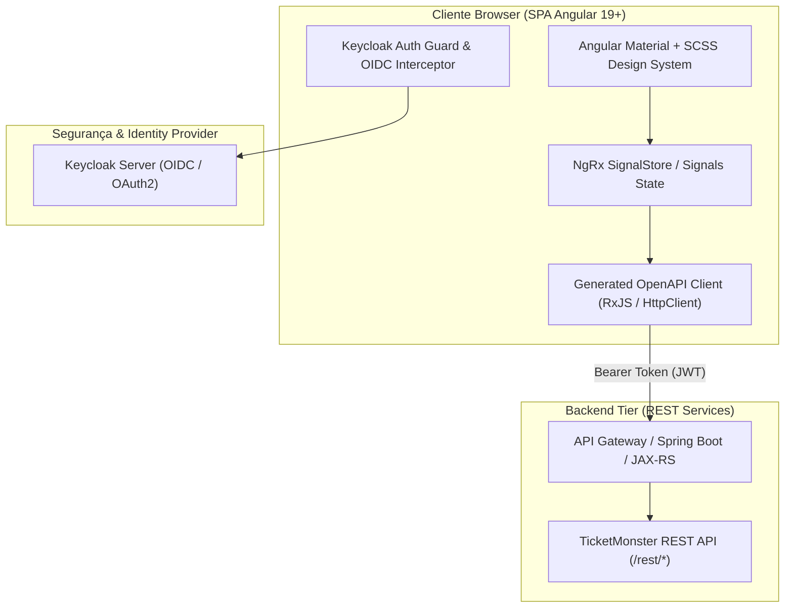

# Modernização do Módulo Frontend - Arquitetura de Solução (`demo`)

Este documento apresenta a proposta de arquitetura de solução para a modernização do módulo frontend da aplicação **TicketMonster** (`#demo`). A aplicação atual é dividida em uma interface pública em **Backbone.js / RequireJS**, uma interface administrativa legada em **AngularJS 1.x**, e uma versão mobile separada em **Cordova / jQuery Mobile**.

A nova arquitetura unifica essas frentes em uma **Single Page Application (SPA) moderna, reativa e segura**, alinhada com as melhores práticas da indústria.

---

## 1. Stack Alvo Definida

| Camada / Componente | Tecnologia / Requisito | Propósito na Nova Arquitetura |
| :--- | :--- | :--- |
| **Framework Base** | **Angular (v19+)** | SPA moderna utilizando *Standalone Components*, *Signals* para reatividade local e a sintaxe nativa de *Control Flow* (`@if`, `@for`, `@switch`). |
| **UI Component Library** | **Angular Material** | Componentes acessíveis, responsivos e padronizados (Form controls, Steppers, Dialogs, Tables, Modals, Cards). |
| **Estilização & Temas** | **SCSS (Sass)** | Sistema de design modular com CSS Variables / Design Tokens, suporte nativo a Dark/Light Mode e escopamento de componentes. |
| **Segurança & IDP** | **Keycloak** | Autenticação e autorização via **OAuth2 + OpenID Connect (OIDC)** com **PKCE Grant Flow** (Proof Key for Code Exchange). |

---

## 2. Visão Geral da Arquitetura do Frontend



---

## 3. Organização do Código & Estrutura de Diretórios

Adotaremos a estrutura **Feature-Driven Architecture** com componentes *Standalone*, facilitando o *lazy loading* e a separação de responsabilidades.

```text
src/
├── app/
│   ├── core/                        # Singleton Services, Guards, Interceptors
│   │   ├── auth/                    # Keycloak integration (guards, service, interceptor)
│   │   ├── http/                    # Global HTTP Error Handler, loading indicator
│   │   └── theme/                   # Theme switcher (Dark/Light SCSS tokens)
│   │
│   ├── shared/                      # Reusable components, directives, pipes
│   │   ├── components/
│   │   │   ├── seat-map/            # Componente interativo do Mapa de Assentos (SVG)
│   │   │   ├── confirm-dialog/      # Diálogos globais (Material)
│   │   │   └── media-viewer/        # Exibição de imagens/mídia de eventos
│   │   └── pipes/                   # Currency, Date, Seat Category formatters
│   │
│   ├── features/                    # Módulos de Negócio (Lazy Loaded)
│   │   ├── public/                  # Portal do Cliente
│   │   │   ├── events/              # Lista de eventos, detalhes, busca
│   │   │   ├── venues/              # Locais dos espetáculos
│   │   │   └── booking/             # Fluxo de compra (MatStepper: Setores -> Assentos -> Pagamento)
│   │   │
│   │   ├── account/                 # Minha Conta & Histórico de Ingressos/Reservas
│   │   │   └── my-bookings/
│   │   │
│   │   └── admin/                   # Painel Administrativo (Substitui AngularJS 1.x)
│   │       ├── dashboard/           # Métricas e gráficos de vendas
│   │       ├── event-mgmt/          # CRUD de Eventos e Espetáculos
│   │       └── venue-mgmt/          # Configuração de Locais e Setores
│   │
│   ├── app.config.ts                # Application Config (Providers, Keycloak Init, Routes)
│   └── app.routes.ts                # Definição de Rotas com Lazy Loading & Guards
│
└── styles/                          # SCSS Global & Design System Tokens
    ├── _variables.scss              # Cores, tipografia, espaçamentos
    ├── _theme.scss                  # Configuração do Angular Material Theme
    └── main.scss                    # Estilos globais
```

---

## 4. Integração de Segurança com Keycloak

### 4.1 Fluxo de Autenticação (OIDC + PKCE)
1. **OIDC Client Library**: Utilização da biblioteca `angular-oauth2-oidc` ou `keycloak-js`.
2. **PKCE Flow**: Garante segurança para aplicações Single Page sem a necessidade de armazenar `client_secret` no cliente.
3. **HTTP Interceptor**: Anexa automaticamente o `Authorization: Bearer <access_token>` em requisições para o backend. Trata renovação automática de token via *refresh_token*.
4. **Role-Based Access Control (RBAC)**:
   - `ROLE_USER`: Acesso às rotas públicas de reserva e histórico de compras.
   - `ROLE_ADMIN`: Acesso restrito ao painel administrativo `/admin/*` via Angular `canActivate` Guards (`admin.guard.ts`).

---

## 5. Pontos de Melhoria & Aspectos Não Cobertos na Stack Alvo

### 5.1 Renderização Dinâmica do Mapa de Assentos (Seat Map)
* **Desafio no Legado**: O mapa de assentos legado possui renderização simplificada e com limitações de interatividade.
* **Recomendação**: Criar um componente **SeatMapComponent** dedicado usando **SVG Dinâmico** ou **Canvas (Konva.js / Fabric.js)** integrado ao Angular Signal Store. Permite zoom, seleção de assentos em tempo real, indicação de assentos ocupados/reservados e acessibilidade básica.

### 5.2 Gerenciamento de Estado Reativo (Signals + NgRx SignalStore)
* **Desafio**: O fluxo de compra de ingressos envolve múltiplos passos (Seleção do Espetáculo → Seleção do Setor → Escolha dos Assentos → Identificação do Usuário → Confirmação).
* **Recomendação**: Em vez de Redux tradicional (boilperplate elevado), utilizar **Angular Signals** e **NgRx SignalStore**. Oferece reatividade de alta performance sem *RxJS memory leaks* e sincronização perfeita entre os passos do `MatStepper`.

### 5.3 Unificação Mobile & Desktop via PWA (Substituição do Cordova)
* **Desafio no Legado**: O TicketMonster possui um app separado baseado em Apache Cordova (`mobileapp.html`).
* **Recomendação**: Descontinuar o código Cordova legado. Com a nova SPA responsiva (Angular Material + Flex Layout/Grid SCSS), adicione suporte a **PWA (Progressive Web App / Angular Service Worker)**. Permite instalação em dispositivos móveis, suporte a notificações push e funcionamento offline parcial para ingressos comprados. Se necessário empacotamento nativo futuro, utilizar **Capacitor** em vez de Cordova.

### 5.4 Contrato de API & Geração Automática de Cliente (OpenAPI / Swagger)
* **Desafio**: Chamadas HTTP manuais sujeitas a erros de tipagem entre Java DTOs e TypeScript Interfaces.
* **Recomendação**: Adicionar anotações OpenAPI/Swagger no backend Java (`demo/src/main/java`) e utilizar `@openapitools/openapi-generator-cli` no build do Angular para gerar automaticamente os serviços, DTOs e tipos TypeScript.

### 5.5 Estratégia de Testes & Qualidade
* **Substituição do Karma/Jasmine**: O ecossistema moderno do Angular recomenda o uso do **Vitest** ou **Jest** para testes unitários mais rápidos.
* **Testes E2E com Playwright**: Implementar testes end-to-end com Playwright para cobrir o fluxo crítico de negócio (Navegação no catálogo → Reserva de ingresso → Checkout → Validação do ingresso).

---

## 6. Plano de Execução & Fases de Transição

1. **Fase 1 - Skeleton & Design System**: Inicialização do Angular 19+, configuração do SCSS, Angular Material Theme e integração com o Keycloak.
2. **Fase 2 - API Client & Core Domain**: Modelagem das interfaces TypeScript e serviços REST integrados ao backend.
3. **Fase 3 - Módulo Público & Fluxo de Reserva**: Migração do portal público, exibição de eventos e desenvolvimento do componente reativo de Mapa de Assentos.
4. **Fase 4 - Painel Administrativo**: Reescrita da interface AngularJS 1.x em componentes Angular Material (Tabelas paginadas, formulários reativos, CRUDs).
5. **Fase 5 - PWA, Testes & Decommissioning**: Validação E2E com Playwright, habilitação do Service Worker PWA e desativação total das páginas legadas Backbone/AngularJS/Cordova.

---

## Verification Plan

### Automated Tests
- `npm run test` (Vitest unit tests for components, services, and guards)
- `npx playwright test` (E2E testing for public booking flow & admin access)

### Manual Verification
- Autenticação e redirecionamento de roles no Keycloak.
- Teste de layout responsivo (Desktop vs Mobile viewport).
- Reserva de assentos interativa no Seat Map SVG.
