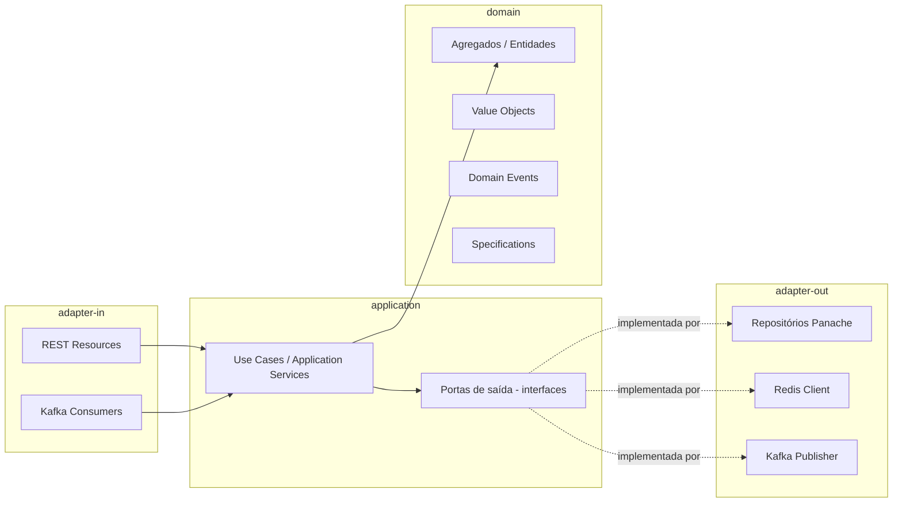
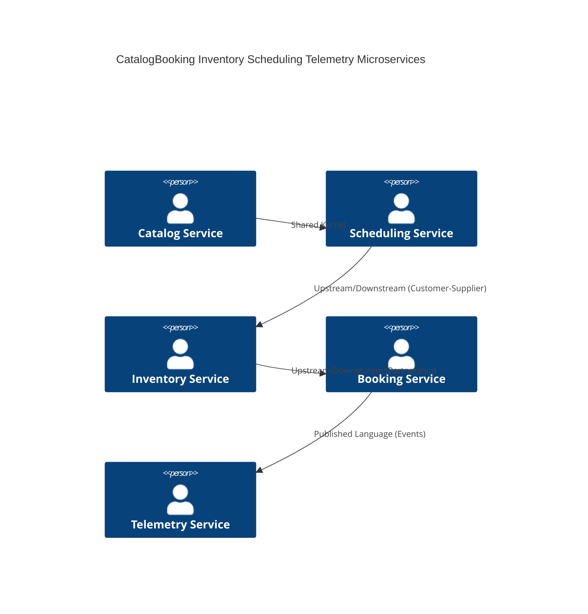
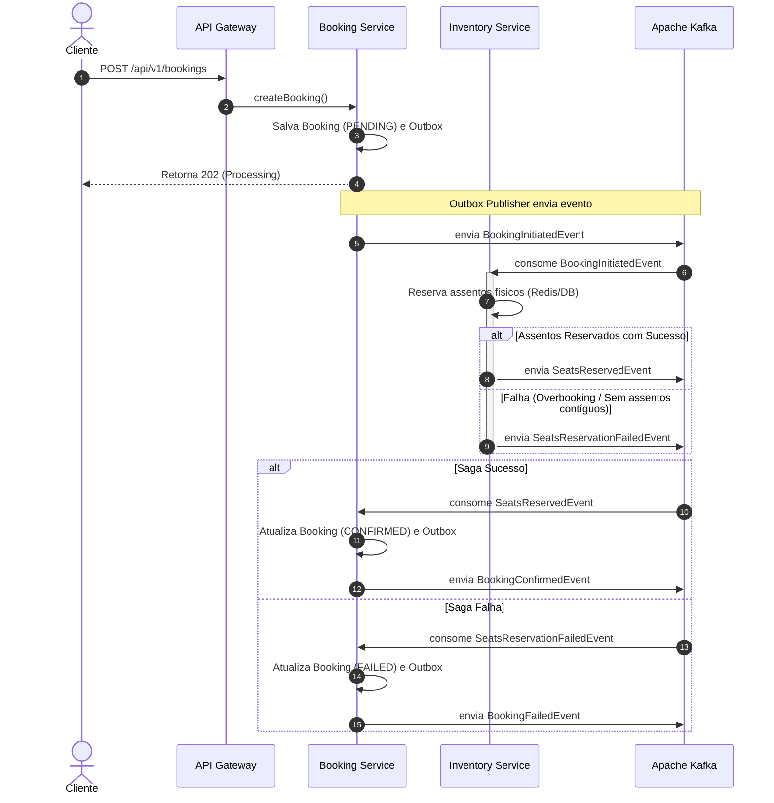
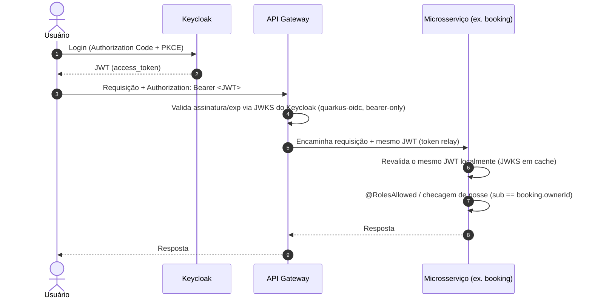
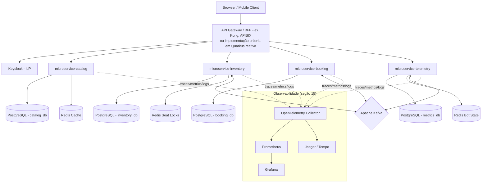
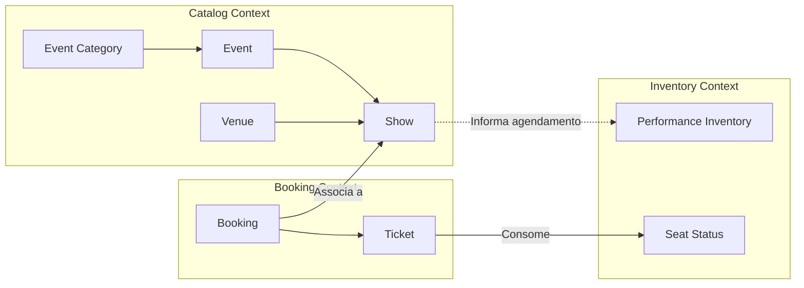
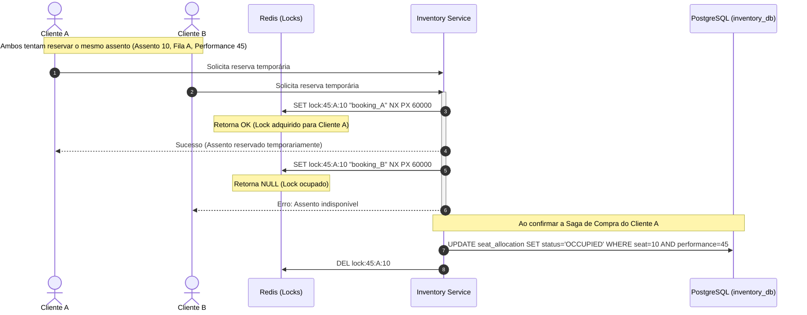

# Arquitetura de Referência e Plano de Modernização — TicketMonster


## 1. Resumo Executivo

O projeto de modernização do **TicketMonster** visa transformar uma aplicação monolítica legada (Java EE 6, Backbone.js, EJB 3.1) em uma plataforma escalável, resiliente e de alto desempenho baseada em microsserviços na nuvem. A nova arquitetura utiliza o **Quarkus 3.27+** com **Java 21**, adotando programação reativa (Mutiny) e orientada a eventos (EDA).

Os principais objetivos de negócio e técnicos alcançados com esta proposta são:
1. **Escalabilidade Linear:** Eliminação de gargalos transacionais centralizados para suportar picos de carga (ex.: abertura de vendas de shows populares).
2. **Resiliência e Alta Disponibilidade:** Isolamento de falhas por meio de microsserviços desacoplados e padrões como Saga, Outbox e Circuit Breaker.
3. **Redução de Custos Operacionais (Cloud-First):** Otimização do consumo de recursos de container com compilação nativa (GraalVM) fornecida pelo Quarkus.
4. **Segurança Corporativa:** Integração com provedores de identidade modernos usando OAuth2 e OIDC.

---

## 2. Análise da Aplicação Atual

A análise por engenharia reversa do código-fonte legado revelou a seguinte estrutura e lógica de negócio:
* **Entidades e Relacionamentos:** O sistema gerencia o catálogo de eventos (`Event`, `EventCategory`), os locais físicos (`Venue`, `Section`), o agendamento (`Show`, `Performance`), a precificação (`TicketPrice`, `TicketCategory`) e a emissão/reserva de ingressos (`Booking`, `Ticket`).
* **Lógica de Alocação de Assentos:** Implementada em `SectionAllocation` e `SeatAllocationService`. A alocação verifica assentos contíguos livres em uma matriz bidimensional `long[][] allocated` persistida como um campo `@Lob` binário no banco de dados.
* **Mecanismos de Sincronismo e Eventos:** Uso de `@Inject Event<Booking>` do CDI em memória para disparar fluxos secundários (ex.: logging e notificações).
* **Simulador de Carga (Bot):** Um EJB `@Singleton` centralizado (`BotService` e `Bot`) executa reservas periódicas na mesma JVM.

---

## 3. Diagnóstico Arquitetural

A arquitetura atual apresenta severas limitações técnicas que impedem o crescimento da aplicação:

1. **Gargalo Crítico de Concorrência (Pessimistic Lock na Seção):**
   * **Problema:** No [SeatAllocationService.java](file:///e:/develop/repos/java-projects/ticket-monster/demo/src/main/java/org/jboss/examples/ticketmonster/service/SeatAllocationService.java#L61), o método `retrieveSectionAllocationExclusively` realiza um lock pessimista de escrita (`LockModeType.PESSIMISTIC_WRITE`) na entidade `SectionAllocation`.
   * **Impacto:** Como cada show e performance possui apenas um `SectionAllocation` por seção física, o banco de dados serializa o processo de alocação de poltronas de toda a seção. Se 100 usuários tentam comprar assentos diferentes na mesma seção, a vazão cai drasticamente, gerando timeouts de conexão e sobrecarga no SGBD.
2. **Uso Indevido de Campos Grandes (`@Lob`) para Matriz de Assentos:**
   * **Problema:** A ocupação das poltronas é gravada como um array serializado de bytes (`long[][] allocated`) no PostgreSQL/H2 (conforme visto em [SectionAllocation.java:110](file:///e:/develop/repos/java-projects/ticket-monster/demo/src/main/java/org/jboss/examples/ticketmonster/model/SectionAllocation.java#L110)).
   * **Impacto:** Não é possível realizar consultas indexadas via SQL para descobrir poltronas livres. O microsserviço precisa carregar o blob inteiro na memória da JVM, desserializar o array, efetuar a lógica iterativa de busca de gap (`findFreeGapStart`), serializar a matriz alterada e gravá-la de volta. Isso consome CPU e banda de rede de forma desnecessária, além de arriscar a corrupção do estado da seção em falhas de escrita.
3. **Acoplamento em Memória dos Eventos (CDI Events):**
   * **Problema:** Comunicação de negócios (criação e cancelamento de reservas) baseada em eventos do CDI dentro do mesmo processo JVM.
   * **Impacto:** Impede a execução distribuída. Se a aplicação foi escalada para duas réplicas, os eventos disparados na Réplica A não serão escutados pelos consumidores na Réplica B.
4. **Acoplamento de Mídia Síncrono:**
   * **Problema:** O `MediaManager` faz requisições HTTP externas síncronas bloqueando threads de I/O em caso de falha de download.
5. **Acoplamento das APIs de Administração e Públicas:**
   * **Problema:** Duplicação de endpoints CRUD (ex.: `rest/bookings` vs `rest/forge/bookings`) sem validação de papéis de acesso (RBAC).

---

## 4. Modelo de Domínio (DDD)

Para o novo sistema reestruturado em DDD, o modelo de domínio foi decomposto em Agregados coesos, definindo responsabilidades claras:

* **Agregado Event (Catalog Context):**
  * **Root Entity:** `Event` (Identificador único, nome exclusivo, descrição, categoria associada).
  * **Value Objects:** `EventCategory` (classificação), `MediaItem` (detalhes da imagem/banner).
* **Agregado Venue (Catalog Context):**
  * **Root Entity:** `Venue` (capacidade total, nome único).
  * **Entities:** `Section` (setor físico com quantidade de linhas e colunas).
  * **Value Objects:** `Address` (endereço físico do local).
* **Agregado Show (Scheduling Context):**
  * **Root Entity:** `Show` (associação única entre um `Event` e um `Venue`).
  * **Entities:** `Performance` (data e hora específicas de execução do Show).
* **Agregado Inventory Allocation (Inventory Context):**
  * **Root Entity:** `PerformanceInventory` (representa o estado atual de ocupação e reservas).
  * **Entities:** `SeatStatus` (status individual de cada assento: FREE, PENDING_LOCK, OCCUPIED, com timestamp e ID do comprador).
  * **Value Objects:** `Seat` (fileira e número do assento físico).
* **Agregado Booking (Sales Context):**
  * **Root Entity:** `Booking` (compra contendo status PENDING, CONFIRMED, CANCELLED, e-mail de contato, código de cancelamento e valor total).
  * **Entities:** `Ticket` (bilhete gerado que vincula um assento de uma seção a um preço cobrado).
  * **Value Objects:** `TicketCategory` (Adulto, Estudante), `TicketPrice` (tabela de preços associando seção e show).

---

### 4.1 Camadas Internas (Clean Architecture)

Cada microsserviço segue quatro camadas com regra de dependência em uma única direção (para dentro), independente do agregado DDD que implementa:



A camada `domain` não conhece Quarkus, JPA ou Kafka. Isso resolve o principal problema estrutural do legado, onde a regra de negócio (`SectionAllocation.allocateSeats`) está emaranhada com anotações JPA na mesma classe.

---

## 5. Bounded Contexts

O Context Map do sistema moderno divide as fronteiras do domínio e estabelece os canais de integração:



* **Catalog Bounded Context (Core):** Define as regras do catálogo físico e artístico.
* **Scheduling Bounded Context (Core):** Gerencia o calendário temporal dos eventos.
* **Inventory Bounded Context (Core):** Controla o mapa dinâmico de assentos, reservas temporárias e preços.
* **Booking Bounded Context (Core):** Gerencia as transações de compra e faturamento de ingressos.
* **Telemetry & Simulator Context (Supporting):** Executa o robô simulador e monitora o volume de ocupação. Utiliza uma **Anti-Corruption Layer (ACL)** para traduzir eventos de reservas em métricas limpas.

---

## 6. Microsserviços Propostos

### 1. `microservice-catalog`
* **Responsabilidade:** Cadastro e exibição de eventos, venues, seções e shows.
* **Banco de Dados:** PostgreSQL (`catalog_db`). Altamente otimizado para leitura.
* **Redis Cache:** Cache-Aside para reduzir acessos ao banco para listagens públicas de eventos e estruturas de Venues.
* **APIs Expostas:** REST HTTP para consulta pública do catálogo e CRUD administrativo.
* **Dependências:** Nenhuma.

### 2. `microservice-inventory`
* **Responsabilidade:** Alocação de assentos físicos, controle de capacidade por performance e expiração de reservas temporárias.
* **Banco de Dados:** PostgreSQL (`inventory_db`) para persistência do estado permanente + Redis para controle de locks de assentos em tempo real.
* **APIs Expostas:** Reactive REST para verificar disponibilidade e solicitar bloqueio de assentos.
* **Eventos Consumidos:** `BookingInitiatedEvent` (para manter os assentos travados), `BookingConfirmedEvent` (para persistir a ocupação definitiva), `BookingCancelledEvent` / `BookingFailedEvent` (para liberar os assentos).
* **Dependências:** `microservice-catalog` (apenas para leitura de estrutura de seções via cache).

### 3. `microservice-booking`
* **Responsabilidade:** Gestão do ciclo de vida das reservas, validação do e-mail do cliente, emissão de tickets e orquestração do checkout.
* **Banco de Dados:** PostgreSQL (`booking_db`).
* **APIs Expostas:** REST endpoints para criação e cancelamento de bookings.
* **Eventos Publicados:** `BookingInitiatedEvent`, `BookingConfirmedEvent`, `BookingCancelledEvent`.
* **Outbox Pattern:** Utiliza a tabela de outbox na base de dados para garantir entrega de eventos ao Kafka com garantia de *at-least-once*.

### 4. `microservice-telemetry`
* **Responsabilidade:** Dashboards de monitoramento de vendas em tempo real e simulador de carga (Bot).
* **Banco de Dados:** PostgreSQL / TimescaleDB (`telemetry_db`) para histórico de métricas.
* **Redis:** Controle de estado do Bot (RUNNING, STOPPED) e buffer de logs rápidos.
* **APIs Expostas:** WebSockets / SSE para envio das métricas ao frontend.
* **Eventos Consumidos:** Todos os eventos de negócios publicados no Kafka.

---

## 7. Stack Tecnológica — Extensões Quarkus

Todos os microsserviços compartilham o mesmo conjunto-base de extensões, garantindo consistência operacional entre times:

- `quarkus-rest` + `quarkus-rest-jackson` (RESTEasy Reactive)
- `quarkus-hibernate-reactive-panache` — acesso a dados não bloqueante, preservando a produtividade do JPA/Panache sem bloquear a thread do event loop (resolve o problema estrutural do legado, onde toda query JPA bloqueava a thread da requisição — ver Diagnóstico Arquitetural, item 1)
- `quarkus-redis-client`
- `quarkus-smallrye-reactive-messaging-kafka`
- `quarkus-opentelemetry` + `quarkus-micrometer-registry-prometheus`
- `quarkus-oidc` (integração Keycloak — ver seção 15)
- `quarkus-smallrye-fault-tolerance` (Circuit Breaker, Retry, Timeout, Bulkhead)
- `quarkus-smallrye-health`

---

## 8. APIs

### Endpoints Principais (API Gateway / V1)

#### Booking Service (`/api/v1/bookings`)
* **POST `/api/v1/bookings`:** Inicia uma nova reserva.
  * *Request Body:*
    ```json
    {
      "performanceId": 45,
      "email": "cliente@email.com",
      "ticketRequests": [
        { "ticketPriceId": 102, "quantity": 2 }
      ]
    }
    ```
  * *Response (202 Accepted):*
    ```json
    {
      "bookingId": "c53d9e8d-d6a1-432d-9eb5-8e3b5e40a1b0",
      "status": "PROCESSING",
      "createdAt": "2026-07-22T10:00:00Z"
    }
    ```
* **GET `/api/v1/bookings/{id}`:** Consulta o status atual da reserva.
* **DELETE `/api/v1/bookings/{id}`:** Solicita o cancelamento da reserva e liberação dos ingressos.

#### Inventory Service (`/api/v1/performances/{performanceId}/availability`)
* **GET `/api/v1/performances/{performanceId}/availability`:** Exibe mapa de assentos livres e ocupados.
  * *Query Params:* `sectionId=12`
  * *Response (200 OK):*
    ```json
    {
      "sectionId": 12,
      "availableSeats": [
        { "row": 1, "number": 5 },
        { "row": 1, "number": 6 }
      ]
    }
    ```

### Padrão de Erro (RFC 7807)
Erros de validação e negócios seguem a especificação de *Problem Details*:
```json
{
  "type": "https://ticketmonster.com/errors/insufficient-seats",
  "title": "Assentos Indisponíveis",
  "status": 400,
  "detail": "Não foi possível alocar 2 assentos contíguos na seção especificada.",
  "instance": "/api/v1/bookings"
}
```

---

## 9. Banco de Dados

Cada microsserviço acessa seu schema PostgreSQL via **Hibernate Reactive com Panache** — mantém a produtividade do JPA/Panache sem bloquear threads do event loop, diferente do acesso JPA síncrono-bloqueante do legado.

### Modelagem da Alocação de Assentos Sem Blob
Para acabar com a contenção do lock pessimista e eliminar o arquivo `@Lob` (matriz binária), modelamos a tabela `seat_allocation` no PostgreSQL do `microservice-inventory`:

```sql
CREATE TABLE seat_allocation (
    id BIGSERIAL PRIMARY KEY,
    performance_id BIGINT NOT NULL,
    section_id BIGINT NOT NULL,
    row_number INT NOT NULL,
    seat_number INT NOT NULL,
    status VARCHAR(20) NOT NULL, -- FREE, RESERVED, OCCUPIED
    booking_id VARCHAR(50),
    locked_until TIMESTAMP,
    version BIGINT NOT NULL DEFAULT 0,
    CONSTRAINT uq_performance_seat UNIQUE (performance_id, section_id, row_number, seat_number)
);

CREATE INDEX idx_perf_sec_avail ON seat_allocation(performance_id, section_id) WHERE status = 'FREE';
```

### Estratégia de Migração e Versionamento
* **Ferramenta:** Liquibase integrado ao Quarkus.
* **Tática:** A tabela `seat_allocation` é populada automaticamente quando um Show/Performance é cadastrado (carga inicial de assentos livres baseada na capacidade da seção), evitando inserções dinâmicas pesadas no momento da compra.

---

## 10. Redis

O Redis é peça fundamental para a escalabilidade horizontal e resiliência:

1. **Cache de Catálogo (Cache-Aside):**
   * Chave: `catalog:event:{id}` e `catalog:shows:performance:{id}`.
   * TTL: 1 hora (600 segundos para eventos populares, invalidado via eventos de alteração de catálogo).
2. **Controle de Ocupação Temporária (Locks Rápidos):**
   * Quando o cliente seleciona assentos, o `microservice-inventory` cria chaves de bloqueio temporário no Redis:
     * Chave: `lock:seat:{performanceId}:{sectionId}:{row}:{number}`.
     * Valor: `bookingId`.
     * TTL: 60 segundos (tempo limite para finalização do pagamento/checkout).
   * **Benefício:** A verificação de disponibilidade e reserva temporária é feita em Redis de forma atômica (usando transações Redis ou scripts Lua), sem tocar no banco de dados relacional nesta etapa.
3. **Idempotência de Compras:**
   * Evita duplicidade de compras pelo clique duplo do usuário.
   * Chave: `idempotency:booking:{hash_requisicao}` com TTL de 30 segundos.

---

## 11. Comunicação entre Serviços

### Saga Baseada em Coreografia com Kafka

O processo de compra utiliza o padrão Saga Coreografada para garantir consistência eventual sem dependência síncrona:



### Padrão Transacional Outbox
Para evitar a perda de mensagens se o Kafka falhar durante a gravação no banco, o `microservice-booking` grava a reserva e o evento na mesma transação relacional usando a tabela `outbox_event`. Um worker reativo do Quarkus lê a tabela e publica no Kafka (usando Debezium ou polling reativo otimizado), marcando como processado após a confirmação do ACK do Kafka.

---

## 12. Arquitetura Reativa

O Quarkus utiliza o framework reativo **Mutiny** de forma nativa para todas as operações críticas:

* **Não Bloqueante (Non-blocking I/O):**
  * APIs REST expostas com RESTEasy Reactive.
  * Drivers de banco reativos (`quarkus-reactive-pg-client`). As conexões não bloqueiam a thread do Event Loop da CPU.
* **Uso de Uni e Multi:**
  * `Uni<Booking>` representa um resultado assíncrono único (ex.: buscar reserva por ID).
  * `Multi<String>` representa fluxos contínuos de dados (ex.: logs do Bot ou telemetria em tempo real).
* **Exemplo de Código Reativo (Mutiny):**
  ```java
  public Uni<Response> createBooking(BookingRequest request) {
      return bookingRepository.savePending(request)
          .flatMap(booking -> outboxRepository.saveEvent(new BookingInitiatedEvent(booking))
              .map(v -> Response.accepted(booking).build())
          )
          .onFailure().recoverWithItem(err -> Response.status(400).entity(new ErrorDTO(err.getMessage())).build());
  }
  ```

---

## 13. Programação Funcional integrada à Orientação a Objeto

* **Domínio rico e imutável, orientado a objetos:** agregados como `Booking` e `SeatMap` continuam sendo objetos com comportamento (não *anemic model*), mas Value Objects (`Seat`, `Money`, `Email`, `CancellationCode`) são modelados como **Java Records**, imutáveis por padrão.
* **Composição funcional para orquestração de fluxo:** o pipeline de criação de reserva é modelado como cadeia de transformações puras usando `Either<Error, T>` (Vavr) ou os operadores de `Uni<T>` (`.chain()`, `.onFailure()`), em vez do `try/catch` aninhado do legado (`BookingService.createBooking`, hoje um método de mais de 80 linhas misturando validação, alocação e persistência).
* **Funções puras para regras de cálculo**, testáveis isoladamente sem mocks de banco — por exemplo `calculateContiguousBlock(SeatMap, quantity): Either<AllocationError, List<Seat>>`, algo inviável no legado porque a lógica de alocação está acoplada ao `EntityManager`.

---

## 14. Observabilidade

A infraestrutura de observabilidade é implementada com **OpenTelemetry** integrada à Stack LGTM (Grafana, Loki, Tempo, Mimir):

* **Tracing Distribuído:**
  * O API Gateway gera o `traceparent` (Correlation ID) baseado no padrão W3C.
  * O `traceparent` é propagado em todas as chamadas HTTP e nos metadados (headers) das mensagens do Kafka.
  * Permite rastrear uma compra desde o clique no browser até a confirmação do inventário e gravação no banco.
* **Métricas Exportadas (Prometheus):**
  * Ingressos reservados por segundo.
  * Taxa de falhas de alocação de assentos.
  * Latência das transações de banco reativas.
  * Tamanho das filas de mensagens do Kafka.
* **Health Checks:**
  * `/q/health/live` e `/q/health/ready` expostos pelo Quarkus SmallRye Health para indicar o status da aplicação ao Kubernetes.

---

## 15. Segurança — Keycloak como Autoridade de Identidade + JWT RBAC

O sistema adota **Keycloak** como *Identity Provider* (IdP) e autoridade central de autenticação/autorização, com controle de acesso baseado em **JWT + RBAC** (roles carregadas no próprio token, validadas localmente por cada serviço — sem chamada de introspecção síncrona ao Keycloak a cada requisição).

### 15.1 Modelo Keycloak (Realm e Clients)

* **Realm:** `ticketmonster`.
* **Clients (Relying Parties):**
  | Client ID | Tipo | Uso |
  |---|---|---|
  | `ticketmonster-web` | Público, `Authorization Code + PKCE` | Login do comprador na SPA pública (opcional — ver 15.4, compra sem login continua permitida). |
  | `ticketmonster-admin` | Público, `Authorization Code + PKCE` | Login do administrador no painel. |
  | `ticketmonster-gateway` | Confidencial, `bearer-only` | Validação de token no API Gateway. |
  | `catalog-service`, `inventory-service`, `booking-service`, `telemetry-service` | Confidencial, `Client Credentials` | Autenticação serviço-a-serviço (ex.: chamada síncrona `booking → catalog` para buscar preço; Bot criando reservas via `booking-service`). |

* **Realm Roles (RBAC):**
  * `ROLE_CUSTOMER` — comprador autenticado.
  * `ROLE_ADMIN` — administrador do painel, acesso de escrita a todos os cadastros.
  * `ROLE_SERVICE` — chamadas internas serviço-a-serviço (via Client Credentials), sem contexto de usuário final.

  *(Evolução futura opcional: quebrar `ROLE_ADMIN` em roles compostas por client — `catalog:write`, `inventory:write`, `booking:write` — para *least privilege* granular. Mantido como `ROLE_ADMIN` único nesta fase para paridade com o legado, que já tratava o admin como acesso total.)*

### 15.2 Claims do JWT relevantes para o domínio

| Claim | Uso |
|---|---|
| `sub` | Identificador único do usuário — usado para checar **posse** de uma reserva (RN-NOVA-01 em `microservices_specification.md`). |
| `email` | Usado no fluxo de compra sem login (guest checkout) como chave alternativa de posse. |
| `realm_access.roles` | Lista de roles (`ROLE_CUSTOMER`, `ROLE_ADMIN`, `ROLE_SERVICE`) usada pelo `@RolesAllowed` do Quarkus. |
| `azp` (authorized party) | Client que originou o token — permite diferenciar token de usuário final (`ticketmonster-web/admin`) de token de serviço (`*-service`), útil para auditoria (RN-NOVA-05). |
| `exp` / `iat` | Expiração/emissão — validados automaticamente pela extensão `quarkus-oidc`. |

### 15.3 Validação e propagação (Zero Trust — validação em cada camada)



* O Gateway **não** troca o token por um formato interno proprietário — o mesmo JWT emitido pelo Keycloak é repassado (*token relay*) até o microsserviço final, que revalida a assinatura de forma independente (cada serviço mantém cache do JWKS do Keycloak). Isso evita o padrão *confused deputy* de confiar cegamente em um header interno não assinado.
* Chamadas **serviço-a-serviço** sem contexto de usuário (ex.: `booking → catalog` para consulta de preço, ou o worker do Bot criando reservas) usam um token próprio obtido via `Client Credentials` (`ROLE_SERVICE`), não o token do usuário final.
* Eventos publicados no Kafka **não carregam JWT** (mensageria assíncrona não tem requisição/resposta); em vez disso, o payload do evento inclui o identificador do ator que originou a ação (`sub` do usuário ou `"system:bot"`), preservando a trilha de auditoria (RN-NOVA-05).

> **Evolução futura considerada:** em vez do *token relay* simples acima, é possível adotar **Token Exchange** (RFC 8693) no Gateway, trocando o token do usuário por um token de escopo reduzido antes de repassar a uma chamada interna. Optou-se pelo *token relay* nesta fase por ser mais simples de operar e depurar; Token Exchange fica como refinamento de *least privilege* caso a matriz de autorização (15.4) se mostre insuficiente para isolar chamadas internas de alto risco.

### 15.4 Matriz de Autorização por Endpoint

| Microsserviço | Endpoint | Método | Autorização |
|---|---|---|---|
| `catalog` | `/events`, `/venues`, `/shows`, `/performances` | GET | Público (sem token) |
| `catalog` | `/events`, `/venues`, `/event-categories`, `/media-items` | POST/PUT/DELETE | `ROLE_ADMIN` |
| `inventory` | `/performances/{id}/availability` | GET | Público (sem token) |
| `inventory` | Alocação/desalocação interna de assentos | — | `ROLE_SERVICE` (chamado apenas por `booking`, não exposto no Gateway público) |
| `inventory` | `/ticket-categories`, `/ticket-prices` | POST/PUT/DELETE | `ROLE_ADMIN` |
| `booking` | `/bookings` | POST | Público, com `email` obrigatório (guest checkout) **ou** `ROLE_CUSTOMER` (associa `sub` como `ownerId`) |
| `booking` | `/bookings/{id}` | GET | Dono da reserva (`sub` == `ownerId`) **ou** `X-Cancellation-Code` válido **ou** `ROLE_ADMIN` |
| `booking` | `/bookings/{id}` | DELETE | Mesmo critério de posse acima — corrige a falha RN30 as-is identificada no legado |
| `booking` | `/bookings` (listagem completa) | GET | `ROLE_ADMIN` apenas — no legado esta listagem é pública, expondo dados de todos os compradores |
| `telemetry` | `/metrics` | GET | `ROLE_ADMIN` |
| `telemetry` | `/bot/status`, `/bot/messages` | GET/PUT | `ROLE_ADMIN` |

> Esta matriz implementa diretamente **RN-NOVA-01** e **RN-NOVA-02** definidas em `microservices_specification.md`, seção 5.3, e corrige a exposição pública hoje existente em `GET /rest/bookings` (listagem) e na ausência total de autenticação no legado.

### 15.4.1 Por que RBAC sozinho não basta

RBAC responde "o usuário tem a role X?", mas não responde "esta reserva específica pertence a ele?" — por isso a matriz acima e o exemplo de código em 13.5 sempre combinam `@RolesAllowed`/rota pública com uma checagem de posse (`sub == booking.ownerId`) dentro do *use case*. Para granularidade além de `ROLE_CUSTOMER`/`ROLE_ADMIN`/`ROLE_SERVICE`, considerar Client Roles mais finas (`catalog:write`, `booking:admin`, `pricing:write`) ou **Keycloak Authorization Services (UMA/policies)** como evolução futura, caso as necessidades de autorização cresçam além do que Client Roles simples conseguem expressar.

### 15.4.2 Glossário de Termos de Identidade e Autorização

| Termo | Definição | Onde se aplica no TicketMonster |
|---|---|---|
| **IdP (Identity Provider)** | Sistema central responsável por autenticar usuários e emitir tokens. | Keycloak, único IdP do domínio `ticketmonster`. |
| **Realm** | Espaço isolado de configuração no Keycloak (usuários, clients, roles próprios). | Realm `ticketmonster` (ver 13.1). |
| **Client (Keycloak)** | Aplicação/serviço registrado no realm que pode solicitar tokens. | `ticketmonster-web`, `ticketmonster-admin`, `ticketmonster-gateway`, clients de serviço (ver 13.1). |
| **Public Client** | Client que **não** guarda segredo (roda no browser/mobile). Autentica via **PKCE**, não por `client_secret`. | `ticketmonster-web`, `ticketmonster-admin`. |
| **Confidential Client** | Client que roda em ambiente controlado (servidor) e pode guardar um `client_secret` com segurança. | `ticketmonster-gateway` (`bearer-only`). |
| **PKCE (Proof Key for Code Exchange)** | Extensão do Authorization Code Flow que impede interceptação do código de autorização, sem exigir `client_secret`. Obrigatório para *public clients*. | Login da SPA/admin (13.1, 13.3). |
| **Authorization Code Flow** | Fluxo OAuth2 padrão para aplicações com interface de usuário. | Login do comprador e do administrador. |
| **Client Credentials Flow** | Fluxo OAuth2 sem usuário: o próprio serviço se autentica com `client_id` + `client_secret` para obter um token representando a si mesmo. | Chamadas internas serviço-a-serviço (`ROLE_SERVICE`, ver 13.3). |
| **Token Exchange** | Mecanismo (RFC 8693) que troca um token por outro com escopo/audiência reduzida. | Não adotado nesta fase — ver nota de evolução futura ao final de 13.3. |
| **JWT (JSON Web Token)** | Formato de token assinado (JWS), com claims verificáveis sem consulta ao IdP a cada uso. | Formato do `access_token` emitido pelo Keycloak. |
| **Claims** | Pares chave-valor dentro do JWT. | `sub`, `email`, `realm_access.roles`, `azp` (ver 13.2). |
| **JWKS (JSON Web Key Set)** | Endpoint público do Keycloak com as chaves usadas para validar a assinatura dos JWTs. | Consumido pelo Gateway e por cada serviço via `quarkus-oidc`. |
| **RBAC (Role-Based Access Control)** | Modelo de autorização baseado em papéis do usuário/client. | `ROLE_CUSTOMER`, `ROLE_ADMIN`, `ROLE_SERVICE` (13.1). |
| **ABAC (Attribute-Based Access Control)** | Autorização baseada em atributos do recurso/contexto, não só no papel do usuário. | Checagem de posse (`sub == booking.ownerId`, 15.4.1). |
| **UMA (User-Managed Access)** | Extensão do Keycloak Authorization Services para políticas de autorização finas administradas centralmente. | Evolução futura opcional (15.4.1). |
| **BFF (Backend for Frontend)** | Camada intermediária que agrega/adapta respostas e concentra preocupações transversais. | Papel exercido pelo API Gateway. |
| **mTLS (mutual TLS)** | TLS onde ambos os lados apresentam certificado. | Comunicação serviço-a-serviço via service mesh (13.6). |
| **ACL de tópico Kafka** | Regra que define quais *principals* podem publicar/consumir em um tópico. | Ver 15.4.3. |
| **SASL/SCRAM** | Autenticação do Kafka baseada em usuário/senha desafio-resposta. | Alternativa ao mTLS entre serviço e broker (15.4.3). |
| **Least Privilege** | Conceder apenas as permissões mínimas necessárias. | Guia a granularidade de Client Roles e a decisão de não usar `ROLE_ADMIN` para tudo. |
| **BOLA (Broken Object Level Authorization)** | Vulnerabilidade (OWASP API Top 10) onde o sistema autentica mas não verifica posse do recurso. | Gap confirmado no legado — ver 15.4.4. |
| **Mass Assignment** | Backend aceita e persiste qualquer campo enviado, sem *whitelist*. | Gap confirmado no legado — ver 15.4.4. |

### 15.4.3 Segurança na camada de mensageria (Kafka)

A validação de JWT cobre REST; os eventos de domínio (`BookingConfirmedEvent`, etc.) também carregam dados sensíveis e trafegam entre serviços sem controle equivalente hoje:

* **SASL/SCRAM ou mTLS** na comunicação com o broker.
* **ACLs por tópico**: apenas `booking` publica em `booking-events`; apenas `inventory`/`telemetry` autorizados consomem.
* Payload de evento sem PII bruta sempre que possível — apenas identificadores; quem precisar do e-mail consulta o serviço dono via API autenticada (ver 15.4.5).

### 15.4.4 OWASP API Security Top 10 — mapeamento a gaps confirmados no legado

| Risco OWASP | Gap confirmado no legado | Mitigação nesta arquitetura |
|---|---|---|
| **BOLA** — Broken Object Level Authorization | `GET/DELETE /rest/bookings/{id}` sem checagem de posse | Checagem de posse no *use case* (15.4.1, exemplo de código em 15.5) |
| **Broken Function Level Authorization** | Painel admin acessível sem autenticação alguma | RBAC + matriz de autorização (15.4) |
| **Excessive Data Exposure** | `GET /rest/bookings` lista todas as reservas de todos os clientes, incluindo e-mail (PII) de terceiros | Listagem completa restrita a `ROLE_ADMIN` (15.4); consulta individual restrita ao dono |
| **Mass Assignment** | `BookingDTO.fromDTO()` aceita e persiste qualquer campo enviado, sem *whitelist* | DTOs de entrada explícitos por *use case*, nunca reaproveitar DTO de leitura para escrita |
| **Lack of Resources & Rate Limiting** | Nenhum limite hoje — o próprio `Bot` do legado evidencia como é fácil gerar carga | Rate limiting no API Gateway |

### 15.4.5 Proteção de dados pessoais (PII)

`Booking.contactEmail` é dado pessoal e hoje trafega e é exposto sem controle algum.

* Mascaramento de e-mail em respostas administrativas (`j***@acme.com`) quando o requisitante não for o próprio dono.
* Política de retenção definida para reservas antigas contendo PII.
* Se aplicável (LGPD/GDPR): regra de negócio própria para exclusão/anonimização de reserva antiga — inexistente no legado.

### 15.5 Configuração de referência (Quarkus)

```properties
# application.properties — booking-service
quarkus.oidc.auth-server-url=https://keycloak.ticketmonster.io/realms/ticketmonster
quarkus.oidc.client-id=booking-service
quarkus.oidc.bearer-only=true
quarkus.oidc.token.issuer=https://keycloak.ticketmonster.io/realms/ticketmonster

# Rotas públicas (sem token)
quarkus.http.auth.permission.public.paths=/api/v1/bookings
quarkus.http.auth.permission.public.methods=POST
quarkus.http.auth.permission.public.policy=permit

# Rotas administrativas
quarkus.http.auth.permission.admin.paths=/api/v1/bookings
quarkus.http.auth.permission.admin.methods=GET
quarkus.http.auth.policy.admin-policy.roles-allowed=ROLE_ADMIN
quarkus.http.auth.permission.admin.policy=admin-policy
```

```java
// Checagem de posse dentro do Use Case, não apenas via anotação declarativa
public class CancelBookingUseCase {

    @Inject JsonWebToken jwt; // pode ser nulo em fluxo guest (sem token)

    public Uni<Void> execute(String bookingId, String cancellationCodeHeader) {
        return bookingRepository.findById(bookingId)
            .onItem().transformToUni(booking -> {
                boolean isOwner = jwt != null && jwt.getSubject().equals(booking.ownerId());
                boolean hasValidCode = cancellationCodeHeader != null
                        && booking.cancellationCode().matches(cancellationCodeHeader);
                if (!isOwner && !hasValidCode) {
                    return Uni.createFrom().failure(new ForbiddenException());
                }
                return cancelAndReleaseSeats(booking);
            });
    }
}
```

### 15.6 Criptografia, comunicação e auditoria

* TLS 1.3 obrigatório para comunicação entre containers (mTLS via Service Mesh — Istio ou Linkerd) — necessário mesmo com JWT, pois o JWT prova identidade do *usuário final*, não do *serviço chamador*.
* Chaves e credenciais (client secrets do Keycloak, credenciais de banco) injetadas via Kubernetes Secrets integrados ao HashiCorp Vault — nunca em `application.properties` versionado (o legado tem exatamente esse padrão de erro aplicado a segredo de negócio: `cancellationCode = "abc"` fixo no código).
* **CORS estrito** no Gateway — hoje inexistente, pois front e backend do legado compartilham o mesmo WAR.
* **Cabeçalhos de segurança** (CSP, HSTS, X-Content-Type-Options) nas respostas do Gateway/BFF.
* **MFA obrigatório** para o realm/role de administrador — o painel admin manipula preço e inventário, é o alvo de maior impacto.
* **Auditoria correlacionada à identidade:** a trilha de auditoria via eventos (RN-NOVA-05) correlaciona cada evento de domínio ao `sub` (usuário) e ao `azp`/`client_id` (client que originou a ação), permitindo responder "quem fez o quê e quando" — inviável no legado, que não possui nenhum conceito de identidade.

---

## 16. Arquitetura Cloud First

A implantação foi desenhada para rodar em ambientes baseados em **Kubernetes** ou **Red Hat OpenShift**:

* **Imagens de Containers Otimizadas:**
  * Builds nativos via GraalVM gerando imagens Docker de poucos megabytes com tempo de inicialização (Startup Time) inferior a 50ms, facilitando o Auto Scaling.
* **Configuração 12-Factor:** variáveis de ambiente/ConfigMaps, sem estado em disco local — elimina o cache em arquivo (`tmpDir`) do `MediaManager` legado, substituído por object storage (S3/MinIO).
* **Kubernetes HPA (Horizontal Pod Autoscaler):**
  * Escalabilidade configurada para reagir a picos de requisições por segundo (RPS) e lag de consumo de mensagens no Kafka.
* **Estratégias de Deploy:**
  * **Rolling Update:** Utilizada por padrão para atualizações de rotina sem indisponibilidade.
  * **Canary Deploy:** Utilizada na liberação do microsserviço de checkout (`microservice-booking`), direcionando 5% do tráfego para validar o comportamento antes da atualização completa.

---

## 17. Estratégia de Migração (Padrão Strangler Fig)

A migração será incremental, reduzindo o risco sistêmico. O monolito continuará em execução enquanto as partes forem substituídas:

### Fase 1: Desacoplamento do Catálogo e Frontend
* **Ação:** Criação do `microservice-catalog`. O frontend antigo Backbone/AngularJS é modificado para apontar rotas de leitura de catálogo para o novo microsserviço.
* **Sincronização:** Criação de um job CDC (Change Data Capture) via Debezium para manter as tabelas de eventos e venues sincronizadas entre o banco antigo e o banco do novo microsserviço.

### Fase 2: Modernização do Inventário (Eliminação do Lock Pessimista)
* **Ação:** Implantação do `microservice-inventory`. A lógica de alocação de assentos é migrada do monolito para a tabela `seat_allocation` no microsserviço e locks temporários no Redis são ativados.
* **Roteamento:** O API Gateway direciona rotas de `/rest/shows` e disponibilidade para este novo microsserviço.

### Fase 3: Modernização das Reservas (Implementação da Saga)
* **Ação:** Implantação do `microservice-booking`. O monolito deixa de processar compras. O padrão Saga Coreografada com Kafka entra em produção.

### Fase 4: Descomissionamento do Monolito
* **Ação:** Migração do painel administrativo para uma interface moderna (ex.: React/Quarkus Admin) consumindo as novas APIs seguras. Desligamento definitivo do servidor JBoss EAP legado.

---

## 18. Diagramas Mermaid

### 18.1 Arquitetura Geral do Sistema (To-Be)



### 18.2 Bounded Contexts e Integração de Eventos



### 18.3 Fluxo Físico de Reserva Concorrente (Sem Pessimistic DB Lock)



---

## 19. Melhorias de Mercado Incluídas Além do Escopo Original

| Melhoria | Justificativa |
|---|---|
| **API Gateway / BFF** | Centraliza rate limiting/anti-scalping e evita expor os 4 serviços diretamente aos clientes. |
| **Outbox Pattern** | Garante atomicidade entre a escrita local e a publicação do evento no Kafka (ver ADR 04 e seção 11). |
| **Idempotency-Key** | Essencial assim que o fluxo deixa de ser uma transação local ACID; evita reserva duplicada em retry de rede na criação do `Booking`. |
| **CQRS leve no `catalog`** | Separa modelo de escrita (admin) do modelo de leitura (público, cacheado em Redis) — o legado já sofre disso implicitamente (`EventService` com predicados vs. Forge CRUD); aqui a separação é formalizada. |
| **Contract Testing (Pact)** | Evita que a mudança de contrato de um serviço quebre outro silenciosamente — risco real numa arquitetura de 4 serviços + gateway. |
| **Testcontainers** | Testes de integração reais contra Postgres/Redis/Kafka em CI, sem mocks frágeis. |
| **Feature Flags** (Unleash / OpenFeature) | Permite rollout gradual de regras críticas novas (ex.: validação de código de cancelamento) sem *big-bang*. |
| **Schema Registry** (Avro/JSON Schema no Kafka) | Evita quebra de consumidor por mudança de payload de evento — problema inexistente no legado (eventos CDI *in-process*, sem serialização). |

---

## 20. Catálogo de Design Patterns Recomendados por Cenário

### 20.1 Domínio e regras de negócio (DDD Tático)

| Pattern | Onde aplicar | Motivo |
|---|---|---|
| **Aggregate** | `Booking` (raiz, contém `Ticket`); `SeatMap`/`SectionAllocation` (raiz, contém `Seat`) | Garante invariantes (ex.: nunca dois tickets no mesmo assento) dentro de um limite transacional claro — hoje o legado só garante isso via lock de banco, não via modelo. |
| **Value Object** | `Money`, `Email`, `SeatCoordinate`, `CancellationCode` | Elimina *primitive obsession* (hoje `price` é `float` cru, `email` é `String` cru sem validação encapsulada). |
| **Domain Events** | `SeatsReservedEvent`, `BookingConfirmedEvent`, `BookingCancelledEvent` | Já usado no legado via CDI `Event<Booking>`; mantém-se o padrão, trocando apenas o transporte (CDI local → Outbox/Kafka). |
| **Specification** | Regra "assentos contíguos suficientes na seção" | Encapsula a regra de elegibilidade de alocação como objeto testável isoladamente, separando o "o quê" da regra do "como" persistir. |
| **Repository** | Uma interface por agregado (`BookingRepository`), implementação em `adapter-out` | Mantém a camada `domain` livre de Panache/Hibernate. |

### 20.2 Aplicação / Casos de Uso (Clean Architecture)

| Pattern | Onde aplicar | Motivo |
|---|---|---|
| **Use Case / Interactor** | `CreateBookingUseCase`, `CancelBookingUseCase`, `AllocateSeatsUseCase` | Um caso de uso por operação de negócio, substituindo o método monolítico `BookingService.createBooking` de hoje. |
| **Ports & Adapters (Hexagonal)** | Interfaces `SeatAllocationPort`, `PricingPort` no domínio, implementadas por clients HTTP/Kafka reais | Permite trocar o transporte de comunicação com `inventory` sem tocar a regra de negócio. |
| **CQRS** | `catalog` (modelo de leitura cacheado) e consulta/histórico em `booking` | Separa carga de leitura pesada da escrita transacional. |
| **Result / Either (Railway-Oriented Programming)** | Toda a cadeia de validação de `CreateBookingUseCase` | Substitui o `try/catch` genérico do legado por composição explícita de sucesso/falha tipada (ver seção 13). |

### 20.3 Concorrência e Alocação de Assentos

| Pattern | Onde aplicar | Motivo |
|---|---|---|
| **Distributed Lock** (Redis `SET NX PX`) | Lock de assento individual | Substitui o `LockModeType.PESSIMISTIC_WRITE` por seção inteira, reduzindo drasticamente a contenção (ver ADR 02). |
| **Lease Pattern** | Reserva temporária de 60s do assento | O "lock" é, na prática, um aluguel com expiração automática — nomear explicitamente como tal no domínio, não apenas como "lock" genérico. |
| **Optimistic Offline Lock** (`@Version`) | Persistência final do `Booking` em `booking_db` | Mantém proteção contra concorrência na escrita definitiva, sem serializar toda a seção como hoje. |

### 20.4 Integração entre Serviços

| Pattern | Onde aplicar | Motivo |
|---|---|---|
| **Saga (Coreografia via Kafka)** | Fluxo `booking` ↔ `inventory` (ver seção 11 e ADR 04) | Coordena a transação distribuída de checkout através de eventos publicados por cada serviço, sem orquestrador central — equivalente ao `failedSections` do legado, porém distribuído. |
| **Outbox** | `booking_db` | Publica evento de forma atômica com a escrita local. |
| **Idempotent Receiver** | Consumidores Kafka em `inventory` e `booking` | Protege contra reprocessamento de mensagem (entrega *at-least-once* do Kafka). |
| **Dead Letter Queue** | Todos os consumidores Kafka | Isola mensagens que falham repetidamente sem travar a partição. |
| **Circuit Breaker + Retry + Timeout** (`@CircuitBreaker`, `@Retry`, `@Timeout` — SmallRye Fault Tolerance) | Chamadas síncronas `booking` → `catalog` (busca de preço) | Evita cascata de falha caso `catalog` degrade. |
| **API Gateway / BFF** | Entrada única do front público, admin e mobile | Centraliza autenticação, rate limiting e agregação de respostas. |

### 20.5 Cache e Leitura

| Pattern | Onde aplicar | Motivo |
|---|---|---|
| **Cache-Aside** | Catálogo de eventos/shows no Redis | Reduz carga no Postgres para o tráfego de navegação (majoritariamente leitura). |
| **Read-Through / TTL curto** | Disponibilidade agregada de assentos (contagem, não o mapa individual) | Evita servir dado obsoleto por muito tempo em cenário de alta demanda. |

### 20.6 Observabilidade e Resiliência Operacional

| Pattern | Onde aplicar | Motivo |
|---|---|---|
| **Correlation ID / Distributed Tracing Context Propagation** | Toda a cadeia HTTP + Kafka | Rastreia uma compra ponta a ponta entre os 4 serviços (ver seção 15). |
| **Health Check / Readiness Probe** | Todos os serviços | Kubernetes só roteia tráfego para instâncias prontas (conexão com DB/Redis/Kafka estabelecida). |
| **Bulkhead** | Pool de conexão Redis separado para locks de assento vs. cache de catálogo | Um pico de contenção de lock não deve esgotar conexões usadas pelo cache de leitura. |

---

## 21. Architecture Decision Records (ADRs)

### ADR 01: Migração do Monolito Java EE 6 para Quarkus 3.27+
* **Status:** Aprovado.
* **Contexto:** O monolito legado depende de servidores JBoss antigos e Java EE 6, resultando em tempos altos de startup, alto consumo de memória e impossibilidade de escala reativa.
* **Decisão:** Adotar Quarkus 3.27+ com Java 21 como framework base de microsserviços.
* **Consequências:**
  * *Positivas:* Menor pegada de memória, inicialização quase instantânea, suporte excelente a desenvolvimento reativo (Mutiny) e compilação nativa.
  * *Negativas:* Necessidade de curva de aprendizado para a equipe em programação reativa.

### ADR 02: Substituição de Lock Pessimista por Locks Distribuídos com Redis
* **Status:** Aprovado.
* **Contexto:** O sistema original executava lock pessimista direto no banco na tabela inteira de ocupação (`SectionAllocation`), serializando as reservas.
* **Decisão:** Mapear os assentos de forma individualizada e realizar o bloqueio concorrente inicial de 60 segundos no Redis usando operações atômicas baseadas em chaves por assento.
* **Consequências:**
  * *Positivas:* Vazão de concorrência massiva. Vários usuários podem comprar poltronas da mesma seção ao mesmo tempo sem bloquear a tabela no PostgreSQL.
  * *Negativas:* Introdução de dependência do Redis no fluxo crítico de checkout.

### ADR 03: Decomposição de Banco de Dados (Database per Service)
* **Status:** Aprovado.
* **Contexto:** A persistência legada utiliza um único datasource compartilhado por todas as operações de CRUD.
* **Decisão:** Implementar bancos de dados independentes (PostgreSQL) para cada microsserviço (Catalog, Inventory, Booking e Telemetry).
* **Consequências:**
  * *Positivas:* Desacoplamento físico completo, permitindo alterações de schema em um serviço sem afetar os demais.
  * *Negativas:* Necessidade de orquestração eventual de dados (Sagas) para garantir consistência.

### ADR 04: Adoção do Padrão Saga Coreografada para Consistência entre Booking e Inventory
* **Status:** Aprovado.
* **Contexto:** A criação de uma reserva exige alteração de estado em Booking (criação do ticket) e em Inventory (marcação de assento como ocupado). Com bancos separados, a consistência em duas fases (2PC) degradaria o desempenho.
* **Decisão:** Adotar Saga Coreografada com Apache Kafka como broker de mensageria de alta vazão.
* **Consequências:**
  * *Positivas:* Acoplamento zero de runtime. Alta resiliência.
  * *Negativas:* Aumento da complexidade de depuração e necessidade de lidar com consistência eventual nas telas de frontend.

### ADR 05: Coreografia (não Orquestração) como Estilo de Saga do Checkout
* **Status:** Aprovado.
* **Contexto:** Durante a elaboração dos documentos de arquitetura, surgiram duas descrições divergentes para o mesmo fluxo de checkout: uma definindo Saga **Coreografada** (cada serviço publica e reage a eventos de forma descentralizada, sem coordenador central) e outra descrevendo Saga **Orquestrada** (um orquestrador central comanda `booking` → `inventory` → confirmação, semelhante ao fluxo transacional único hoje existente em `BookingService.createBooking` no legado). Os diagramas de sequência produzidos em ambos os casos já implementavam, na prática, o fluxo coreografado — apenas o texto e a tabela de patterns de um dos documentos rotulavam a decisão como "orquestrada", criando uma contradição terminológica entre documento e diagrama, e entre os dois documentos de arquitetura.
* **Alternativas consideradas:**
  1. **Coreografia via Kafka** (cada serviço publica eventos de domínio e reage a eventos de outros serviços; nenhum componente central conhece o fluxo inteiro).
  2. **Orquestração** (um Orchestrator/Process Manager dedicado — dentro do próprio `microservice-booking` ou como componente separado — invoca `inventory` e decide os próximos passos, mantendo o estado da Saga centralizado).
* **Decisão:** Manter **Coreografia**, consistente com ADR 04 e com os diagramas de sequência já publicados (seção 11 e seção 18.3). A Coreografia foi preferida porque: (a) o número de participantes da Saga é pequeno (2 serviços — `booking` e `inventory` — mais `telemetry` como consumidor passivo), cenário em que a Coreografia não sofre tanto do problema de "explosão de eventos" que a torna difícil de depurar em Sagas com muitos participantes; (b) evita introduzir um componente central adicional (o Orquestrador) que precisaria de seu próprio armazenamento de estado e se tornaria um novo ponto de acoplamento; (c) mantém o padrão Outbox já decidido em ADR 04 funcionando de forma natural em ambas as pontas, sem necessidade de um serviço extra para orquestrar.
* **Consequências:**
  * *Positivas:* Nenhum componente novo a operar; time de arquitetura já validou o fluxo coreografado nos dois diagramas de sequência existentes; menor superfície de acoplamento.
  * *Negativas:* Se o número de serviços participantes do checkout crescer (ex.: adicionar `payment-service`, `notification-service`), a Coreografia pode se tornar difícil de rastrear sem uma ferramenta de correlação de Saga dedicada — o rastreamento distribuído via OpenTelemetry (seção 15) é o principal mitigante hoje adotado; se a complexidade aumentar, revisitar esta decisão em favor de Orquestração explícita é uma opção documentada, não descartada.

### ADR 06: Token Relay (não Token Exchange) para Propagação de Identidade entre Serviços
* **Status:** Aprovado.
* **Contexto:** Um dos documentos de arquitetura definia que o mesmo JWT emitido pelo Keycloak para o usuário final é repassado sem alteração (*token relay*) do API Gateway até o microsserviço que efetivamente processa a requisição, sendo revalidado localmente em cada camada. O outro documento propunha usar **Token Exchange** (RFC 8693) no Gateway, trocando o token do usuário por um token de escopo reduzido antes de repassá-lo às chamadas internas, como mecanismo de *least privilege*. As duas abordagens não são combináveis como estavam descritas — era necessário escolher uma linha de base.
* **Alternativas consideradas:**
  1. **Token Relay:** o Gateway valida o JWT do usuário e o repassa inalterado; cada microsserviço revalida a assinatura via JWKS e aplica sua própria checagem de role/posse.
  2. **Token Exchange (RFC 8693):** o Gateway troca o token do usuário por um novo token, com escopo/audiência reduzidos, antes de repassar a chamadas internas.
* **Decisão:** Adotar **Token Relay** como linha de base para esta fase da modernização, mantendo Token Exchange documentado como evolução futura (ver nota em seção 15.3).
* **Justificativa:** Token Relay é significativamente mais simples de implementar, operar e depurar — não exige uma chamada adicional síncrona ao Keycloak a cada requisição (o Token Exchange introduziria essa latência extra no caminho crítico do checkout) nem uma política de mapeamento de escopos por rota interna, que ainda não existe formalizada no time. Como a matriz de autorização por endpoint (seção 15.4) e a checagem de posse no *use case* (`sub == booking.ownerId`) já cobrem os principais riscos de autorização identificados no legado (BOLA, Broken Function Level Authorization — seção 15.4.4), o ganho incremental de segurança do Token Exchange não justifica, nesta fase, a complexidade operacional adicional.
* **Consequências:**
  * *Positivas:* Menor latência (sem chamada extra ao IdP por requisição interna), menor complexidade operacional, mais fácil de depurar (o mesmo token aparece em todos os logs/traces de uma requisição).
  * *Negativas:* Um microsserviço interno comprometido recebe o token completo do usuário (mesmo escopo do Gateway), não um token de escopo reduzido — mitigado por mTLS entre serviços (seção 15.6) e pela checagem de posse feita em cada *use case*, mas é uma superfície de risco maior do que a alternativa. Revisitar esta decisão (migrar para Token Exchange) é recomendado caso o número de chamadas síncronas serviço-a-serviço cresça ou caso surjam requisitos de compliance que exijam escopo mínimo comprovável por chamada.

### ADR 07: Padronização de Nomenclatura do Evento de Resultado de Alocação de Assentos
* **Status:** Aprovado.
* **Contexto:** Nenhuma das especificações de microsserviço (`microservice-inventory_spec.md`) define o nome do evento publicado pelo `microservice-inventory` ao concluir (com sucesso ou falha) uma tentativa de alocação de assentos disparada por `BookingInitiatedEvent` — apenas os eventos consumidos por `inventory` estão nomeados nas specs. Como consequência, os dois documentos de arquitetura, elaborados em momentos diferentes, adotaram nomes distintos para o mesmo evento: `SeatsReservedEvent`/`SeatsReservationFailedEvent` em um, `SeatsAllocatedEvent`/`SeatsAllocationFailedEvent` no outro. Nomes de evento divergentes para o mesmo conceito de domínio, se não unificados antes da implementação, gerariam consumidores (`microservice-booking`, `microservice-telemetry`) escritos contra contratos de mensageria inconsistentes.
* **Alternativas consideradas:**
  1. `SeatsReservedEvent` / `SeatsReservationFailedEvent` — verbo "reservar", alinhado à terminologia usada no restante do documento base (`seat_allocation`/`RESERVED_PENDING` no modelo de dados de `microservice-inventory_data_model.md`).
  2. `SeatsAllocatedEvent` / `SeatsAllocationFailedEvent` — verbo "alocar", alinhado ao nome do próprio microsserviço (`microservice-inventory`) e de sua classe de domínio principal no legado (`SeatAllocationService`, `SectionAllocation`).
* **Decisão:** Padronizar em `SeatsReservedEvent` / `SeatsReservationFailedEvent`.
* **Justificativa:** A escolha é primariamente uma questão de convenção, não de mérito técnico — ambas as opções são semanticamente corretas. Optou-se pela primeira por já ser a nomenclatura usada nos diagramas de sequência do documento-base (seção 11 e seção 18.3), reduzindo o volume de reedição de diagramas Mermaid já revisados, e por refletir melhor o estado transitório de "reserva temporária de 60s" (RN23) que antecede a ocupação definitiva — "alocar" no domínio já é usado para o resultado final persistido em `seat_ledger`/`seat_allocation` (status `OCCUPIED`), o que poderia causar ambiguidade entre o evento intermediário e o estado final caso ambos usassem "Allocated".
* **Consequências:**
  * *Positivas:* Contrato de mensageria único e não ambíguo entre `booking`, `inventory` e `telemetry`; nomenclatura consistente com o Schema Registry (seção 19) a ser adotado no Kafka.
  * *Negativas:* Nenhuma relevante — é uma decisão de nomenclatura sem impacto arquitetural; o custo é apenas de padronização textual nos artefatos já produzidos.

---

## 22. Roadmap

```
           Q1/2026                   Q2/2026                   Q3/2026
┌─────────────────────────┐ ┌─────────────────────────┐ ┌─────────────────────────┐
│     Fase 1 & 2          │ │         Fase 3          │ │         Fase 4          │
│ ─ Migração do Catálogo  │ │ ─ Microsserviço Booking │ │ ─ Novo Admin React     │
│ ─ Modelagem do Redis    │ │ ─ Sagas com Kafka       │ │ ─ Desligamento JBoss    │
│ ─ Setup OpenTelemetry   │ │ ─ Outbox Pattern        │ │ ─ Otimização Nativa   │
└─────────────────────────┘ └─────────────────────────┘ └─────────────────────────┘
```

### Quick Wins (Primeiros 30 dias)
* Configuração do repositório base com Quarkus, Gradle e Java 21.
* Implantação do Keycloak e migração do modelo de segurança básico (autenticação JWT).
* Criação do ambiente Docker Compose local com Postgres, Redis e Kafka.

### Curto Prazo (90 dias)
* Desenvolvimento e homologação do `microservice-catalog` e `microservice-inventory`.
* Implementação do cache do catálogo e locks reativos de poltronas no Redis.

### Médio Prazo (180 dias)
* Construção do `microservice-booking` com tabela Outbox.
* Desenvolvimento dos fluxos de Saga reativos no Kafka.
* Implantação em ambiente Kubernetes de homologação.

### Longo Prazo (270 dias)
* Migração das aplicações client (Backbone/AngularJS) para aplicações modernas (React/Tailwind) integradas ao API Gateway.
* Migração e modernização do simulador de carga (Bot) para rodar como Kubernetes CronJobs sob demanda.
* Descomissionamento definitivo do servidor JBoss EAP legado.

---

## 23. Riscos

1. **Complexidade de Consistência Eventual:**
   * *Risco:* O cliente pode visualizar uma confirmação de pagamento pendente enquanto a Saga ainda está confirmando os assentos no Kafka.
   * *Mitigação:* O frontend deve se conectar ao WebSocket do `microservice-telemetry` ou realizar polling rápido de `/api/v1/bookings/{id}` para atualizar a tela de forma reativa assim que o evento `BookingConfirmedEvent` for disparado.
2. **Latência de Mensageria (Kafka Lag):**
   * *Risco:* Lentidão no processamento dos consumidores do Kafka pode estourar o TTL de 60 segundos do lock no Redis.
   * *Mitigação:* Configurar alarmes de monitoramento de Kafka lag e habilitar auto-scaling automático dos pods do `microservice-inventory`.
3. **Gerenciamento de Rede e Falhas Parciais:**
   * *Risco:* Perda de conectividade com o Redis de locks pode impossibilitar a realização de qualquer compra.
   * *Mitigação:* Configurar o cluster Redis em modo Alta Disponibilidade (Sentinel ou Redis Cluster) com replicação automática.

---

## 24. Recomendações Finais

Para o sucesso da modernização arquitetural do **TicketMonster**, recomendamos:
1. **Capacitação da Equipe:** Realizar treinamentos focados em Programação Reativa (Mutiny) e Arquitetura de Mensageria (Kafka).
2. **Adotar o GitOps:** Utilizar ferramentas como ArgoCD para garantir que as configurações do Kubernetes/OpenShift permaneçam idênticas entre os ambientes de staging e produção.
3. **Foco em Testes de Carga:** O simulador de carga (Bot) deve ser usado desde as fases iniciais da Fase 2 para realizar testes de estresse com alto volume de concorrência nos novos locks reativos do Redis, validando a ausência de overbooking sob falhas simuladas de rede.

### Próximos Passos
4. Validar este documento com os times de plataforma e segurança.
5. ~~Detalhar o modelo de dados (schemas Postgres) por serviço~~ — **concluído**: ver `microservice-catalog_data_model.md`, `microservice-inventory_data_model.md`, `microservice-booking_data_model.md` e `microservice-telemetry_data_model.md`.
6. Elaborar ADRs individuais adicionais para decisões ainda em aberto (ex.: adoção futura de Token Exchange — ver seção 15.3 — e de Keycloak Authorization Services/UMA — ver seção 15.4.1).
7. Priorizar a Fase 1 do roadmap (seção 22) com foco no `microservice-inventory`, por concentrar o maior risco técnico herdado do legado.

---

## 25. Sugestões de Alteração de Regras de Negócio e Histórias de Usuário para a Modernização

Esta seção consolida, em nível arquitetural, as mudanças de **regra de negócio** e **histórias de usuário** motivadas por gaps identificados no legado (ver `projeto.md`, seção 11 e 14). Cada item indica a RN as-is afetada, a mudança proposta e o impacto arquitetural. O detalhamento por microsserviço está em `microservices_specification.md`.

### 25.1 Identidade, posse e autorização (novo — não existe no legado)

O legado não possui nenhum conceito de identidade: `Visitante` e `Administrador` são atores não autenticados (confirmado — ausência de `<security-constraint>` em `web.xml` e de qualquer verificação de `Principal`/role no backend). Isso implica em duas novas regras de negócio que não têm equivalente as-is:

* **RN-NOVA-01 (Posse de Reserva):** Uma reserva passa a pertencer ao identity subject (usuário autenticado via OIDC) ou, no mínimo, ao e-mail informado + código de cancelamento (fallback para compra sem login). Consultar ou cancelar uma reserva de terceiros deixa de ser permitido — hoje qualquer `GET/DELETE /rest/bookings/{id}` é aberto a qualquer requisitante.
* **RN-NOVA-02 (Escopo Administrativo):** Toda rota de escrita administrativa (CRUD de `Event`, `Show`, `Venue`, `TicketPrice`, etc.) exige token com `ROLE_ADMIN`. Hoje o painel Angular é acessível sem autenticação.
* **US-NOVA-01:** Como comprador, quero me autenticar (OIDC) ou informar e-mail + código de cancelamento para visualizar apenas minhas próprias reservas.
* **US-NOVA-02:** Como administrador, quero autenticar-me via SSO corporativo para acessar o painel administrativo, com trilha de auditoria de quem alterou cada cadastro.
* **US-NOVA-03:** Como comprador, quero que uma tentativa de cancelar uma reserva que não é minha seja rejeitada com HTTP 403.

### 25.2 Unificação dos canais de escrita (corrige duplicidade Forge vs público)

* **Alteração de RN:** a RN as-is "duas implementações concorrentes de criação de `Booking`" (endpoint público completo vs. endpoint Forge que faz `em.persist` direto, sem alocar assentos) é **eliminada**. Passa a existir **um único fluxo de criação de reserva**, usado tanto pelo canal público quanto pelo painel administrativo, sempre passando pela orquestração de alocação de assentos do `microservice-inventory`.
* **US-NOVA-04:** Como administrador, quero criar uma reserva manualmente (ex.: venda por telefone) através do mesmo fluxo transacional usado pelo canal público, para que o estoque de assentos nunca fique inconsistente.

### 25.3 Padronização de paginação (corrige RN42)

* **Alteração de RN:** a RN42 as-is (paginação pública em base 1 via `first`/`maxResults`, paginação administrativa em base 0 via `start`/`max`) é substituída por uma única convenção REST (`page`, `size`, base 0) aplicada a todos os microsserviços, eliminando a inconsistência herdada do legado.

### 25.4 Preço de ingresso — versionamento (extensão de RN17)

* **Alteração de RN:** `TicketPrice` deixa de ser um valor único e mutável por combinação Show+Seção+Categoria e passa a suportar vigência temporal (`effectiveFrom`/`effectiveTo`), permitindo campanhas promocionais e reajustes sem afetar o preço já cobrado em reservas históricas. Isso é uma capacidade nova — o legado não versiona preço.
* **US-NOVA-05:** Como administrador, quero programar um novo preço de ingresso com data de início de vigência, sem alterar o valor já cobrado em ingressos vendidos anteriormente.

### 25.5 Idempotência na criação de reserva (novo — mitiga risco de arquitetura distribuída)

O legado é uma transação local única (EJB `@Stateless` + JPA); a modernização introduz um fluxo distribuído (Saga com Kafka), que passa a ter risco de duplicidade em retries de rede — risco que não existia no legado.

* **RN-NOVA-03:** Toda requisição de criação de reserva deve ser idempotente por meio de uma chave (`Idempotency-Key`) fornecida pelo cliente; reenvios com a mesma chave retornam o resultado da primeira tentativa, sem criar uma segunda reserva.
* **US-NOVA-06:** Como comprador, quero que uma falha de rede durante o checkout não resulte em cobrança/reserva duplicada caso eu reenvie a compra.

### 25.6 Proteção contra picos e scalping (novo — não existe no legado)

* **RN-NOVA-04:** Endpoints de disponibilidade e criação de reserva devem aplicar rate limiting por usuário/IP durante abertura de vendas de shows de alta demanda.
* **US-NOVA-07:** Como plataforma, quero limitar a taxa de requisições de um mesmo cliente para reduzir abuso automatizado (bots de revenda) durante picos de venda — sem impactar o simulador de carga legítimo (`Bot`), que deve rodar isolado (ver 21.7).

### 25.7 Isolamento do simulador de carga (Bot)

* **Alteração de RN:** RN38–RN41 (limites e comportamento do Bot) são preservadas como regra de negócio do ambiente de demonstração, mas o **Bot deixa de rodar dentro do mesmo processo dos serviços de produção** (hoje é um `@Singleton`/`@Stateless` EJB na mesma JVM do monólito). Passa a ser um worker isolado do `microservice-telemetry`, consumindo a mesma API pública usada por compradores reais, para não competir por CPU/threads com tráfego real.
* **US-NOVA-08:** Como engenheiro de plataforma, quero que o Bot de simulação rode em um worker/container próprio, para que testes de carga não degradem a experiência de compradores reais.

### 25.8 Trilha de auditoria via eventos (extensão de RN27/RN-Bot)

* **RN-NOVA-05:** Toda mudança de estado de uma reserva (criada, confirmada, falhou, cancelada) deve gerar um evento de domínio publicado via Outbox/Kafka, retido por um período mínimo definido (ex.: 1 ano), para fins de auditoria e conciliação financeira — capacidade inexistente no legado, que não mantém histórico de transições, apenas o estado final no banco.
* **US-NOVA-09:** Como auditor/financeiro, quero consultar o histórico completo de eventos de uma reserva (criação, tentativas de alocação, confirmação ou falha, cancelamento) para fins de conciliação e disputa.

> Os itens RN-NOVA-01 a RN-NOVA-05 e US-NOVA-01 a US-NOVA-09 acima **não têm equivalente no sistema legado** — são requisitos novos motivados pela modernização, e devem ser tratados no backlog como funcionalidades novas, não como "migração" de regra existente.