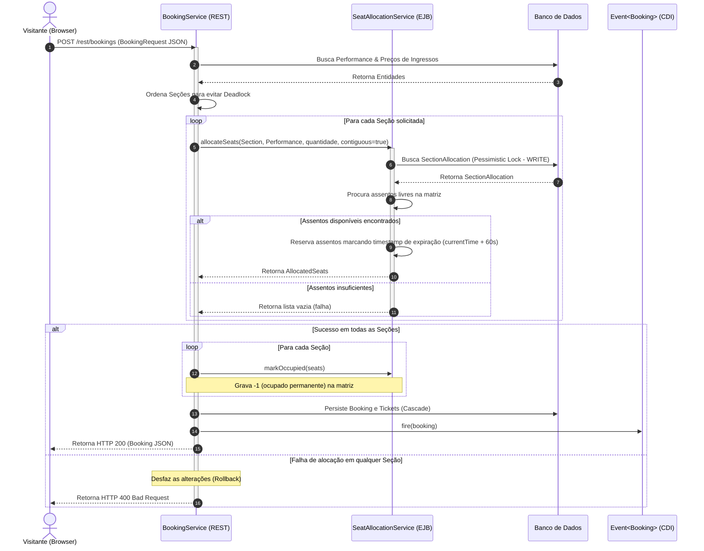
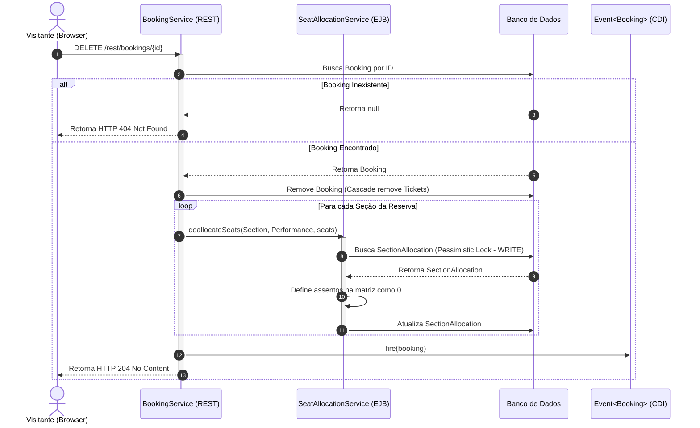
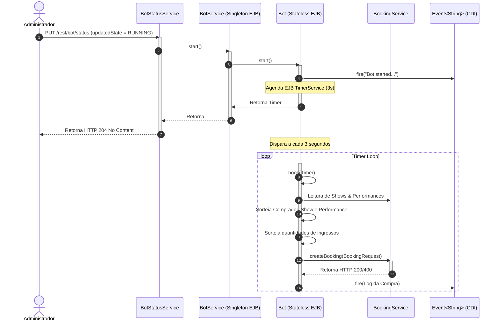
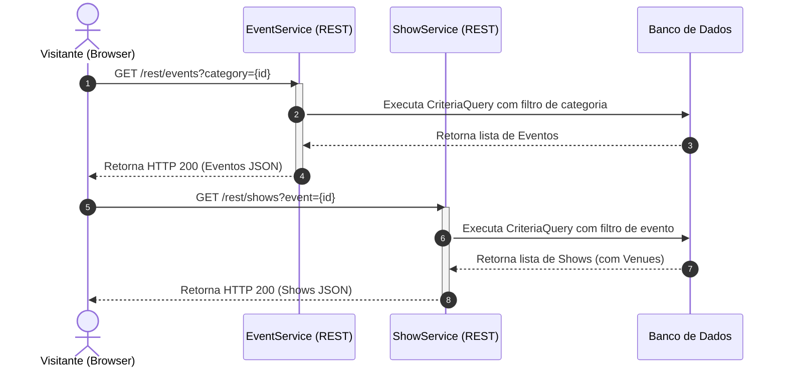
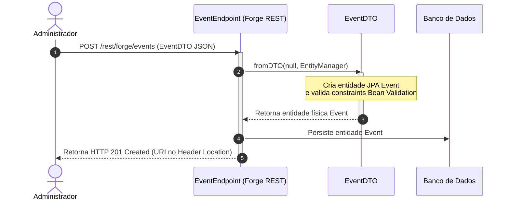
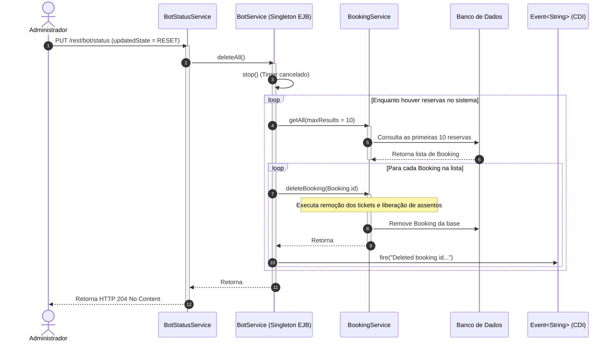

# Catálogo de Engenharia Reversa e Especificação Funcional — Sistema Legado "TicketMonster"

Este documento apresenta o levantamento técnico e funcional completo do sistema legado **TicketMonster** (`org.jboss.examples.ticketmonster`), obtido por meio de engenharia reversa do código-fonte (Java EE 6, Backbone.js, AngularJS 1.x). O documento serve como especificação funcional de referência e mapeamento do comportamento atual ("as-is") para subsidiar o processo de modernização arquitetural ("to-be").

---

# PARTE I: MAPEAMENTO ARQUITETURAL E ESTRUTURA DO SISTEMA

## 1. Mapeamento da Arquitetura Atual do Sistema
O sistema legado foi desenvolvido sob a especificação **Java EE 6 (Full Profile)**. Ele roda em um servidor de aplicação corporativo (originalmente JBoss EAP 6 / WildFly) e utiliza os seguintes padrões e frameworks arquiteturais no backend:
* **Injeção de Dependência e Desacoplamento:** CDI 1.0 (Contexts and Dependency Injection).
* **Camada Transacional e Serviços:** EJB 3.1 (Enterprise JavaBeans) utilizando declaração `@Stateless` para transações de banco de dados e `@Singleton` para gerenciamento centralizado de estado (ex. Bot).
* **Camada de Persistência:** JPA 2.0 (Java Persistence API) com Hibernate 4.x como provedor.
* **Camada de Validação:** Bean Validation 1.0 (JSR-303).
* **Camada de API REST:** JAX-RS 1.1 para exposição de endpoints HTTP JSON.
* **Banco de Dados:** Conexão JTA configurada com o datasource JNDI `java:jboss/datasources/ticket-monsterDS` (com suporte a H2 em desenvolvimento e MySQL/PostgreSQL em produção).

```
┌────────────────────────────────────────────────────────────────────────────────┐
│                             CAMADA DE APRESENTAÇÃO                             │
│                                                                                │
│  ┌───────────────────────────┐   ┌──────────────────────────┐   ┌───────────┐  │
│  │    Site Público (SPA)     │   │  Painel Admin AngularJS   │   │ App Mob.  │  │
│  │   Backbone.js / jQuery    │   │  (Scaffold JBoss Forge)  │   │ (Cordova) │  │
│  └─────────────┬─────────────┘   └────────────┬─────────────┘   └─────┬─────┘  │
└────────────────┼──────────────────────────────┼───────────────────────┼────────┘
                 │                              │                       │
                 │ HTTP (JAX-RS /rest/*)        │ HTTP (JAX-RS forge/*) │ HTTP
                 ▼                              ▼                       ▼
┌────────────────────────────────────────────────────────────────────────────────┐
│                               CAMADA DE API REST                               │
│                                                                                │
│        ┌───────────────────────────┐          ┌──────────────────────────┐     │
│        │ Endpoints Públicos        │          │ Endpoints Administrativos│     │
│        │ (Events, Bookings, etc.)  │          │ (Forge e CRUDs Diretos)  │     │
│        └─────────────┬─────────────┘          └────────────┬─────────────┘     │
└──────────────────────┼─────────────────────────────────────┼───────────────────┘
                       │                                     │
                       ▼                                     ▼
┌────────────────────────────────────────────────────────────────────────────────┐
│                              CAMADA DE SERVIÇOS                                │
│                                                                                │
│    ┌─────────────────────────┐  ┌────────────────────────┐  ┌──────────────┐   │
│    │  SeatAllocationService  │  │   BotService & Bot     │  │ MediaManager │   │
│    │ (Alocação de Assentos)  │  │  (Simulador de Carga)  │  │ (Cache Míd.) │   │
│    └─────────────┬───────────┘  └────────────┬───────────┘  └──────┬───────┘   │
└──────────────────┼───────────────────────────┼─────────────────────┼───────────┘
                   │                           │                     │
                   ▼                           ▼                     ▼
┌────────────────────────────────────────────────────────────────────────────────┐
│                            MODELO DE DADOS E JPA                               │
│                                                                                │
│   ┌────────────────────────────────────────────────────────────────────────┐   │
│   │  Entidades JPA 2.0 (Mapeamento Objeto-Relacional)                      │   │
│   │  Locks Pessimistas (DB level) / Locks Otimistas (@Version)             │   │
│   └────────────────────────────────────────────────────────────────────────┘   │
└────────────────────────────────────────────────────────────────────────────────┘
```

## 2. Módulos Existentes do Legado
1. **Módulo Web Front-End Comprador (Desktop/Mobile):**
   * Localizado em `demo/src/main/webapp/resources`.
   * SPA baseada em Backbone.js, RequireJS para carregamento assíncrono de módulos, Underscore.js para templates HTML estruturados, e jQuery Mobile para estilização responsiva adaptada a celulares.
2. **Módulo Web Front-End Administrativo:**
   * Localizado em `demo/src/main/webapp/admin`.
   * SPA construída com AngularJS 1.x e Bootstrap CSS, gerada automaticamente pelo JBoss Forge.
3. **Módulo Mobile Nativo Híbrido:**
   * Localizado em `cordova/`.
   * Projeto para encapsulamento da interface pública em aplicações nativas Android/iOS via Apache Cordova.
4. **Módulo de Serviços e Negócio (Backend JAR/WAR):**
   * Localizado em `demo/src/main/java/org/jboss/examples/ticketmonster`.
   * Agrupa os pacotes de modelo (`model`), endpoints REST (`rest`), serviços corporativos (`service`), DTOs gerados para o admin (`rest/dto`) e utilitários (`util`).

## 3. Atores do Sistema
* **Visitante / Comprador (Não Autenticado):** Usuário do canal de vendas público. Navega no catálogo, visualiza disponibilidade e executa reservas de ingressos.
* **Administrador (Não Autenticado):** Usuário do painel administrativo. Possui privilégios para executar operações de CRUD em todas as entidades do sistema.
* **Sistema / Bot (Automatizado):** Processo em background simulando compras frequentes para fins de demonstração.

## 4. Dependências entre Módulos e Componentes
* **Acoplamento de Serviços:**
  * `BookingService` $\rightarrow$ `SeatAllocationService` para alocar e desalocar assentos.
  * `Bot` $\rightarrow$ `ShowService` e `BookingService` para obter shows e simular compras.
  * `BotService` $\rightarrow$ `Bot` para start/stop e `BookingService` para resetar as reservas.
  * `MediaService` $\rightarrow$ `MediaManager` para resolver imagens.
* **Fluxo de Dados REST $\rightarrow$ Banco de Dados:**
  * Endpoints públicos utilizam os EJBs de serviço para persistência e lock.
  * Endpoints administrativos gerados pelo Forge injetam diretamente o `EntityManager` para persistir os DTOs convertidos de e para entidades JPA.

---

# PARTE II: MODELAGEM DO DOMÍNIO E ENTIDADES

## 5. Domínios de Negócio (Bounded Contexts)
* **Subdomínio Core: Catálogo de Espetáculos (Catalog):** Compreende o cadastro e exibição de eventos (`Event`, `EventCategory`), locais físicos (`Venue`, `Section`) e ativos de divulgação (`MediaItem`).
* **Subdomínio Core: Agenda e Calendário (Scheduling):** Associa eventos aos locais (`Show`) e define suas respectivas apresentações temporais (`Performance`).
* **Subdomínio Core: Inventário e Precificação (Ticketing & Pricing):** Define assentos físicos (`Seat`), regras de precificação (`TicketPrice`, `TicketCategory`) e o mapa dinâmico de ocupação de assentos (`SectionAllocation`).
* **Subdomínio Core: Vendas e Reservas (Sales & Booking):** Lida com o ciclo transacional de reservas (`Booking`), emissão de ingressos (`Ticket`) e cancelamentos.
* **Subdomínio de Apoio: Simulação e Métricas (Telemetry):** Painel de telemetria de vendas (`MetricsService`) e simulação automática de carga (`BotService`).

## 6. Entidades de Negócio Relevantes
Abaixo são detalhadas as entidades físicas do banco de dados e seus papéis funcionais:

* **EventCategory (`model/EventCategory.java`):** Categoria do evento (Teatro, Show, Concerto).
* **Event (`model/Event.java`):** Atração ou show conceitual.
* **MediaItem (`model/MediaItem.java`):** Imagem associada a eventos/venues.
* **Venue (`model/Venue.java`):** Espaço físico que sedia shows.
* **Address (`model/Address.java`):** Objeto de valor (Value Object) embutido no local.
* **Section (`model/Section.java`):** Setor físico dentro do local.
* **Seat (`model/Seat.java`):** Coordenada física (fileira e número do assento) embutida nos tickets.
* **Show (`model/Show.java`):** Espetáculo agendado em um Venue.
* **Performance (`model/Performance.java`):** Sessão em data/hora específica do Show.
* **TicketCategory (`model/TicketCategory.java`):** Tipo de tarifa (Adulto, Meia, Infantil).
* **TicketPrice (`model/TicketPrice.java`):** Preço de cada categoria tarifária por seção e show.
* **SectionAllocation (`model/SectionAllocation.java`):** Mapa dinâmico de alocação de assentos.
* **Ticket (`model/Ticket.java`):** Bilhete individual vinculando assento, tarifa e preço.
* **Booking (`model/Booking.java`):** Compra que agrupa múltiplos tickets.

## 7. Eventos Importantes do Domínio
O sistema utiliza eventos do **CDI (Contexts and Dependency Injection)** em memória para comunicação assíncrona/desacoplada:
1. **Reserva Criada (`newBookingEvent` - Qualificador `@Created`):** Disparado em [BookingService.java](file:///e:/develop/repos/java-projects/ticket-monster/demo/src/main/java/org/jboss/examples/ticketmonster/rest/BookingService.java#L204) após salvar uma reserva com sucesso.
2. **Reserva Cancelada (`cancelledBookingEvent` - Qualificador `@Cancelled`):** Disparado em [BookingService.java](file:///e:/develop/repos/java-projects/ticket-monster/demo/src/main/java/org/jboss/examples/ticketmonster/rest/BookingService.java#L107) após excluir a reserva e liberar assentos.
3. **Log do Simulador (`event` - Qualificador `@BotMessage`):** Disparado pelo [Bot.java](file:///e:/develop/repos/java-projects/ticket-monster/demo/src/main/java/org/jboss/examples/ticketmonster/service/Bot.java#L119) e capturado pelo [BotService.java](file:///e:/develop/repos/java-projects/ticket-monster/demo/src/main/java/org/jboss/examples/ticketmonster/service/BotService.java#L93) para alimentar o log de 50 mensagens.

---

# PARTE III: FLUXOS, PROCESSOS E INTEGRAÇÕES

## 8. Fluxos de Negócio
1. **Fluxo de Compra de Ingressos:** Escolha do evento, local, performance, seleção da quantidade por tarifa, preenchimento do e-mail de contato, alocação de assentos pelo sistema e confirmação.
2. **Fluxo de Cancelamento de Compra:** O usuário fornece o ID da reserva, o sistema remove a reserva, os ingressos e desaloca os assentos na matriz física da seção.
3. **Fluxo de Carga e Demonstração:** Acionamento do simulador em background que cria reservas consecutivas a cada 3 segundos.

## 9. Processos Executados pelo Sistema
* **Processo de Alocação de Assentos (Lógica de Negócio em [SectionAllocation.java](file:///e:/develop/repos/java-projects/ticket-monster/demo/src/main/java/org/jboss/examples/ticketmonster/model/SectionAllocation.java#L171)):**
  * O sistema lê a matriz `long[][] allocated` onde cada célula é indexada por `[linha][assento]`.
  * Se `contiguous = true`, o sistema busca sequências lineares livres onde o timestamp gravado é menor que o horário do sistema (`System.currentTimeMillis()`).
  * Ao reservar temporariamente, atualiza os valores da célula para `System.currentTimeMillis() + 60000` (reserva temporária de 60 segundos).
  * Ao confirmar, chama `markOccupied` gravando `-1` (ocupado permanente).
* **Processo de Travamento Concorrente:**
  * O [SeatAllocationService.java](file:///e:/develop/repos/java-projects/ticket-monster/demo/src/main/java/org/jboss/examples/ticketmonster/service/SeatAllocationService.java#L61) bloqueia a linha da tabela `SectionAllocation` usando `LockModeType.PESSIMISTIC_WRITE` para evitar que reservas concorrentes vendam a mesma poltrona.
* **Processo de Cache e Injeção de Fallback de Mídias:**
  * O [MediaManager.java](file:///e:/develop/repos/java-projects/ticket-monster/demo/src/main/java/org/jboss/examples/ticketmonster/service/MediaManager.java#L104) tenta carregar imagens externas. Se falhar, substitui síncronamente pela imagem `not_available.jpg`.
* **Processo de Exclusão Recursiva em Lote (Bot Reset):**
  * O [BotService.java](file:///e:/develop/repos/java-projects/ticket-monster/demo/src/main/java/org/jboss/examples/ticketmonster/service/BotService.java#L73) para o bot e deleta reservas em blocos de 10 por transação para evitar estouro de log transacional.

## 10. Integrações com Sistemas Externos
* **Módulo de Mídia (HTTP/1.1):** O `MediaManager` realiza requisições HTTP (`java.net.URLConnection`) externas para download e validação das imagens dos eventos.
* **Banco de Dados (JTA/JDBC):** Integração externa com o SGBD PostgreSQL/MySQL configurado no servidor JBoss através da API JTA.

---

# PARTE IV: REGRAS DE NEGÓCIO E VALIDAÇÕES

## 11. Todas as Regras de Negócio Existentes (Extração)

| # | Regra de Negócio | Evidência no Código | Classe / Método |
|---|---|---|---|
| **RN01** | O nome do evento deve ser único. | `@Column(unique = true)` | `model/Event.java` |
| **RN02** | O nome de um evento deve ter entre 5 e 50 caracteres. | `@Size(min = 5, max = 50)` | `model/Event.java` |
| **RN03** | A descrição de um evento deve ter entre 20 e 1000 caracteres. | `@NotNull @Size(min = 20, max = 1000)` | `model/Event.java` |
| **RN04** | Todo evento deve pertencer a uma categoria de evento. | `category` com `@NotNull` | `model/Event.java` |
| **RN05** | A imagem de um evento é opcional. | Campo `mediaItem` sem `@NotNull` | `model/Event.java` |
| **RN06** | A descrição da categoria de evento é única e não nula. | `@Column(unique=true) @NotEmpty` | `model/EventCategory.java` |
| **RN07** | O nome de um local (Venue) deve ser único e não vazio. | `@Column(unique = true) @NotEmpty` | `model/Venue.java` |
| **RN08** | Um Show representa a associação única entre Event e Venue. | `@UniqueConstraint(columnNames={"event_id","venue_id"})` | `model/Show.java` |
| **RN09** | Toda Performance tem data/hora obrigatória e show associado. | `@NotNull` em `date` e `show` | `model/Performance.java` |
| **RN10** | Não pode haver duas performances do mesmo show na mesma data/hora. | `@UniqueConstraint(columnNames={"date","show_id"})` | `model/Performance.java` |
| **RN11** | O nome de uma seção deve ser único no mesmo local (Venue). | `@UniqueConstraint(columnNames={"name","venue_id"})` | `model/Section.java` |
| **RN12** | A capacidade de uma seção é fileiras × capacidade por fileira. | `Section.getCapacity()` | `model/Section.java` |
| **RN13** | O preço é definido pela união de Show + Seção + Categoria. | `@UniqueConstraint(columnNames={"section_id","show_id","ticketcategory_id"})` | `model/TicketPrice.java` |
| **RN14** | A descrição da categoria de ingresso deve ser única. | `@Column(unique = true) @NotEmpty` | `model/TicketCategory.java` |
| **RN15** | Uma reserva deve conter no mínimo 1 ingresso. | `@NotEmpty` na coleção `tickets` | `model/Booking.java` |
| **RN16** | O e-mail de contato da reserva deve ser válido e preenchido. | `@NotEmpty @Email` | `model/Booking.java` |
| **RN17** | O preço cobrado no ingresso deve corresponder ao `TicketPrice` ativo. | Atribuição direta em `createBooking` | `rest/BookingService.java` |
| **RN18** | IDs de categoria de preço duplicados na mesma reserva são proibidos. | `getUniquePriceCategoryIds()` lança exceção | `rest/BookingRequest.java` |
| **RN19** | O total de uma reserva é a soma de todos os ingressos. | `Booking.getTotalTicketPrice()` | `model/Booking.java` |
| **RN20** | O sistema tenta alocar assentos contíguos por padrão. | Chamada `allocateSeats(..., true)` | `rest/BookingService.java` |
| **RN21** | Se a alocação falhar em qualquer seção, a reserva inteira é rejeitada. | Validação de `failedSections` em `createBooking` | `rest/BookingService.java` |
| **RN22** | O processo de alocação de assentos utiliza lock pessimista por seção. | `entityManager.lock(..., LockModeType.PESSIMISTIC_WRITE)` | `service/SeatAllocationService.java` |
| **RN23** | Reservas temporárias expiram automaticamente após 60 segundos. | `EXPIRATION_TIME = 60 * 1000` | `model/SectionAllocation.java` |
| **RN24** | Ao confirmar, os assentos alocados mudam para ocupado permanente. | `markOccupied` grava `-1` na célula | `model/SectionAllocation.java` |
| **RN25** | Quantidade a alocar deve ser positiva. | Valida se `size <= 0` e lança exceção | `model/SectionAllocation.java` |
| **RN26** | Não é permitido liberar um assento não ocupado. | `deallocate` lança `SeatAllocationException` | `model/SectionAllocation.java` |
| **RN27** | Ao cancelar a reserva, os assentos dos ingressos são liberados. | Processo de exclusão de tickets em `deleteBooking` | `rest/BookingService.java` |
| **RN28** | Assentos de uma desalocação em lote devem pertencer à mesma seção. | Validações em `deallocateSeats` | `service/SeatAllocationService.java` |
| **RN29** | O código de cancelamento é gerado fixo como `"abc"`. | `booking.setCancellationCode("abc")` | `rest/BookingService.java` |
| **RN30** | O código de cancelamento não é validado na exclusão. | Método `deleteBooking` sem validação de hash/código | `rest/BookingService.java` |
| **RN31** | O painel de métricas ignora shows sem performances futuras. | Query com `p.date > current_timestamp` | `rest/MetricsService.java` |
| **RN32** | A contagem de ocupação de métricas ignora reservas passadas. | Query filtrando data maior que o tempo atual | `rest/MetricsService.java` |
| **RN33** | Painel de métricas é exclusivamente de leitura. | Somente método `@GET` exposto no serviço | `rest/MetricsService.java` |
| **RN34** | O tipo de mídia suportado é um conjunto fechado (enum: IMAGE). | Tipo armazenado como String na base | `model/MediaType.java` |
| **RN35** | Na falha de mídia, exibe imagem padrão `not_available.jpg`. | `createPath` com fallback local | `service/MediaManager.java` |
| **RN36** | Arquivos de imagem cacheados no disco são nomeados com a *codificação* Base64 (não é uma função de hash) da URL original. | `getCachedFileName` com `Base64.encodeToString` | `service/MediaManager.java` |
| **RN37** | A URL do item de mídia deve ser única e válida. | `@Column(unique = true) @URL` | `model/MediaItem.java` |
| **RN38** | O Bot limita a 100 ticket requests e 100 tickets por request. | Constantes `MAX_TICKET_REQUESTS`, `MAX_TICKETS_PER_REQUEST` | `service/Bot.java` |
| **RN39** | O Bot executa compras em background a cada 3 segundos. | `DURATION = 3000` via TimerService | `service/Bot.java` |
| **RN40** | O log de atividades do Bot mantém as últimas 50 mensagens. | CircularBuffer de tamanho 50 na memória da JVM | `service/BotService.java` |
| **RN41** | O comando RESET do Bot limpa a base deletando reservas de 10 em 10. | `deleteAll` com query parametrizada em lote | `service/BotService.java` |
| **RN42** | Paginação pública usa base 1; paginação administrativa usa base 0. | Conversão `firstRecord = first - 1` vs `startPosition` | `rest/BaseEntityService.java` vs endpoints DTO |

## 12. Todas as Validações de Negócio (Bean Validation e Regras Físicas)
* **Validações de Coordenada de Assento:** `Seat.rowNumber` e `Seat.number` marcados com `@Min(1)` para barrar valores nulos ou negativos.
* **Validação Sintática de E-mail:** `Booking.contactEmail` validado com `@Email(message = "Not a valid email format")` impedindo strings arbitrárias.
* **Validação de URL de Mídia:** `MediaItem.url` anotado com `@URL` obrigando estrutura HTTP/HTTPS.
* **Duplicação de Tarifas em Reserva:** `BookingRequest` avalia se há duas solicitações para o mesmo `TicketPrice.id` na mesma requisição, impedindo a sobreposição de itens na transação.
* **Limites de Alocação de Assento:** `SectionAllocation.allocate` valida fisicamente se a coordenada solicitada ultrapassa a capacidade física da Seção cadastrada.

---

# PARTE V: FUNCIONALIDADES E HISTÓRIAS DE USUÁRIO

## 13. Funcionalidades Implementadas
1. **Navegação Pública de Catálogo:** Consulta e detalhamento de eventos, venues e shows cadastrados.
2. **Reserva Autogerenciada:** Alocação de assentos de forma contígua em tempo real.
3. **Cancelamento de Venda:** Exclusão de reservas pelo visitante liberando poltronas.
4. **Painel de Ocupação:** Dashboard dinâmico exibindo percentual de ingressos vendidos de shows futuros.
5. **Simulador de Carga:** Disparo em lote de ordens de compra automáticas de teste.
6. **CRUD Geral de Entidades:** Gestão total de cadastros via interface administrativa AngularJS.
7. **Reset Geral de Dados:** Botão de limpeza de transações de venda do banco de dados.

## 14. Consolidação de Funcionalidades Semelhantes ou Duplicadas
* **Duplicidade de Rotas CRUD:**
  * Para as entidades principais (`Booking`, `Event`, `Show`, `Venue`), existem dois conjuntos de APIs concorrentes:
    1. Os endpoints públicos (`rest/bookings`, etc.) herdados de `BaseEntityService`.
    2. Os endpoints administrativos do Forge (`rest/forge/bookings`, etc.), efetivamente usados pelo painel Angular (confirmado em `admin/scripts/services/BookingFactory.js`, `EventFactory.js`, `ShowFactory.js`, `VenueFactory.js`, que apontam para `../rest/forge/...`).
  * *Divergência de comportamento (não apenas de rota):* `BookingEndpoint.create()` (Forge, usado pelo admin) persiste a entidade diretamente via `em.persist(entity)`, **sem** passar por `SeatAllocationService`, sem validar duplicidade de categoria de tarifa (`getUniquePriceCategoryIds`) e sem disparar o evento CDI `@Created`. Já `BookingService.createBooking()` (usado pelo comprador) executa toda a lógica de alocação de assentos. Ou seja, uma reserva criada pelo admin pode referenciar tickets/assentos que nunca passaram pela matriz de alocação de `SectionAllocation`, gerando inconsistência de estoque entre o que o admin cadastra manualmente e o que o motor de vendas público controla.
  * *Modernização necessária:* Consolidar em uma única API controlada por papéis de autenticação, garantindo que toda criação de `Booking` (inclusive via admin) passe pela mesma regra de alocação de assentos.

## 15. Lista Completa de Histórias de Usuário (Apenas Listagem)
* **Apresentação & Vendas (Visitante):**
  * **US01:** Listar eventos em cartaz no catálogo.
  * **US02:** Filtrar eventos catalogados por categoria de interesse.
  * **US03:** Visualizar informações detalhadas de um evento específico.
  * **US04:** Consultar lista de locais de espetáculo (venues) disponíveis.
  * **US05:** Visualizar detalhes geográficos e capacidade física de um local (venue).
  * **US06:** Visualizar a agenda de shows de um determinado evento ou local.
  * **US07:** Selecionar uma sessão/performance ativa (data/hora) de um show.
  * **US08:** Escolher assentos em uma seção indicando quantidades por tipo de tarifa.
  * **US09:** Informar e-mail de contato para formalização da reserva.
  * **US10:** Efetuar a compra de múltiplos ingressos em lote sob uma única reserva.
  * **US11:** Receber alocação automática otimizada de assentos contíguos na seção escolhida.
  * **US12:** Receber notificação de erro em caso de esgotamento ou indisponibilidade de assentos contíguos.
  * **US13:** Visualizar a tela de confirmação de reserva bem-sucedida.
  * **US14:** Consultar e-mail e dados básicos de reservas anteriores.
  * **US15:** Visualizar o detalhamento completo de ingressos de uma reserva por ID.
  * **US16:** Cancelar uma reserva ativa liberando os assentos para o estoque.
  * **US17:** Acessar o catálogo e efetuar reservas através de interface móvel.
* **Administração Geral (Administrador):**
  * **US18:** Gerenciar o cadastro de eventos (CRUD).
  * **US19:** Gerenciar o catálogo de categorias/gêneros de eventos (CRUD).
  * **US20:** Gerenciar locais físicos de eventos (Venues) (CRUD).
  * **US21:** Gerenciar o layout de seções de um Venue (CRUD).
  * **US22:** Agendar temporadas de espetáculos (Shows) relacionando Eventos e Venues (CRUD).
  * **US23:** Agendar sessões individuais (Performances) com datas e horários para os Shows (CRUD).
  * **US24:** Configurar modalidades de tarifa (TicketCategory) para os espetáculos (CRUD).
  * **US25:** Configurar a tabela de valores de ingressos (TicketPrice) por show, seção e tarifa (CRUD).
  * **US26:** Gerenciar o catálogo de imagens de divulgação (MediaItem) para venues e eventos (CRUD).
  * **US27:** Visualizar e gerenciar ingressos individuais emitidos no sistema (CRUD).
  * **US28:** Consultar e gerenciar todas as reservas ativas no sistema via painel de controle (CRUD).
  * **US29:** Auditar e gerenciar mapas de alocação de seções física e individualmente (CRUD).
  * **US30:** Visualizar painel consolidado com a contagem total de registros de cada entidade.
  * **US31:** Navegar por listagens completas paginadas das entidades de administração.
  * **US32:** Acompanhar o painel de monitoramento de ocupação em tempo real.
  * **US33:** Lançar robô simulador de vendas automáticas (Bot).
  * **US34:** Interromper o funcionamento do simulador de carga de reservas.
  * **US35:** Visualizar o histórico de logs efetuados pelo simulador.
  * **US36:** Reinicializar o ambiente de demonstração limpando todas as reservas e dados transacionais.
* **Serviços de Infraestrutura (Sistema):**
  * **US37:** Executar lock concorrente exclusivo na alocação de assentos para evitar overbooking.
  * **US38:** Descartar reservas temporárias expiradas liberando posições físicas após 60 segundos.
  * **US39:** Retornar assentos ao catálogo de vendas imediatamente após o processamento de um cancelamento.
  * **US40:** Cachear mídia de imagem remota em disco local para otimizar tempo de resposta.
  * **US41:** Injetar imagem padrão (fallback) quando arquivos de mídia cadastrados forem inválidos ou inacessíveis.
  * **US42:** Validar dados de entrada via Bean Validation retornando mensagens de erro padronizadas.

---

# PARTE VI: DIAGRAMAS DE SEQUÊNCIA NEGOCIAIS

## 16. Diagramas de Sequência para Todas as Funcionalidades Principais

### 16.1 Fluxo de Criação de Reserva de Ingressos (Booking)


### 16.2 Fluxo de Cancelamento de Reserva


### 16.3 Fluxo de Execução do Simulador de Cargas (Bot)


### 16.4 Fluxo de Consulta de Eventos e Shows (Catálogo Público)


### 16.5 Fluxo de Operações de CRUD do Painel Administrativo


### 16.6 Fluxo de Reset do Simulador (Bot Reset e Remoção em Massa)
