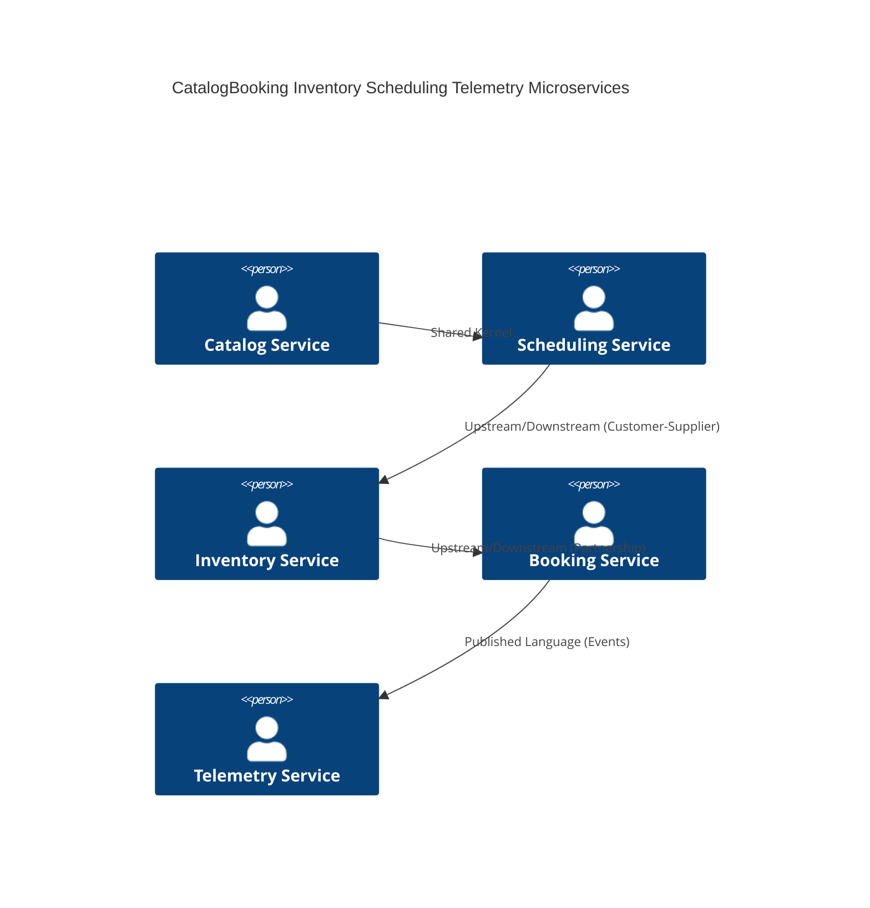
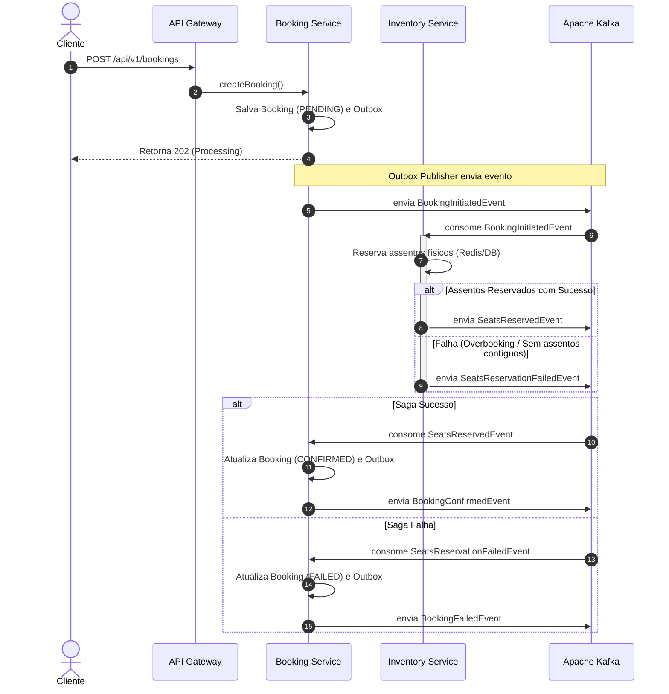
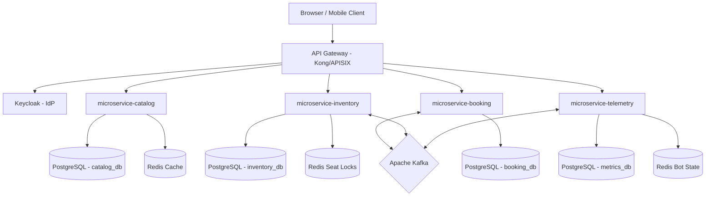
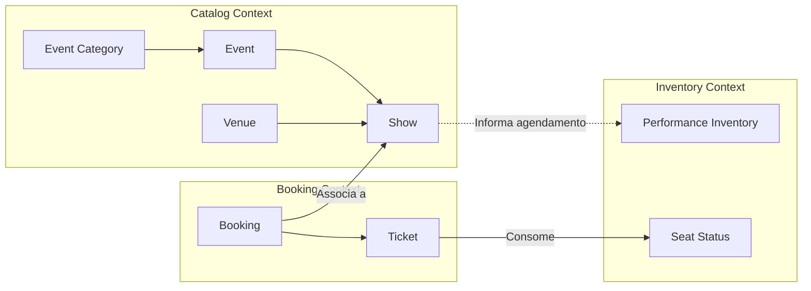
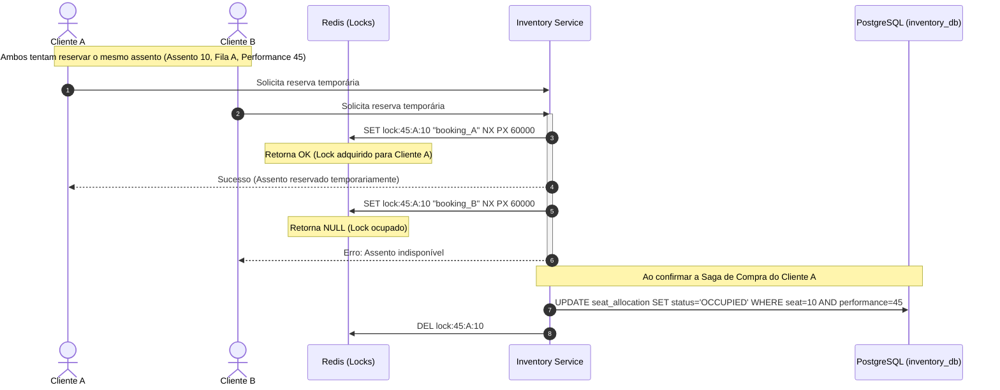

# Arquitetura de Referência e Plano de Modernização — TicketMonster

Este documento apresenta a especificação técnica e o projeto da nova arquitetura de referência para a modernização do sistema legado **TicketMonster**. O sistema foi redesenhado a partir do estado atual ("as-is") de um monolito Java EE 6 para um estado futuro ("to-be") baseado em microsserviços reativos com Quarkus, Java 21, mensageria reativa com Kafka, e cache distribuído com Redis.

---

## 1. Resumo Executivo

O projeto de modernização do **TicketMonster** visa transformar uma aplicação monolítica legada (Java EE 6, Backbone.js, EJB 3.1) em uma plataforma escalável, resiliente e de alto desempenho baseada em microsserviços na nuvem. A nova arquitetura utiliza o **Quarkus 3.27+** com **Java 21**, adotando programação reativa (Mutiny) e orientada a eventos (EDA).

Os principais objetivos de negócio e técnicos alcançados com esta proposta são:
1. **Escalabilidade Linear:** Eliminação de gargalos transacionais centralizados para suportar picos de carga (ex.: abertura de vendas de shows populares).
2. **Resiliência e Alta Disponibilidade:** Isolamento de falhas por meio de microsserviços desacoplados e padrões como Saga, Outbox e Circuit Breaker.
3. **Redução de Custos Operacionais (Cloud-First):** Otimização do consumo de recursos de container com compilação nativa (GraalVM) fornecida pelo Quarkus.
4. **Segurança Corporativa:** Integração com provedores de identidade modernos usando OAuth2 e OIDC.

---

## 2. Análise da Aplicação Atual

A análise por engenharia reversa do código-fonte legado revelou a seguinte estrutura e lógica de negócio:
* **Entidades e Relacionamentos:** O sistema gerencia o catálogo de eventos (`Event`, `EventCategory`), os locais físicos (`Venue`, `Section`), o agendamento (`Show`, `Performance`), a precificação (`TicketPrice`, `TicketCategory`) e a emissão/reserva de ingressos (`Booking`, `Ticket`).
* **Lógica de Alocação de Assentos:** Implementada em `SectionAllocation` e `SeatAllocationService`. A alocação verifica assentos contíguos livres em uma matriz bidimensional `long[][] allocated` persistida como um campo `@Lob` binário no banco de dados.
* **Mecanismos de Sincronismo e Eventos:** Uso de `@Inject Event<Booking>` do CDI em memória para disparar fluxos secundários (ex.: logging e notificações).
* **Simulador de Carga (Bot):** Um EJB `@Singleton` centralizado (`BotService` e `Bot`) executa reservas periódicas na mesma JVM.

---

## 3. Diagnóstico Arquitetural

A arquitetura atual apresenta severas limitações técnicas que impedem o crescimento da aplicação:

1. **Gargalo Crítico de Concorrência (Pessimistic Lock na Seção):**
   * **Problema:** No [SeatAllocationService.java](file:///e:/develop/repos/java-projects/ticket-monster/demo/src/main/java/org/jboss/examples/ticketmonster/service/SeatAllocationService.java#L61), o método `retrieveSectionAllocationExclusively` realiza um lock pessimista de escrita (`LockModeType.PESSIMISTIC_WRITE`) na entidade `SectionAllocation`.
   * **Impacto:** Como cada show e performance possui apenas um `SectionAllocation` por seção física, o banco de dados serializa o processo de alocação de poltronas de toda a seção. Se 100 usuários tentam comprar assentos diferentes na mesma seção, a vazão cai drasticamente, gerando timeouts de conexão e sobrecarga no SGBD.
2. **Uso Indevido de Campos Grandes (`@Lob`) para Matriz de Assentos:**
   * **Problema:** A ocupação das poltronas é gravada como um array serializado de bytes (`long[][] allocated`) no PostgreSQL/H2 (conforme visto em [SectionAllocation.java:110](file:///e:/develop/repos/java-projects/ticket-monster/demo/src/main/java/org/jboss/examples/ticketmonster/model/SectionAllocation.java#L110)).
   * **Impacto:** Não é possível realizar consultas indexadas via SQL para descobrir poltronas livres. O microsserviço precisa carregar o blob inteiro na memória da JVM, desserializar o array, efetuar a lógica iterativa de busca de gap (`findFreeGapStart`), serializar a matriz alterada e gravá-la de volta. Isso consome CPU e banda de rede de forma desnecessária, além de arriscar a corrupção do estado da seção em falhas de escrita.
3. **Acoplamento em Memória dos Eventos (CDI Events):**
   * **Problema:** Comunicação de negócios (criação e cancelamento de reservas) baseada em eventos do CDI dentro do mesmo processo JVM.
   * **Impacto:** Impede a execução distribuída. Se a aplicação foi escalada para duas réplicas, os eventos disparados na Réplica A não serão escutados pelos consumidores na Réplica B.
4. **Acoplamento de Mídia Síncrono:**
   * **Problema:** O `MediaManager` faz requisições HTTP externas síncronas bloqueando threads de I/O em caso de falha de download.
5. **Acoplamento das APIs de Administração e Públicas:**
   * **Problema:** Duplicação de endpoints CRUD (ex.: `rest/bookings` vs `rest/forge/bookings`) sem validação de papéis de acesso (RBAC).

---

## 4. Modelo de Domínio (DDD)

Para o novo sistema reestruturado em DDD, o modelo de domínio foi decomposto em Agregados coesos, definindo responsabilidades claras:

* **Agregado Event (Catalog Context):**
  * **Root Entity:** `Event` (Identificador único, nome exclusivo, descrição, categoria associada).
  * **Value Objects:** `EventCategory` (classificação), `MediaItem` (detalhes da imagem/banner).
* **Agregado Venue (Catalog Context):**
  * **Root Entity:** `Venue` (capacidade total, nome único).
  * **Entities:** `Section` (setor físico com quantidade de linhas e colunas).
  * **Value Objects:** `Address` (endereço físico do local).
* **Agregado Show (Scheduling Context):**
  * **Root Entity:** `Show` (associação única entre um `Event` e um `Venue`).
  * **Entities:** `Performance` (data e hora específicas de execução do Show).
* **Agregado Inventory Allocation (Inventory Context):**
  * **Root Entity:** `PerformanceInventory` (representa o estado atual de ocupação e reservas).
  * **Entities:** `SeatStatus` (status individual de cada assento: FREE, PENDING_LOCK, OCCUPIED, com timestamp e ID do comprador).
  * **Value Objects:** `Seat` (fileira e número do assento físico).
* **Agregado Booking (Sales Context):**
  * **Root Entity:** `Booking` (compra contendo status PENDING, CONFIRMED, CANCELLED, e-mail de contato, código de cancelamento e valor total).
  * **Entities:** `Ticket` (bilhete gerado que vincula um assento de uma seção a um preço cobrado).
  * **Value Objects:** `TicketCategory` (Adulto, Estudante), `TicketPrice` (tabela de preços associando seção e show).

---

## 5. Bounded Contexts

O Context Map do sistema moderno divide as fronteiras do domínio e estabelece os canais de integração:



* **Catalog Bounded Context (Core):** Define as regras do catálogo físico e artístico.
* **Scheduling Bounded Context (Core):** Gerencia o calendário temporal dos eventos.
* **Inventory Bounded Context (Core):** Controla o mapa dinâmico de assentos, reservas temporárias e preços.
* **Booking Bounded Context (Core):** Gerencia as transações de compra e faturamento de ingressos.
* **Telemetry & Simulator Context (Supporting):** Executa o robô simulador e monitora o volume de ocupação. Utiliza uma **Anti-Corruption Layer (ACL)** para traduzir eventos de reservas em métricas limpas.

---

## 6. Microsserviços Propostos

### 1. `microservice-catalog`
* **Responsabilidade:** Cadastro e exibição de eventos, venues, seções e shows.
* **Banco de Dados:** PostgreSQL (`catalog_db`). Altamente otimizado para leitura.
* **Redis Cache:** Cache-Aside para reduzir acessos ao banco para listagens públicas de eventos e estruturas de Venues.
* **APIs Expostas:** REST HTTP para consulta pública do catálogo e CRUD administrativo.
* **Dependências:** Nenhuma.

### 2. `microservice-inventory`
* **Responsabilidade:** Alocação de assentos físicos, controle de capacidade por performance e expiração de reservas temporárias.
* **Banco de Dados:** PostgreSQL (`inventory_db`) para persistência do estado permanente + Redis para controle de locks de assentos em tempo real.
* **APIs Expostas:** Reactive REST para verificar disponibilidade e solicitar bloqueio de assentos.
* **Eventos Consumidos:** `BookingInitiatedEvent` (para manter os assentos travados), `BookingConfirmedEvent` (para persistir a ocupação definitiva), `BookingCancelledEvent` / `BookingFailedEvent` (para liberar os assentos).
* **Dependências:** `microservice-catalog` (apenas para leitura de estrutura de seções via cache).

### 3. `microservice-booking`
* **Responsabilidade:** Gestão do ciclo de vida das reservas, validação do e-mail do cliente, emissão de tickets e orquestração do checkout.
* **Banco de Dados:** PostgreSQL (`booking_db`).
* **APIs Expostas:** REST endpoints para criação e cancelamento de bookings.
* **Eventos Publicados:** `BookingInitiatedEvent`, `BookingConfirmedEvent`, `BookingCancelledEvent`.
* **Outbox Pattern:** Utiliza a tabela de outbox na base de dados para garantir entrega de eventos ao Kafka com garantia de *at-least-once*.

### 4. `microservice-telemetry`
* **Responsabilidade:** Dashboards de monitoramento de vendas em tempo real e simulador de carga (Bot).
* **Banco de Dados:** PostgreSQL / TimescaleDB (`telemetry_db`) para histórico de métricas.
* **Redis:** Controle de estado do Bot (RUNNING, STOPPED) e buffer de logs rápidos.
* **APIs Expostas:** WebSockets / SSE para envio das métricas ao frontend.
* **Eventos Consumidos:** Todos os eventos de negócios publicados no Kafka.

---

## 7. APIs

### Endpoints Principais (API Gateway / V1)

#### Booking Service (`/api/v1/bookings`)
* **POST `/api/v1/bookings`:** Inicia uma nova reserva.
  * *Request Body:*
    ```json
    {
      "performanceId": 45,
      "email": "cliente@email.com",
      "ticketRequests": [
        { "ticketPriceId": 102, "quantity": 2 }
      ]
    }
    ```
  * *Response (202 Accepted):*
    ```json
    {
      "bookingId": "c53d9e8d-d6a1-432d-9eb5-8e3b5e40a1b0",
      "status": "PROCESSING",
      "createdAt": "2026-07-22T10:00:00Z"
    }
    ```
* **GET `/api/v1/bookings/{id}`:** Consulta o status atual da reserva.
* **DELETE `/api/v1/bookings/{id}`:** Solicita o cancelamento da reserva e liberação dos ingressos.

#### Inventory Service (`/api/v1/performances/{performanceId}/availability`)
* **GET `/api/v1/performances/{performanceId}/availability`:** Exibe mapa de assentos livres e ocupados.
  * *Query Params:* `sectionId=12`
  * *Response (200 OK):*
    ```json
    {
      "sectionId": 12,
      "availableSeats": [
        { "row": 1, "number": 5 },
        { "row": 1, "number": 6 }
      ]
    }
    ```

### Padrão de Erro (RFC 7807)
Erros de validação e negócios seguem a especificação de *Problem Details*:
```json
{
  "type": "https://ticketmonster.com/errors/insufficient-seats",
  "title": "Assentos Indisponíveis",
  "status": 400,
  "detail": "Não foi possível alocar 2 assentos contíguos na seção especificada.",
  "instance": "/api/v1/bookings"
}
```

---

## 8. Banco de Dados

### Modelagem da Alocação de Assentos Sem Blob
Para acabar com a contenção do lock pessimista e eliminar o arquivo `@Lob` (matriz binária), modelamos a tabela `seat_allocation` no PostgreSQL do `microservice-inventory`:

```sql
CREATE TABLE seat_allocation (
    id BIGSERIAL PRIMARY KEY,
    performance_id BIGINT NOT NULL,
    section_id BIGINT NOT NULL,
    row_number INT NOT NULL,
    seat_number INT NOT NULL,
    status VARCHAR(20) NOT NULL, -- FREE, RESERVED, OCCUPIED
    booking_id VARCHAR(50),
    locked_until TIMESTAMP,
    version BIGINT NOT NULL DEFAULT 0,
    CONSTRAINT uq_performance_seat UNIQUE (performance_id, section_id, row_number, seat_number)
);

CREATE INDEX idx_perf_sec_avail ON seat_allocation(performance_id, section_id) WHERE status = 'FREE';
```

### Estratégia de Migração e Versionamento
* **Ferramenta:** Liquibase integrado ao Quarkus.
* **Tática:** A tabela `seat_allocation` é populada automaticamente quando um Show/Performance é cadastrado (carga inicial de assentos livres baseada na capacidade da seção), evitando inserções dinâmicas pesadas no momento da compra.

---

## 9. Redis

O Redis é peça fundamental para a escalabilidade horizontal e resiliência:

1. **Cache de Catálogo (Cache-Aside):**
   * Chave: `catalog:event:{id}` e `catalog:shows:performance:{id}`.
   * TTL: 1 hora (600 segundos para eventos populares, invalidado via eventos de alteração de catálogo).
2. **Controle de Ocupação Temporária (Locks Rápidos):**
   * Quando o cliente seleciona assentos, o `microservice-inventory` cria chaves de bloqueio temporário no Redis:
     * Chave: `lock:seat:{performanceId}:{sectionId}:{row}:{number}`.
     * Valor: `bookingId`.
     * TTL: 60 segundos (tempo limite para finalização do pagamento/checkout).
   * **Benefício:** A verificação de disponibilidade e reserva temporária é feita em Redis de forma atômica (usando transações Redis ou scripts Lua), sem tocar no banco de dados relacional nesta etapa.
3. **Idempotência de Compras:**
   * Evita duplicidade de compras pelo clique duplo do usuário.
   * Chave: `idempotency:booking:{hash_requisicao}` com TTL de 30 segundos.

---

## 10. Comunicação entre Serviços

### Saga Baseada em Coreografia com Kafka

O processo de compra utiliza o padrão Saga Coreografada para garantir consistência eventual sem dependência síncrona:



### Padrão Transacional Outbox
Para evitar a perda de mensagens se o Kafka falhar durante a gravação no banco, o `microservice-booking` grava a reserva e o evento na mesma transação relacional usando a tabela `outbox_event`. Um worker reativo do Quarkus lê a tabela e publica no Kafka (usando Debezium ou polling reativo otimizado), marcando como processado após a confirmação do ACK do Kafka.

---

## 11. Arquitetura Reativa

O Quarkus utiliza o framework reativo **Mutiny** de forma nativa para todas as operações críticas:

* **Não Bloqueante (Non-blocking I/O):**
  * APIs REST expostas com RESTEasy Reactive.
  * Drivers de banco reativos (`quarkus-reactive-pg-client`). As conexões não bloqueiam a thread do Event Loop da CPU.
* **Uso de Uni e Multi:**
  * `Uni<Booking>` representa um resultado assíncrono único (ex.: buscar reserva por ID).
  * `Multi<String>` representa fluxos contínuos de dados (ex.: logs do Bot ou telemetria em tempo real).
* **Exemplo de Código Reativo (Mutiny):**
  ```java
  public Uni<Response> createBooking(BookingRequest request) {
      return bookingRepository.savePending(request)
          .flatMap(booking -> outboxRepository.saveEvent(new BookingInitiatedEvent(booking))
              .map(v -> Response.accepted(booking).build())
          )
          .onFailure().recoverWithItem(err -> Response.status(400).entity(new ErrorDTO(err.getMessage())).build());
  }
  ```

---

## 12. Observabilidade

A infraestrutura de observabilidade é implementada com **OpenTelemetry** integrada à Stack LGTM (Grafana, Loki, Tempo, Mimir):

* **Tracing Distribuído:**
  * O API Gateway gera o `traceparent` (Correlation ID) baseado no padrão W3C.
  * O `traceparent` é propagado em todas as chamadas HTTP e nos metadados (headers) das mensagens do Kafka.
  * Permite rastrear uma compra desde o clique no browser até a confirmação do inventário e gravação no banco.
* **Métricas Exportadas (Prometheus):**
  * Ingressos reservados por segundo.
  * Taxa de falhas de alocação de assentos.
  * Latência das transações de banco reativas.
  * Tamanho das filas de mensagens do Kafka.
* **Health Checks:**
  * `/q/health/live` e `/q/health/ready` expostos pelo Quarkus SmallRye Health para indicar o status da aplicação ao Kubernetes.

---

## 13. Segurança

O sistema adota o padrão moderno de arquitetura de segurança federada:

* **Identity Provider (IdP):** Keycloak integrado como servidor OIDC.
* **Autenticação:** O cliente se autentica no Keycloak e recebe um token **JWT**.
* **Autorização (RBAC):**
  * Chamadas públicas (/api/v1/events) não exigem token.
  * Chamadas de compra (/api/v1/bookings) exigem a role `ROLE_CUSTOMER`.
  * Chamadas de administração (/api/v1/admin/*) exigem a role `ROLE_ADMIN`.
* **Criptografia e Comunicação:**
  * TLS 1.3 obrigatório para comunicação entre containers (mTLS implementado via Service Mesh como Istio ou Linkerd).
  * Chaves e credenciais injetadas em variáveis de ambiente a partir de Kubernetes Secrets integrados com HashiCorp Vault.

---

## 14. Arquitetura Cloud First

A implantação foi desenhada para rodar em ambientes baseados em **Kubernetes** ou **Red Hat OpenShift**:

* **Imagens de Containers Otimizadas:**
  * Builds nativos via GraalVM gerando imagens Docker de poucos megabytes com tempo de inicialização (Startup Time) inferior a 50ms, facilitando o Auto Scaling.
* **Kubernetes HPA (Horizontal Pod Autoscaler):**
  * Escalabilidade configurada para reagir a picos de requisições por segundo (RPS) e lag de consumo de mensagens no Kafka.
* **Estratégias de Deploy:**
  * **Rolling Update:** Utilizada por padrão para atualizações de rotina sem indisponibilidade.
  * **Canary Deploy:** Utilizada na liberação do microsserviço de checkout (`microservice-booking`), direcionando 5% do tráfego para validar o comportamento antes da atualização completa.

---

## 15. Estratégia de Migração (Padrão Strangler Fig)

A migração será incremental, reduzindo o risco sistêmico. O monolito continuará em execução enquanto as partes forem substituídas:

### Fase 1: Desacoplamento do Catálogo e Frontend
* **Ação:** Criação do `microservice-catalog`. O frontend antigo Backbone/AngularJS é modificado para apontar rotas de leitura de catálogo para o novo microsserviço.
* **Sincronização:** Criação de um job CDC (Change Data Capture) via Debezium para manter as tabelas de eventos e venues sincronizadas entre o banco antigo e o banco do novo microsserviço.

### Fase 2: Modernização do Inventário (Eliminação do Lock Pessimista)
* **Ação:** Implantação do `microservice-inventory`. A lógica de alocação de assentos é migrada do monolito para a tabela `seat_allocation` no microsserviço e locks temporários no Redis são ativados.
* **Roteamento:** O API Gateway direciona rotas de `/rest/shows` e disponibilidade para este novo microsserviço.

### Fase 3: Modernização das Reservas (Implementação da Saga)
* **Ação:** Implantação do `microservice-booking`. O monolito deixa de processar compras. O padrão Saga Coreografada com Kafka entra em produção.

### Fase 4: Descomissionamento do Monolito
* **Ação:** Migração do painel administrativo para uma interface moderna (ex.: React/Quarkus Admin) consumindo as novas APIs seguras. Desligamento definitivo do servidor JBoss EAP legado.

---

## 16. Diagramas Mermaid

### 16.1 Arquitetura Geral do Sistema (To-Be)



### 16.2 Bounded Contexts e Integração de Eventos



### 16.3 Fluxo Físico de Reserva Concorrente (Sem Pessimistic DB Lock)



---

## 17. Architecture Decision Records (ADRs)

### ADR 01: Migração do Monolito Java EE 6 para Quarkus 3.27+
* **Status:** Aprovado.
* **Contexto:** O monolito legado depende de servidores JBoss antigos e Java EE 6, resultando em tempos altos de startup, alto consumo de memória e impossibilidade de escala reativa.
* **Decisão:** Adotar Quarkus 3.27+ com Java 21 como framework base de microsserviços.
* **Consequências:**
  * *Positivas:* Menor pegada de memória, inicialização quase instantânea, suporte excelente a desenvolvimento reativo (Mutiny) e compilação nativa.
  * *Negativas:* Necessidade de curva de aprendizado para a equipe em programação reativa.

### ADR 02: Substituição de Lock Pessimista por Locks Distribuídos com Redis
* **Status:** Aprovado.
* **Contexto:** O sistema original executava lock pessimista direto no banco na tabela inteira de ocupação (`SectionAllocation`), serializando as reservas.
* **Decisão:** Mapear os assentos de forma individualizada e realizar o bloqueio concorrente inicial de 60 segundos no Redis usando operações atômicas baseadas em chaves por assento.
* **Consequências:**
  * *Positivas:* Vazão de concorrência massiva. Vários usuários podem comprar poltronas da mesma seção ao mesmo tempo sem bloquear a tabela no PostgreSQL.
  * *Negativas:* Introdução de dependência do Redis no fluxo crítico de checkout.

### ADR 03: Decomposição de Banco de Dados (Database per Service)
* **Status:** Aprovado.
* **Contexto:** A persistência legada utiliza um único datasource compartilhado por todas as operações de CRUD.
* **Decisão:** Implementar bancos de dados independentes (PostgreSQL) para cada microsserviço (Catalog, Inventory, Booking e Telemetry).
* **Consequências:**
  * *Positivas:* Desacoplamento físico completo, permitindo alterações de schema em um serviço sem afetar os demais.
  * *Negativas:* Necessidade de orquestração eventual de dados (Sagas) para garantir consistência.

### ADR 04: Adoção do Padrão Saga para Orquestração de Reservas
* **Status:** Aprovado.
* **Contexto:** A criação de uma reserva exige alteração de estado em Booking (criação do ticket) e em Inventory (marcação de assento como ocupado). Com bancos separados, a consistência em duas fases (2PC) degradaria o desempenho.
* **Decisão:** Adotar Saga Coreografada com Apache Kafka como broker de mensageria de alta vazão.
* **Consequências:**
  * *Positivas:* Acoplamento zero de runtime. Alta resiliência.
  * *Negativas:* Aumento da complexidade de depuração e necessidade de lidar com consistência eventual nas telas de frontend.

---

## 18. Roadmap

```
           Q1/2026                   Q2/2026                   Q3/2026
┌─────────────────────────┐ ┌─────────────────────────┐ ┌─────────────────────────┐
│     Fase 1 & 2          │ │         Fase 3          │ │         Fase 4          │
│ ─ Migração do Catálogo  │ │ ─ Microsserviço Booking │ │ ─ Novo Admin React     │
│ ─ Modelagem do Redis    │ │ ─ Sagas com Kafka       │ │ ─ Desligamento JBoss    │
│ ─ Setup OpenTelemetry   │ │ ─ Outbox Pattern        │ │ ─ Otimização Nativa   │
└─────────────────────────┘ └─────────────────────────┘ └─────────────────────────┘
```

### Quick Wins (Primeiros 30 dias)
* Configuração do repositório base com Quarkus, Gradle e Java 21.
* Implantação do Keycloak e migração do modelo de segurança básico (autenticação JWT).
* Criação do ambiente Docker Compose local com Postgres, Redis e Kafka.

### Curto Prazo (90 dias)
* Desenvolvimento e homologação do `microservice-catalog` e `microservice-inventory`.
* Implementação do cache do catálogo e locks reativos de poltronas no Redis.

### Médio Prazo (180 dias)
* Construção do `microservice-booking` com tabela Outbox.
* Desenvolvimento dos fluxos de Saga reativos no Kafka.
* Implantação em ambiente Kubernetes de homologação.

### Longo Prazo (270 dias)
* Migração das aplicações client (Backbone/AngularJS) para aplicações modernas (React/Tailwind) integradas ao API Gateway.
* Migração e modernização do simulador de carga (Bot) para rodar como Kubernetes CronJobs sob demanda.
* Descomissionamento definitivo do servidor JBoss EAP legado.

---

## 19. Riscos

1. **Complexidade de Consistência Eventual:**
   * *Risco:* O cliente pode visualizar uma confirmação de pagamento pendente enquanto a Saga ainda está confirmando os assentos no Kafka.
   * *Mitigação:* O frontend deve se conectar ao WebSocket do `microservice-telemetry` ou realizar polling rápido de `/api/v1/bookings/{id}` para atualizar a tela de forma reativa assim que o evento `BookingConfirmedEvent` for disparado.
2. **Latência de Mensageria (Kafka Lag):**
   * *Risco:* Lentidão no processamento dos consumidores do Kafka pode estourar o TTL de 60 segundos do lock no Redis.
   * *Mitigação:* Configurar alarmes de monitoramento de Kafka lag e habilitar auto-scaling automático dos pods do `microservice-inventory`.
3. **Gerenciamento de Rede e Falhas Parciais:**
   * *Risco:* Perda de conectividade com o Redis de locks pode impossibilitar a realização de qualquer compra.
   * *Mitigação:* Configurar o cluster Redis em modo Alta Disponibilidade (Sentinel ou Redis Cluster) com replicação automática.

---

## 20. Recomendações Finais

Para o sucesso da modernização arquitetural do **TicketMonster**, recomendamos:
1. **Capacitação da Equipe:** Realizar treinamentos focados em Programação Reativa (Mutiny) e Arquitetura de Mensageria (Kafka).
2. **Adotar o GitOps:** Utilizar ferramentas como ArgoCD para garantir que as configurações do Kubernetes/OpenShift permaneçam idênticas entre os ambientes de staging e produção.
3. **Foco em Testes de Carga:** O simulador de carga (Bot) deve ser usado desde as fases iniciais da Fase 2 para realizar testes de estresse com alto volume de concorrência nos novos locks reativos do Redis, validando a ausência de overbooking sob falhas simuladas de rede.
