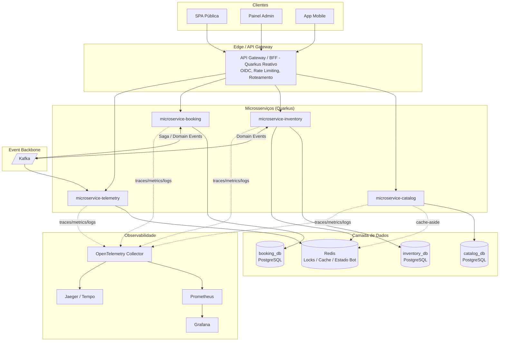
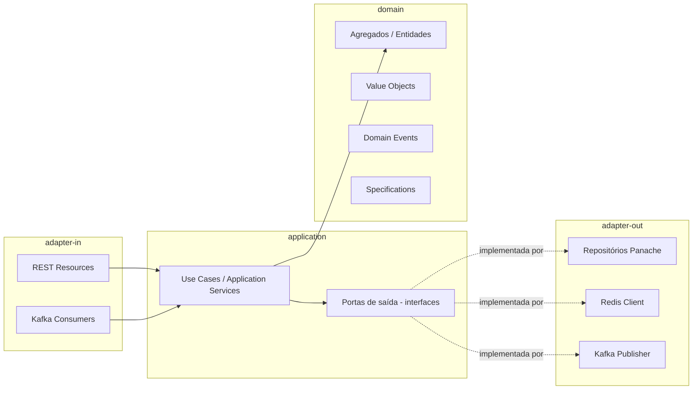
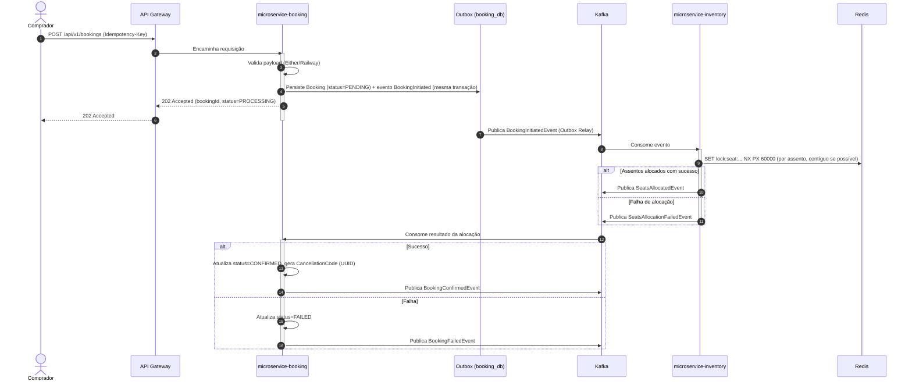

# Proposta de Arquitetura de Referência — TicketMonster Modernizado

Este documento detalha a proposta de arquitetura de referência para a modernização do **TicketMonster**, atendendo à arquitetura-alvo definida (Microsserviços, Quarkus 3.27+, PostgreSQL, Redis, Cloud First, Observabilidade via OpenTelemetry, Clean Architecture, DDD, APIs REST, Sistema Reativo, Programação Funcional integrada com OO). Complementa `modernization_architecture.md` e `microservices_specification.md`, detalhando o *como* e o *porquê* de cada escolha técnica, além de um catálogo de design patterns recomendados por cenário.

---

## 1. Visão Geral

A arquitetura mantém o particionamento por *bounded context* já estabelecido em `microservices_specification.md` (`catalog`, `inventory`, `booking`, `telemetry`), cada um com Clean Architecture interna, DDD tático, banco PostgreSQL próprio (**Database per Service**), e comunicação híbrida: REST reativo síncrono para consultas e Kafka assíncrono para eventos de domínio e orquestração de Saga.

---

## 2. Como cada princípio da arquitetura-alvo é atendido

### 2.1 Arquitetura de Microsserviços
Corte por *bounded context* de negócio (catálogo, estoque de assentos, vendas, telemetria) — não por entidade CRUD, evitando repetir o erro do legado de expor CRUDs genéricos duplicados (`rest/bookings` vs `rest/forge/bookings`, ver `projeto.md` seção 14). Cada serviço possui seu próprio schema de banco, eliminando o acoplamento hoje existente implicitamente via `EntityManager` compartilhado no monólito.

### 2.2 Quarkus 3.27+
Escolhido pelo tempo de inicialização (~50ms em *native image*) e footprint de memória reduzido, essenciais para o Horizontal Pod Autoscaler reagir rapidamente a picos de venda — justamente o cenário que mais estressa o legado hoje, dado o lock pessimista por seção inteira.

Extensões-chave:
- `quarkus-rest` + `quarkus-rest-jackson` (RESTEasy Reactive)
- `quarkus-hibernate-reactive-panache` (acesso a dados não bloqueante)
- `quarkus-redis-client`
- `quarkus-smallrye-reactive-messaging-kafka`
- `quarkus-opentelemetry` + `quarkus-micrometer-registry-prometheus`
- `quarkus-oidc` (integração Keycloak)
- `quarkus-smallrye-fault-tolerance` (Circuit Breaker, Retry, Timeout, Bulkhead)
- `quarkus-smallrye-health`

### 2.3 PostgreSQL
Uma instância/schema lógico por serviço. Acesso via **Hibernate Reactive com Panache**, não bloqueante — preserva a produtividade do JPA sem bloquear threads do event loop, resolvendo o problema estrutural do legado, onde toda query JPA bloqueava a thread da requisição.

### 2.4 Redis
Usado para três finalidades distintas, deliberadamente **não** tratadas como um único "cache genérico":
1. **Lock distribuído por assento** (`SET lock:seat:{perfId}:{secId}:{row}:{num} <bookingId> NX PX 60000`) — substitui o `@Lob`/lock pessimista por seção inteira do legado.
2. **Cache-aside** de leitura pesada do catálogo (eventos, shows, disponibilidade agregada).
3. **Estado efêmero de telemetria** (status RUNNING/STOPPED do Bot, buffer circular de log).

### 2.5 Cloud First
- Containers com imagem *native* GraalVM.
- Configuração via variáveis de ambiente / ConfigMaps (12-Factor), sem estado em disco local — elimina o cache em arquivo (`tmpDir`) do `MediaManager` legado, substituído por object storage (S3/MinIO).
- Health checks (`/q/health/live`, `/q/health/ready`) para probes do Kubernetes.
- HPA reagindo a RPS e a *consumer lag* do Kafka (via KEDA).

### 2.6 Observabilidade (OpenTelemetry)
- Instrumentação automática via `quarkus-opentelemetry`, com propagação de contexto W3C Trace Context de ponta a ponta — inclusive através dos headers de mensagem do Kafka — permitindo rastrear uma única compra desde o clique no front até a confirmação assíncrona no `inventory`.
- Logs estruturados em JSON correlacionados por `traceId`/`spanId`, facilitando localizar todos os logs de uma Saga específica.
- Métricas de negócio customizadas via Micrometer (`booking.created.count`, `seat.lock.contention`, `bot.requests.total`), além das técnicas (latência, throughput, taxa de erro).

### 2.7 Clean Architecture + DDD + REST
Cada serviço segue quatro camadas com regra de dependência única direção (para dentro):

`domain` não conhece Quarkus, JPA ou Kafka. Isso resolve o principal problema estrutural do legado, onde a regra de negócio (`SectionAllocation.allocateSeats`) está emaranhada com anotações JPA na mesma classe.

### 2.8 Sistema Reativo
Todo I/O (banco, Redis, Kafka, chamadas entre serviços) é feito via **Mutiny** (`Uni<T>` / `Multi<T>`), não bloqueante fim a fim. Substitui o modelo síncrono-bloqueante do legado (EJB `@Stateless` + JPA bloqueante), origem do gargalo de concorrência identificado no lock pessimista por seção.

### 2.9 Programação Funcional integrada com Orientação a Objeto
- **Domínio rico e imutável, orientado a objetos:** agregados como `Booking` e `SeatMap` continuam sendo objetos com comportamento (não *anemic model*), mas Value Objects (`Seat`, `Money`, `Email`, `CancellationCode`) são modelados como **Java Records**, imutáveis por padrão.
- **Composição funcional para orquestração:** o pipeline de criação de reserva é modelado como cadeia de transformações puras usando `Either<Error, T>` (Vavr) ou os operadores de `Uni<T>` (`.chain()`, `.onFailure()`), em vez do `try/catch` aninhado do legado (`BookingService.createBooking`, hoje um método de mais de 80 linhas misturando validação, alocação e persistência).
- **Funções puras para regras de cálculo**, testáveis isoladamente sem mocks de banco — por exemplo `calculateContiguousBlock(SeatMap, quantity): Either<AllocationError, List<Seat>>`, algo inviável no legado porque a lógica de alocação está acoplada ao `EntityManager`.

---

## 3. Melhorias de mercado incluídas além do escopo original

| Melhoria | Justificativa |
|---|---|
| **API Gateway / BFF** | Centraliza rate limiting/anti-scalping e evita expor os 4 serviços diretamente aos clientes. |
| **Outbox Pattern** | Garante atomicidade entre a escrita em `booking_db` e a publicação do evento no Kafka — sem isso, uma falha entre commit e publish perde o evento silenciosamente. |
| **Saga orquestrada** (não coreografada) para o checkout | Com 3 serviços envolvidos (`booking` → `inventory` → `catalog` para preço), orquestração centralizada é mais debugável que coreografia pura, e mapeia diretamente o fluxo transacional único hoje existente em `BookingService.createBooking`. |
| **Idempotency-Key** | Cobre RN-NOVA-03 (`microservices_specification.md`, seção 5.3); essencial assim que o fluxo deixa de ser uma transação local ACID. |
| **CQRS leve no `catalog`** | Separa modelo de escrita (admin) do modelo de leitura (público, cacheado em Redis) — o legado já sofre disso implicitamente (`EventService` com predicados vs. Forge CRUD); aqui a separação é formalizada. |
| **Contract Testing (Pact)** | Evita que a mudança de contrato de um serviço quebre outro silenciosamente — risco real numa arquitetura de 4 serviços + gateway. |
| **Testcontainers** | Testes de integração reais contra Postgres/Redis/Kafka em CI, sem mocks frágeis. |
| **Feature Flags** (Unleash / OpenFeature) | Permite rollout gradual de regras críticas novas (ex.: validação de código de cancelamento) sem *big-bang*. |
| **Schema Registry** (Avro/JSON Schema no Kafka) | Evita quebra de consumidor por mudança de payload de evento — problema inexistente no legado (eventos CDI *in-process*, sem serialização). |

---

## 4. Catálogo de Design Patterns Recomendados por Cenário

### 4.1 Domínio e regras de negócio (DDD Tático)

| Pattern | Onde aplicar | Motivo |
|---|---|---|
| **Aggregate** | `Booking` (raiz, contém `Ticket`); `SeatMap`/`SectionAllocation` (raiz, contém `Seat`) | Garante invariantes (ex.: nunca dois tickets no mesmo assento) dentro de um limite transacional claro — hoje o legado só garante isso via lock de banco, não via modelo. |
| **Value Object** | `Money`, `Email`, `SeatCoordinate`, `CancellationCode` | Elimina *primitive obsession* (hoje `price` é `float` cru, `email` é `String` cru sem validação encapsulada). |
| **Domain Events** | `SeatsAllocated`, `BookingConfirmed`, `BookingCancelled` | Já usado no legado via CDI `Event<Booking>`; mantém-se o padrão, trocando apenas o transporte (CDI local → Outbox/Kafka). |
| **Specification** | Regra "assentos contíguos suficientes na seção" | Encapsula a regra de elegibilidade de alocação como objeto testável isoladamente, separando o "o quê" da regra do "como" persistir. |
| **Repository** | Uma interface por agregado (`BookingRepository`), implementação em `adapter-out` | Mantém a camada `domain` livre de Panache/Hibernate. |

### 4.2 Aplicação / Casos de Uso (Clean Architecture)

| Pattern | Onde aplicar | Motivo |
|---|---|---|
| **Use Case / Interactor** | `CreateBookingUseCase`, `CancelBookingUseCase`, `AllocateSeatsUseCase` | Um caso de uso por operação de negócio, substituindo o método monolítico `BookingService.createBooking` de hoje. |
| **Ports & Adapters (Hexagonal)** | Interfaces `SeatAllocationPort`, `PricingPort` no domínio, implementadas por clients HTTP/Kafka reais | Permite trocar o transporte de comunicação com `inventory` sem tocar a regra de negócio. |
| **CQRS** | `catalog` (modelo de leitura cacheado) e consulta/histórico em `booking` | Separa carga de leitura pesada da escrita transacional. |
| **Result / Either (Railway-Oriented Programming)** | Toda a cadeia de validação de `CreateBookingUseCase` | Substitui o `try/catch` genérico do legado por composição explícita de sucesso/falha tipada. |

### 4.3 Concorrência e Alocação de Assentos

| Pattern | Onde aplicar | Motivo |
|---|---|---|
| **Distributed Lock** (Redis `SET NX PX`) | Lock de assento individual | Substitui o `LockModeType.PESSIMISTIC_WRITE` por seção inteira, reduzindo drasticamente a contenção. |
| **Lease Pattern** | Reserva temporária de 60s do assento | O "lock" é, na prática, um aluguel com expiração automática — nomear explicitamente como tal no domínio, não apenas como "lock" genérico. |
| **Optimistic Offline Lock** (`@Version`) | Persistência final do `Booking` em `booking_db` | Mantém proteção contra concorrência na escrita definitiva, sem serializar toda a seção como hoje. |

### 4.4 Integração entre Serviços

| Pattern | Onde aplicar | Motivo |
|---|---|---|
| **Saga (Orquestração)** | Fluxo `booking` → `inventory` → confirmação | Coordena a transação distribuída de checkout, com compensação (`ReleaseSeatsCommand`) em caso de falha — equivalente ao `failedSections` do legado, porém distribuído. |
| **Outbox** | `booking_db` | Publica evento de forma atômica com a escrita local. |
| **Idempotent Receiver** | Consumidores Kafka em `inventory` e `booking` | Protege contra reprocessamento de mensagem (entrega *at-least-once* do Kafka). |
| **Dead Letter Queue** | Todos os consumidores Kafka | Isola mensagens que falham repetidamente sem travar a partição. |
| **Circuit Breaker + Retry + Timeout** (`@CircuitBreaker`, `@Retry`, `@Timeout` — SmallRye Fault Tolerance) | Chamadas síncronas `booking` → `catalog` (busca de preço) | Evita cascata de falha caso `catalog` degrade. |
| **API Gateway / BFF** | Entrada única do front público, admin e mobile | Centraliza autenticação, rate limiting e agregação de respostas. |

### 4.5 Cache e Leitura

| Pattern | Onde aplicar | Motivo |
|---|---|---|
| **Cache-Aside** | Catálogo de eventos/shows no Redis | Reduz carga no Postgres para o tráfego de navegação (majoritariamente leitura). |
| **Read-Through / TTL curto** | Disponibilidade agregada de assentos (contagem, não o mapa individual) | Evita servir dado obsoleto por muito tempo em cenário de alta demanda. |

### 4.6 Observabilidade e Resiliência Operacional

| Pattern | Onde aplicar | Motivo |
|---|---|---|
| **Correlation ID / Distributed Tracing Context Propagation** | Toda a cadeia HTTP + Kafka | Rastreia uma compra ponta a ponta entre os 4 serviços. |
| **Health Check / Readiness Probe** | Todos os serviços | Kubernetes só roteia tráfego para instâncias prontas (conexão com DB/Redis/Kafka estabelecida). |
| **Bulkhead** | Pool de conexão Redis separado para locks de assento vs. cache de catálogo | Um pico de contenção de lock não deve esgotar conexões usadas pelo cache de leitura. |

---

## 5. Fluxo de Referência: Saga de Criação de Reserva

---

## 6. Próximos Passos Sugeridos

1. Validar este documento com os times de plataforma e segurança.
2. Detalhar o modelo de dados (schemas Postgres) por serviço em documento técnico complementar.
3. Elaborar ADRs individuais para as decisões mais controversas (granularidade do lock, orquestração vs. coreografia da Saga).
4. Priorizar a Fase 1 do roadmap (`modernization_architecture.md`, seção 18) com foco no `microservice-inventory`, por concentrar o maior risco técnico herdado do legado.
