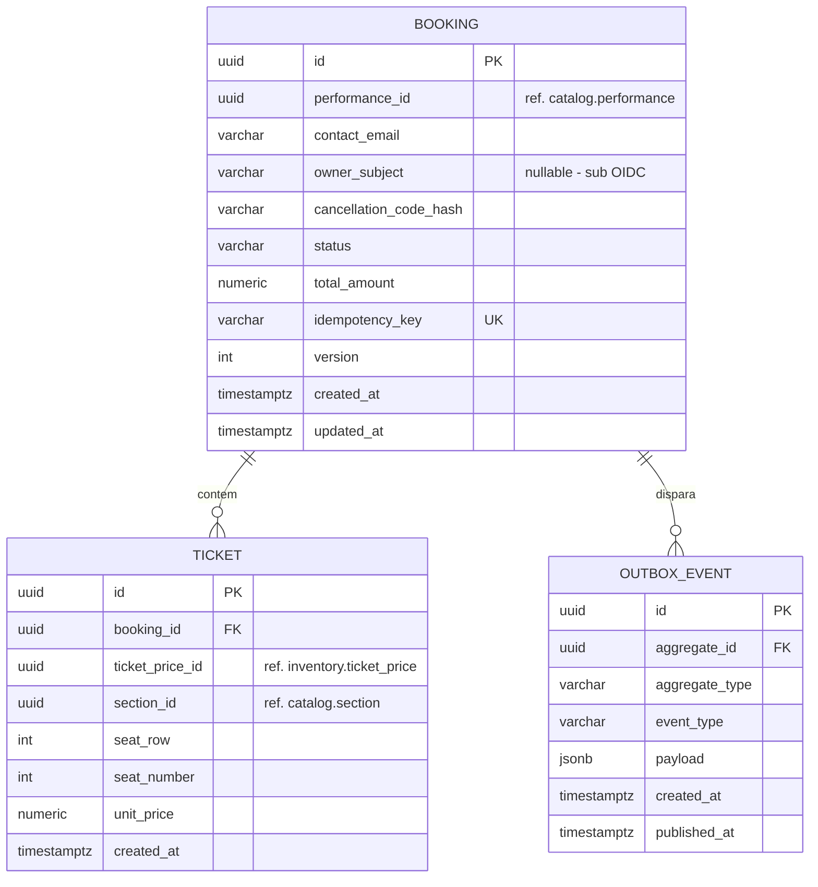

# Microsserviço: `microservice-booking`

## 1. `microservice-booking`
* **Responsabilidade:** Gestão do ciclo de vida das reservas, validação do e-mail do cliente, emissão de tickets e orquestração do checkout.
* **Banco de Dados:** PostgreSQL (`booking_db`).
* **APIs Expostas:** REST endpoints para criação e cancelamento de bookings.
* **Eventos Publicados:** `BookingInitiatedEvent`, `BookingConfirmedEvent`, `BookingCancelledEvent`.
* **Outbox Pattern:** Utiliza a tabela de outbox na base de dados para garantir entrega de eventos ao Kafka com garantia de *at-least-once*.


### Responsabilidade
Orquestração transacional do checkout de compras. É o ponto de entrada para pedidos de reserva, validação de e-mails de compradores, geração de bilhetes, controle do código de cancelamento e processamento de exclusões (cancelamento da venda).

## 2. Regras de Negócio (RNs) Mapeadas
* **RN15 (Itens Mínimos):** Uma transação de reserva (`Booking`) deve conter obrigatoriamente no mínimo 1 ingresso (`Ticket`).
* **RN16 (Validação de E-mail):** O e-mail de contato do comprador deve ser válido sintaticamente e não nulo.
* **RN17 (Integridade de Preço):** O preço cobrado no ticket individual deve corresponder exatamente ao valor definido em `TicketPrice` para a combinação Show + Seção + Categoria de Ingresso no momento da criação da reserva. *(No legado o preço é copiado diretamente de `TicketPrice.getPrice()` para o `Ticket` no instante da compra; não existe histórico/versionamento de preço por data — `TicketPrice` é um valor único e atual por combinação. Se a modernização exigir preço "vigente na data", isso é uma capacidade nova, não herdada do legado.)*
* **RN18 (Sem Categorias Duplicadas na Linha):** Não é permitida a inclusão de múltiplas solicitações para a mesma categoria de preço (`TicketPrice.id`) na mesma requisição de checkout (as quantidades de tickets da mesma modalidade devem ser agrupadas em um único item de requisição).
* **RN19 (Cálculo do Total da Reserva):** O valor total cobrado em uma reserva é a soma exata de todos os ingressos individuais emitidos na transação.
* **RN21 (Transação Tudo-ou-Nada):** Se a alocação de poltronas falhar para qualquer uma das seções solicitadas na requisição do cliente, a reserva inteira deve ser cancelada e estornada (Rollback da Saga).
* **RN27 (Limpeza Transacional de Cancelamento):** A exclusão de uma reserva ativa implica obrigatoriamente no cancelamento em cascata de todos os seus ingressos (`Tickets`) e no disparo da desalocação das poltronas no estoque.
* **RN29 (Código de Cancelamento) — As-Is:** O legado gera um código de cancelamento **fixo e estático** `"abc"` para toda reserva (`booking.setCancellationCode("abc")` em `BookingService.createBooking()`). O campo existe no modelo (`Booking.cancellationCode`), mas nunca é gerado de forma única ou aleatória.
* **RN30 (Autenticação do Cancelamento) — As-Is:** O método de exclusão de reserva do legado (`BookingService.deleteBooking(Long id)`) **não recebe nem valida** nenhum código de cancelamento — a operação é executada apenas com base no ID da reserva, sem qualquer verificação de posse. Isto é uma falha de controle de acesso do sistema atual (qualquer requisição `DELETE /rest/bookings/{id}` remove a reserva de terceiros), não uma proteção existente.
* **Melhoria Proposta (To-Be):** gerar o código de cancelamento com UUID ou algoritmo criptográfico único por reserva, e passar a exigir e validar esse código na exclusão — corrigindo a falha de controle de acesso identificada em RN30 as-is. Esta é uma capacidade **nova**, não uma regra herdada do legado.


### Sugestões de Alteração de Regras de Negócio e Histórias de Usuário para a Modernização

* **[ALTERA RN29 / RN30]** Código de cancelamento passa a ser gerado por UUID e validado no cancelamento — ver seção 3, RN29/RN30 (as-is/to-be) acima. Esta é a mudança de regra de negócio mais crítica identificada na modernização, pois corrige uma falha de controle de acesso presente no legado.
* **[NOVO]** Posse da reserva: consulta (`GET`) e cancelamento (`DELETE`) exigem ownership (token OIDC do comprador ou e-mail + código de cancelamento). Hoje `GET /rest/bookings/{id}` e a listagem completa (`GET /rest/bookings`) são publicamente acessíveis a qualquer requisitante, sem filtro por comprador.
* **[NOVO]** Idempotência via `Idempotency-Key` na criação de reserva, para tolerar retries de rede no fluxo distribuído (Saga) — risco que não existia na transação local única do legado.


## 3. Histórias de Usuário (US)
* **US-BOOK-01:** Criar um pedido de compra contendo e-mail de contato, ID de performance e lista de ingressos desejados por preço.
* **US-BOOK-02:** Consultar o status atual e detalhes de faturamento de uma compra por ID.
* **US-BOOK-03:** Confirmar a criação definitiva da reserva e emitir os tickets após retorno positivo do inventário.
* **US-BOOK-04:** Rejeitar a compra e notificar o usuário caso o estoque de assentos contíguos não esteja mais disponível no checkout.
* **US-BOOK-05:** Cancelar uma reserva ativa informando o ID da compra e o respectivo código de cancelamento válido.
* **US-BOOK-06:** Visualizar listagem de compras paginadas no painel corporativo (Admin).
* **US-BOOK-07:** Garantir a publicação de eventos de vendas (`BookingInitiatedEvent`, `BookingConfirmedEvent`, `BookingCancelledEvent`) no broker Kafka através de escrita transacional com Outbox Pattern.

### Critérios de Aceite (CAs)
* **CA-BOOK-01-VAL:** A chamada de criação de booking (`POST /api/v1/bookings`) deve validar a estrutura de e-mail (anotação `@Email`) e rejeitar payloads que não contenham itens de ingresso, retornando HTTP 400.
* **CA-BOOK-02-SAG:** Caso o Kafka ou o `microservice-inventory` sinalize falha de alocação de poltrona, a reserva correspondente no banco de dados do `microservice-booking` deve ser imediatamente alterada para o status `FAILED`, liberando quaisquer recursos.
* **CA-BOOK-03-SEC:** O método de cancelamento (`DELETE /api/v1/bookings/{id}`) deve conter o header `X-Cancellation-Code`. Se o código fornecido não bater com o UUID gerado no momento do cadastro do Booking, o serviço deve negar a operação retornando HTTP 403 (Forbidden). *(Este controle não existe no legado — ver RN30 as-is — e é um requisito novo desta modernização.)*

### Sugestões de Alteração de Histórias de Usuário para a Modernização

* **US-BOOK-08 (nova):** Como comprador, quero cancelar minha reserva informando o código de cancelamento recebido na confirmação, e ser barrado (HTTP 403) se o código não corresponder.
* **US-BOOK-09 (nova):** Como comprador, quero reenviar uma requisição de compra sem risco de duplicar a reserva em caso de timeout de rede.
* **US-BOOK-10 (nova):** Como comprador, quero consultar apenas as reservas associadas à minha conta/e-mail, e não a listagem completa de reservas de todos os clientes.

---

# Modelo de Dados — `microservice-booking`

Complementa `microservice-bookin_spec.md`. Detalha o schema PostgreSQL (`booking_db`), decisões de modelagem e o mapeamento de cada regra de negócio (RN) para a estrutura física.

---

## 1. Decisões de Modelagem

* **Chave primária `UUID`:** consistente com os demais serviços (ver `microservice-catalog_data_model.md`, seção 1). O `booking.id` é o identificador propagado nos eventos de domínio e correlacionado na trilha de auditoria de `microservice-telemetry`.
* **Sem FKs para outros bancos:** `performance_id` (referência a `catalog`), `ticket_price_id` e `section_id` (referência a `inventory`) são armazenados como colunas simples (UUID), **sem constraint de FK** — são referências lógicas entre serviços, validadas em tempo de execução (chamada síncrona ou consumo de evento), nunca por *foreign key* de banco, pois `booking_db` é um banco isolado (*Database per Service*).
* **`cancellation_code_hash` em vez de código em texto plano:** corrige a falha crítica do legado (RN29/RN30 as-is: código fixo `"abc"`, sem validação). O código gerado (UUID) é entregue ao comprador **uma única vez** na confirmação e apenas seu hash (SHA-256 ou bcrypt) é persistido — o serviço nunca consegue reexibir o código original, apenas validar um valor recebido contra o hash.
* **`owner_subject` nullable:** suporta tanto reserva autenticada (Keycloak `sub`) quanto *guest checkout* (fallback por e-mail + código de cancelamento), conforme RN-NOVA-01/US-BOOK-10.
* **`total_amount` persistido (não recalculado em runtime):** RN19 é garantida no momento da escrita pelo *use case*; o valor gravado é a fonte de verdade para faturamento e não é recomputado a partir dos `ticket` a cada leitura, evitando divergência caso um preço de referência mude posteriormente em `inventory`.
* **`unit_price` snapshot em `ticket`:** cada ticket grava o preço praticado no momento da compra (RN17), independente de qualquer alteração futura em `TicketPrice` no `inventory_db`.
* **Optimistic locking (`version`):** substitui a ausência de controle de concorrência explícito do legado na escrita final do agregado `Booking`.
* **Tabela `outbox_event`:** implementa o Outbox Pattern — a transação que grava/atualiza `booking` grava também a linha de evento na mesma transação local ACID, garantindo que a publicação no Kafka nunca seja perdida por falha entre commit e publish (US-BOOK-07).
* **`idempotency_key` única:** cobre RN-NOVA-03 — reenvio de uma requisição de criação de reserva com a mesma chave não gera uma segunda linha em `booking`.

---

## 2. Diagrama ER



---

## 3. DDL

```sql
CREATE SCHEMA IF NOT EXISTS booking;
CREATE EXTENSION IF NOT EXISTS pgcrypto;

-- ============================================================
-- Booking (agregado raiz)
-- ============================================================
CREATE TABLE booking.booking (
    id                       UUID PRIMARY KEY DEFAULT gen_random_uuid(),
    performance_id           UUID NOT NULL,                 -- ref. lógica catalog.performance.id
    contact_email            VARCHAR(255) NOT NULL,
    owner_subject            VARCHAR(255) NULL,              -- claim `sub` do Keycloak (RN-NOVA-01), NULL em guest checkout
    cancellation_code_hash   VARCHAR(255) NOT NULL,           -- hash do código (RN29 to-be) — nunca texto plano
    status                   VARCHAR(20)  NOT NULL DEFAULT 'PENDING',
    total_amount             NUMERIC(10,2) NOT NULL,          -- RN19, snapshot calculado no use case
    idempotency_key          VARCHAR(255) NOT NULL,           -- RN-NOVA-03
    version                  INT NOT NULL DEFAULT 0,          -- optimistic lock
    created_at               TIMESTAMPTZ NOT NULL DEFAULT now(),
    updated_at               TIMESTAMPTZ NOT NULL DEFAULT now(),
    CONSTRAINT uq_booking_idempotency_key UNIQUE (idempotency_key),
    CONSTRAINT ck_booking_status CHECK (status IN ('PENDING','CONFIRMED','FAILED','CANCELLED')),
    CONSTRAINT ck_booking_total_amount_non_negative CHECK (total_amount >= 0), -- RN19
    CONSTRAINT ck_booking_email_format CHECK (
        contact_email ~* '^[A-Za-z0-9._%+-]+@[A-Za-z0-9.-]+\.[A-Za-z]{2,}$'
    ) -- RN16
);
CREATE INDEX ix_booking_performance ON booking.booking(performance_id);
CREATE INDEX ix_booking_owner_subject ON booking.booking(owner_subject) WHERE owner_subject IS NOT NULL; -- US-BOOK-10
CREATE INDEX ix_booking_contact_email ON booking.booking(contact_email); -- fallback guest checkout

-- ============================================================
-- Ticket (item de linha da reserva)
-- ============================================================
CREATE TABLE booking.ticket (
    id               UUID PRIMARY KEY DEFAULT gen_random_uuid(),
    booking_id       UUID NOT NULL REFERENCES booking.booking(id) ON DELETE CASCADE, -- RN27 (cascata no cancelamento)
    ticket_price_id  UUID NOT NULL,     -- ref. lógica inventory.ticket_price.id
    section_id       UUID NOT NULL,     -- ref. lógica catalog.section.id (desnormalizado para consulta/relatório)
    seat_row         INT NOT NULL,
    seat_number      INT NOT NULL,
    unit_price       NUMERIC(10,2) NOT NULL,   -- RN17, snapshot do preço no instante da compra
    created_at       TIMESTAMPTZ NOT NULL DEFAULT now(),
    CONSTRAINT ck_ticket_unit_price_non_negative CHECK (unit_price >= 0)
);
CREATE INDEX ix_ticket_booking ON booking.ticket(booking_id);

-- Garante RN15 (mínimo 1 ticket por booking) via trigger, pois CHECK não alcança tabelas relacionadas
CREATE OR REPLACE FUNCTION booking.fn_ensure_min_one_ticket() RETURNS TRIGGER AS $$
BEGIN
    IF (SELECT COUNT(*) FROM booking.ticket WHERE booking_id = OLD.booking_id) = 0
       AND (SELECT status FROM booking.booking WHERE id = OLD.booking_id) NOT IN ('CANCELLED','FAILED') THEN
        RAISE EXCEPTION 'Booking % ficaria sem nenhum ticket (RN15)', OLD.booking_id;
    END IF;
    RETURN OLD;
END;
$$ LANGUAGE plpgsql;

CREATE CONSTRAINT TRIGGER trg_ticket_min_one
    AFTER DELETE ON booking.ticket
    DEFERRABLE INITIALLY DEFERRED
    FOR EACH ROW EXECUTE FUNCTION booking.fn_ensure_min_one_ticket();

-- ============================================================
-- Outbox (garantia transacional de publicação de evento)
-- ============================================================
CREATE TABLE booking.outbox_event (
    id              UUID PRIMARY KEY DEFAULT gen_random_uuid(),
    aggregate_type  VARCHAR(50)  NOT NULL DEFAULT 'Booking',
    aggregate_id    UUID         NOT NULL REFERENCES booking.booking(id),
    event_type      VARCHAR(100) NOT NULL,     -- BookingInitiatedEvent | BookingConfirmedEvent | BookingCancelledEvent | BookingFailedEvent
    payload         JSONB        NOT NULL,
    created_at      TIMESTAMPTZ  NOT NULL DEFAULT now(),
    published_at    TIMESTAMPTZ  NULL
);
-- Índice parcial: consulta do relay do Outbox busca apenas eventos ainda não publicados
CREATE INDEX ix_outbox_pending ON booking.outbox_event(created_at) WHERE published_at IS NULL;
```

---

## 4. Mapeamento RN → Estrutura Física

| RN | Implementação |
|---|---|
| RN15 (mínimo 1 ticket) | Trigger de constraint (`fn_ensure_min_one_ticket`) — não é possível expressar via `CHECK` simples entre tabelas |
| RN16 (e-mail válido) | `CHECK` de formato em `booking.contact_email` (validação sintática; regra semântica completa fica no *use case* com `@Email`) |
| RN17 (integridade de preço) | `ticket.unit_price` gravado como snapshot no momento da criação |
| RN18 (sem categoria duplicada na requisição) | Validado no *use case* de criação (regra sobre o **payload de entrada**, não sobre o schema persistido — múltiplos `ticket` podem legitimamente compartilhar `ticket_price_id`, um por assento) |
| RN19 (total exato) | `booking.total_amount` calculado e persistido no *use case*; `CHECK >= 0` como guarda mínima |
| RN21 (tudo-ou-nada) | Orquestração de Saga na camada de aplicação; reflexo no schema é `status = 'FAILED'` |
| RN27 (limpeza em cascata) | `ON DELETE CASCADE` de `ticket` para `booking` |
| RN29 (to-be) | `cancellation_code_hash` (nunca texto plano) |
| RN30 (to-be) | Validação do hash feita no *use case* de cancelamento antes de alterar `status` para `CANCELLED` |
| RN-NOVA-01 (ownership) | `owner_subject` + índice para filtro de listagem por dono |
| RN-NOVA-03 (idempotência) | `UNIQUE (idempotency_key)` |
| US-BOOK-07 (Outbox) | Tabela `outbox_event` + índice parcial `published_at IS NULL` |

---

## 5. Notas de Operação

* **Relay do Outbox:** processo separado (ou Debezium/CDC lendo o WAL do Postgres) publica eventos com `published_at IS NULL` no Kafka e marca `published_at = now()` após confirmação do broker. Evita *polling* pesado via o índice parcial `ix_outbox_pending`.
* **Retenção de `outbox_event`:** eventos já publicados podem ser arquivados/expurgados periodicamente (ex.: job diário removendo linhas com `published_at < now() - interval '7 days'`), pois a fonte de verdade de auditoria de longo prazo passa a ser `microservice-telemetry` (`booking_event_audit`), não este banco.
* **Particionamento:** não é necessário inicialmente; se o volume de `booking`/`ticket` crescer muito, considerar particionamento por `created_at` (mensal) no futuro.