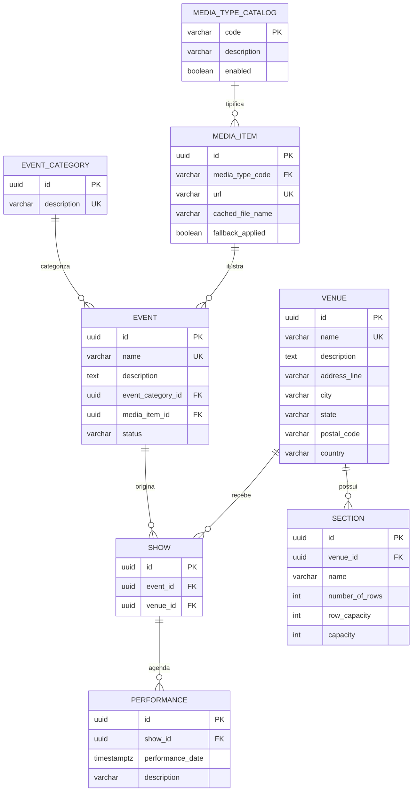

# Microsserviço: `microservice-booking`

## 1. `microservice-booking`
* **Responsabilidade:** Gestão do ciclo de vida das reservas, validação do e-mail do cliente, emissão de tickets e orquestração do checkout.
* **Banco de Dados:** PostgreSQL (`booking_db`).
* **APIs Expostas:** REST endpoints para criação e cancelamento de bookings.
* **Eventos Publicados:** `BookingInitiatedEvent`, `BookingConfirmedEvent`, `BookingCancelledEvent`.
* **Outbox Pattern:** Utiliza a tabela de outbox na base de dados para garantir entrega de eventos ao Kafka com garantia de *at-least-once*.


### Responsabilidade
Orquestração transacional do checkout de compras. É o ponto de entrada para pedidos de reserva, validação de e-mails de compradores, geração de bilhetes, controle do código de cancelamento e processamento de exclusões (cancelamento da venda).

## 2. Regras de Negócio (RNs) Mapeadas
* **RN15 (Itens Mínimos):** Uma transação de reserva (`Booking`) deve conter obrigatoriamente no mínimo 1 ingresso (`Ticket`).
* **RN16 (Validação de E-mail):** O e-mail de contato do comprador deve ser válido sintaticamente e não nulo.
* **RN17 (Integridade de Preço):** O preço cobrado no ticket individual deve corresponder exatamente ao valor definido em `TicketPrice` para a combinação Show + Seção + Categoria de Ingresso no momento da criação da reserva. *(No legado o preço é copiado diretamente de `TicketPrice.getPrice()` para o `Ticket` no instante da compra; não existe histórico/versionamento de preço por data — `TicketPrice` é um valor único e atual por combinação. Se a modernização exigir preço "vigente na data", isso é uma capacidade nova, não herdada do legado.)*
* **RN18 (Sem Categorias Duplicadas na Linha):** Não é permitida a inclusão de múltiplas solicitações para a mesma categoria de preço (`TicketPrice.id`) na mesma requisição de checkout (as quantidades de tickets da mesma modalidade devem ser agrupadas em um único item de requisição).
* **RN19 (Cálculo do Total da Reserva):** O valor total cobrado em uma reserva é a soma exata de todos os ingressos individuais emitidos na transação.
* **RN21 (Transação Tudo-ou-Nada):** Se a alocação de poltronas falhar para qualquer uma das seções solicitadas na requisição do cliente, a reserva inteira deve ser cancelada e estornada (Rollback da Saga).
* **RN27 (Limpeza Transacional de Cancelamento):** A exclusão de uma reserva ativa implica obrigatoriamente no cancelamento em cascata de todos os seus ingressos (`Tickets`) e no disparo da desalocação das poltronas no estoque.
* **RN29 (Código de Cancelamento) — As-Is:** O legado gera um código de cancelamento **fixo e estático** `"abc"` para toda reserva (`booking.setCancellationCode("abc")` em `BookingService.createBooking()`). O campo existe no modelo (`Booking.cancellationCode`), mas nunca é gerado de forma única ou aleatória.
* **RN30 (Autenticação do Cancelamento) — As-Is:** O método de exclusão de reserva do legado (`BookingService.deleteBooking(Long id)`) **não recebe nem valida** nenhum código de cancelamento — a operação é executada apenas com base no ID da reserva, sem qualquer verificação de posse. Isto é uma falha de controle de acesso do sistema atual (qualquer requisição `DELETE /rest/bookings/{id}` remove a reserva de terceiros), não uma proteção existente.
* **Melhoria Proposta (To-Be):** gerar o código de cancelamento com UUID ou algoritmo criptográfico único por reserva, e passar a exigir e validar esse código na exclusão — corrigindo a falha de controle de acesso identificada em RN30 as-is. Esta é uma capacidade **nova**, não uma regra herdada do legado.


### Sugestões de Alteração de Regras de Negócio e Histórias de Usuário para a Modernização

* **[ALTERA RN29 / RN30]** Código de cancelamento passa a ser gerado por UUID e validado no cancelamento — ver seção 3, RN29/RN30 (as-is/to-be) acima. Esta é a mudança de regra de negócio mais crítica identificada na modernização, pois corrige uma falha de controle de acesso presente no legado.
* **[NOVO]** Posse da reserva: consulta (`GET`) e cancelamento (`DELETE`) exigem ownership (token OIDC do comprador ou e-mail + código de cancelamento). Hoje `GET /rest/bookings/{id}` e a listagem completa (`GET /rest/bookings`) são publicamente acessíveis a qualquer requisitante, sem filtro por comprador.
* **[NOVO]** Idempotência via `Idempotency-Key` na criação de reserva, para tolerar retries de rede no fluxo distribuído (Saga) — risco que não existia na transação local única do legado.


## 3. Histórias de Usuário (US)
* **US-BOOK-01:** Criar um pedido de compra contendo e-mail de contato, ID de performance e lista de ingressos desejados por preço.
* **US-BOOK-02:** Consultar o status atual e detalhes de faturamento de uma compra por ID.
* **US-BOOK-03:** Confirmar a criação definitiva da reserva e emitir os tickets após retorno positivo do inventário.
* **US-BOOK-04:** Rejeitar a compra e notificar o usuário caso o estoque de assentos contíguos não esteja mais disponível no checkout.
* **US-BOOK-05:** Cancelar uma reserva ativa informando o ID da compra e o respectivo código de cancelamento válido.
* **US-BOOK-06:** Visualizar listagem de compras paginadas no painel corporativo (Admin).
* **US-BOOK-07:** Garantir a publicação de eventos de vendas (`BookingInitiatedEvent`, `BookingConfirmedEvent`, `BookingCancelledEvent`) no broker Kafka através de escrita transacional com Outbox Pattern.

### Critérios de Aceite (CAs)
* **CA-BOOK-01-VAL:** A chamada de criação de booking (`POST /api/v1/bookings`) deve validar a estrutura de e-mail (anotação `@Email`) e rejeitar payloads que não contenham itens de ingresso, retornando HTTP 400.
* **CA-BOOK-02-SAG:** Caso o Kafka ou o `microservice-inventory` sinalize falha de alocação de poltrona, a reserva correspondente no banco de dados do `microservice-booking` deve ser imediatamente alterada para o status `FAILED`, liberando quaisquer recursos.
* **CA-BOOK-03-SEC:** O método de cancelamento (`DELETE /api/v1/bookings/{id}`) deve conter o header `X-Cancellation-Code`. Se o código fornecido não bater com o UUID gerado no momento do cadastro do Booking, o serviço deve negar a operação retornando HTTP 403 (Forbidden). *(Este controle não existe no legado — ver RN30 as-is — e é um requisito novo desta modernização.)*

### Sugestões de Alteração de Histórias de Usuário para a Modernização

* **US-BOOK-08 (nova):** Como comprador, quero cancelar minha reserva informando o código de cancelamento recebido na confirmação, e ser barrado (HTTP 403) se o código não corresponder.
* **US-BOOK-09 (nova):** Como comprador, quero reenviar uma requisição de compra sem risco de duplicar a reserva em caso de timeout de rede.
* **US-BOOK-10 (nova):** Como comprador, quero consultar apenas as reservas associadas à minha conta/e-mail, e não a listagem completa de reservas de todos os clientes.

---

# Modelo de Dados — `microservice-catalog`


## 1. Decisões de Modelagem

* **Chave primária:** `UUID` (`gen_random_uuid()`, extensão `pgcrypto`) em vez de `BIGSERIAL`. Motivo: os IDs deste serviço são replicados por eventos para `microservice-inventory` (tabelas de snapshot) — UUID evita colisão entre serviços e permite geração client-side/offline sem round-trip ao banco.
* **Sem FKs para outros bancos:** por ser *Database per Service*, `catalog_db` não referencia `inventory_db`/`booking_db`. Onde outro serviço precisa desses dados, ele mantém uma tabela de *snapshot* populada via eventos (ver `microservice-inventory_data_model.md`, seção 3).
* **Capacidade calculada em coluna gerada:** `Section.capacity` (RN12) deixa de ser calculado em código Java a cada leitura e passa a ser uma `GENERATED COLUMN`, garantindo consistência mesmo em consultas SQL diretas/relatórios.
* **Catálogo de tipos de mídia extensível:** substitui o enum fechado do legado (`MediaType.IMAGE`) por uma tabela de domínio (`media_type_catalog`), atendendo a `[ALTERA RN34]`/US-CAT-14 sem exigir redeploy para adicionar `VIDEO`, `AUDIO`, etc.
* **Ciclo de vida do evento:** nova coluna `event.status`, atendendo ao item `[NOVO]` (DRAFT → PUBLISHED → ARCHIVED) da spec.

---

## 2. Diagrama ER



---

## 3. DDL

```sql
CREATE SCHEMA IF NOT EXISTS catalog;
CREATE EXTENSION IF NOT EXISTS pgcrypto;

-- ============================================================
-- Domínio de mídia (catálogo extensível — [ALTERA RN34])
-- ============================================================
CREATE TABLE catalog.media_type_catalog (
    code        VARCHAR(30)  PRIMARY KEY,      -- 'IMAGE', 'VIDEO', 'AUDIO'...
    description VARCHAR(120) NOT NULL,
    enabled     BOOLEAN      NOT NULL DEFAULT TRUE
);

INSERT INTO catalog.media_type_catalog (code, description, enabled)
VALUES ('IMAGE', 'Imagem promocional', TRUE); -- valor herdado do legado (RN34 as-is)

CREATE TABLE catalog.media_item (
    id                UUID PRIMARY KEY DEFAULT gen_random_uuid(),
    media_type_code   VARCHAR(30) NOT NULL REFERENCES catalog.media_type_catalog(code),
    url               VARCHAR(2048) NOT NULL,
    cached_file_name  VARCHAR(255),
    fallback_applied  BOOLEAN NOT NULL DEFAULT FALSE, -- RN35
    created_at        TIMESTAMPTZ NOT NULL DEFAULT now(),
    CONSTRAINT uq_media_item_url UNIQUE (url),                       -- RN37
    CONSTRAINT ck_media_item_url_scheme CHECK (url ~* '^https?://')  -- RN37
);

-- ============================================================
-- Categoria de evento
-- ============================================================
CREATE TABLE catalog.event_category (
    id          UUID PRIMARY KEY DEFAULT gen_random_uuid(),
    description VARCHAR(120) NOT NULL,
    created_at  TIMESTAMPTZ NOT NULL DEFAULT now(),
    CONSTRAINT uq_event_category_description UNIQUE (description) -- RN06
);

-- ============================================================
-- Evento
-- ============================================================
CREATE TABLE catalog.event (
    id                UUID PRIMARY KEY DEFAULT gen_random_uuid(),
    name              VARCHAR(50) NOT NULL,
    description       VARCHAR(1000) NOT NULL,
    event_category_id UUID NOT NULL REFERENCES catalog.event_category(id) ON DELETE RESTRICT, -- RN04 + proteção [NOVO]
    media_item_id     UUID NULL REFERENCES catalog.media_item(id) ON DELETE SET NULL,          -- RN05 (opcional)
    status            VARCHAR(20) NOT NULL DEFAULT 'DRAFT',                                     -- [NOVO] ciclo de vida
    created_at        TIMESTAMPTZ NOT NULL DEFAULT now(),
    updated_at        TIMESTAMPTZ NOT NULL DEFAULT now(),
    published_at      TIMESTAMPTZ NULL,
    CONSTRAINT uq_event_name UNIQUE (name),                                    -- RN01
    CONSTRAINT ck_event_name_length CHECK (char_length(name) BETWEEN 5 AND 50),        -- RN02
    CONSTRAINT ck_event_description_length CHECK (char_length(description) BETWEEN 20 AND 1000), -- RN03
    CONSTRAINT ck_event_status CHECK (status IN ('DRAFT','PUBLISHED','ARCHIVED'))
);
CREATE INDEX ix_event_category ON catalog.event(event_category_id);
CREATE INDEX ix_event_status_published ON catalog.event(status) WHERE status = 'PUBLISHED'; -- US-CAT-01

-- ============================================================
-- Venue (com endereço embutido — equivalente ao @Embeddable Address do legado)
-- ============================================================
CREATE TABLE catalog.venue (
    id            UUID PRIMARY KEY DEFAULT gen_random_uuid(),
    name          VARCHAR(255) NOT NULL,
    description   TEXT,
    address_line  VARCHAR(255),
    city          VARCHAR(120),
    state         VARCHAR(120),
    postal_code   VARCHAR(20),
    country       VARCHAR(120),
    created_at    TIMESTAMPTZ NOT NULL DEFAULT now(),
    CONSTRAINT uq_venue_name UNIQUE (name),                 -- RN07
    CONSTRAINT ck_venue_name_not_empty CHECK (btrim(name) <> '')  -- RN07
);

-- ============================================================
-- Seção física
-- ============================================================
CREATE TABLE catalog.section (
    id              UUID PRIMARY KEY DEFAULT gen_random_uuid(),
    venue_id        UUID NOT NULL REFERENCES catalog.venue(id) ON DELETE CASCADE,
    name            VARCHAR(120) NOT NULL,
    number_of_rows  INT NOT NULL,
    row_capacity    INT NOT NULL,
    capacity        INT GENERATED ALWAYS AS (number_of_rows * row_capacity) STORED, -- RN12
    CONSTRAINT uq_section_venue_name UNIQUE (venue_id, name),      -- RN11
    CONSTRAINT ck_section_rows_positive CHECK (number_of_rows > 0),
    CONSTRAINT ck_section_row_capacity_positive CHECK (row_capacity > 0)
);

-- ============================================================
-- Show (associação única Event + Venue)
-- ============================================================
CREATE TABLE catalog.show (
    id         UUID PRIMARY KEY DEFAULT gen_random_uuid(),
    event_id   UUID NOT NULL REFERENCES catalog.event(id) ON DELETE CASCADE,
    venue_id   UUID NOT NULL REFERENCES catalog.venue(id) ON DELETE RESTRICT,
    created_at TIMESTAMPTZ NOT NULL DEFAULT now(),
    CONSTRAINT uq_show_event_venue UNIQUE (event_id, venue_id) -- RN08
);
CREATE INDEX ix_show_venue ON catalog.show(venue_id); -- US-CAT-06

-- ============================================================
-- Performance (sessão de um Show)
-- ============================================================
CREATE TABLE catalog.performance (
    id                UUID PRIMARY KEY DEFAULT gen_random_uuid(),
    show_id           UUID NOT NULL REFERENCES catalog.show(id) ON DELETE CASCADE,
    performance_date  TIMESTAMPTZ NOT NULL,     -- RN09
    description       VARCHAR(255),
    CONSTRAINT uq_performance_show_date UNIQUE (show_id, performance_date) -- RN10
);
CREATE INDEX ix_performance_date ON catalog.performance(performance_date); -- US-CAT-07, RN31/RN32 (consumido por telemetry)
```

---

## 4. Mapeamento RN → Estrutura Física

| RN | Implementação |
|---|---|
| RN01 | `UNIQUE (name)` em `event` |
| RN02 | `CHECK` de tamanho em `event.name` |
| RN03 | `CHECK` de tamanho em `event.description` |
| RN04 | `event.event_category_id NOT NULL` + FK |
| RN05 | `event.media_item_id` nullable |
| RN06 | `UNIQUE (description)` em `event_category` |
| RN07 | `UNIQUE (name)` + `CHECK` não vazio em `venue` |
| RN08 | `UNIQUE (event_id, venue_id)` em `show` |
| RN09 | `performance.performance_date NOT NULL` |
| RN10 | `UNIQUE (show_id, performance_date)` em `performance` |
| RN11 | `UNIQUE (venue_id, name)` em `section` |
| RN12 | `GENERATED COLUMN capacity` em `section` |
| RN34 (alterada) | `media_type_catalog` (tabela de domínio, não enum) |
| RN35 | coluna `fallback_applied` em `media_item` |
| RN37 | `UNIQUE (url)` + `CHECK` de esquema `http(s)` em `media_item` |
| [NOVO] ciclo de vida | `event.status` + `CHECK` |
| [NOVO] proteção de categoria | `event_category_id ... ON DELETE RESTRICT` |

> Observação: RN sobre validação de conteúdo de negócio mais complexo (ex.: regra de publicação exigir `media_item_id` preenchido) fica na camada de aplicação (`PublishEventUseCase`), não no schema — o banco garante apenas invariantes estruturais.