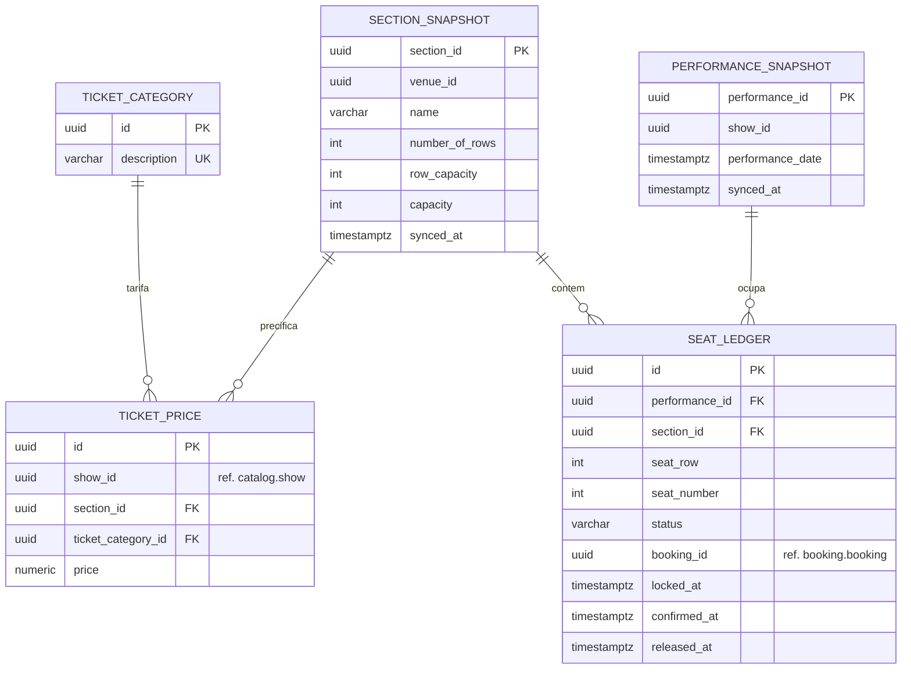

## 1. `microservice-inventory`
* **Responsabilidade:** Alocação de assentos físicos, controle de capacidade por performance e expiração de reservas temporárias.
* **Banco de Dados:** PostgreSQL (`inventory_db`) para persistência do estado permanente + Redis para controle de locks de assentos em tempo real.
* **APIs Expostas:** Reactive REST para verificar disponibilidade e solicitar bloqueio de assentos.
* **Eventos Consumidos:** `BookingInitiatedEvent` (para manter os assentos travados), `BookingConfirmedEvent` (para persistir a ocupação definitiva), `BookingCancelledEvent` / `BookingFailedEvent` (para liberar os assentos).
* **Dependências:** `microservice-catalog` (apenas para leitura de estrutura de seções via cache).


### Responsabilidade
Controle em tempo real da disponibilidade de poltronas livres, precificação por show/seção/categoria de ingresso, gerenciamento dos bloqueios temporários (locks de checkout) e confirmação final dos assentos ocupados.

### Regras de Negócio (RNs) Mapeadas
* **RN13 (Definição de Tarifa):** O preço do ingresso deve ser associado unicamente à combinação de `Show + Seção Física + Categoria de Ingresso` (ex.: Show 1, Seção "Pista", Categoria "Meia-Entrada").
* **RN14 (Unicidade de Categoria Tarifária):** A descrição da categoria tarifária de ingresso (ex.: "Estudante", "VIP") deve ser única na base.
* **RN20 (Alocação Contígua):** O sistema deve buscar prioritariamente uma sequência linear e contígua de assentos livres na mesma fileira para atender à quantidade de ingressos solicitados pelo comprador.
* **RN22 (Concorrência por Poltrona) — As-Is:** A reserva de assentos não pode permitir reservas duplicadas da mesma poltrona física. No legado, isso é garantido por um lock pessimista de escrita (`LockModeType.PESSIMISTIC_WRITE`) sobre a linha de `SectionAllocation`, aplicado por **seção inteira** (não por assento individual) — `SeatAllocationService.retrieveSectionAllocationExclusively()`. Isso serializa toda a alocação de uma seção, mesmo entre compradores disputando assentos diferentes dentro dela.
* **Melhoria Proposta (To-Be):** substituir o lock pessimista por seção por operações atômicas NX (Not Exists) no Redis, com granularidade por assento individual (`lock:seat:{perfId}:{secId}:{row}:{num}`), eliminando a serialização de toda a seção e permitindo concorrência real entre compradores de assentos distintos.
* **RN23 (Expiração do Bloqueio):** Reservas temporárias de assentos (geradas durante a navegação do checkout) devem expirar automaticamente após 60 segundos, retornando as posições ao estoque disponível.
* **RN25 (Quantidade Positiva):** A quantidade de assentos solicitada em uma requisição de alocação deve ser estritamente maior que zero.
* **RN26 (Consistência de Desalocação):** Não é permitida a desalocação ou liberação de uma poltrona que não esteja marcada como ocupada ou reservada.
* **RN28 (Agrupamento de Desalocação):** O processo de liberação em lote de poltronas exige que todos os assentos informados na lista pertençam à mesma seção física da Performance.

####  Sugestões de Alteração de Regras de Negócio  
* **[ALTERA RN22]** Granularidade do lock passa de seção inteira (lock pessimista JPA) para assento individual (Redis NX) — ver `modernization_architecture.md` seção 21 e RN22 (as-is/to-be) acima.
* **[NOVO]** Locks órfãos (ex.: instância do serviço derruba antes de confirmar ou cancelar) devem ser recuperados automaticamente pelo TTL do Redis, sem exigir intervenção manual — capacidade equivalente ao `EXPIRATION_TIME` do legado, porém agora resiliente a falhas de processo (no legado, se a JVM cair no meio de uma alocação, o timestamp gravado na matriz ainda expira normalmente, então o comportamento é preservado, não é uma regra nova de fato — mantido aqui apenas como critério de aceite de paridade).
 

### Histórias de Usuário (US)
* **US-INV-01:** Consultar mapa dinâmico de assentos livres e ocupados por performance e seção específica.
* **US-INV-02:** Solicitar reserva temporária de assentos contíguos para início de checkout.
* **US-INV-03:** Solicitar reserva temporária de assentos não contíguos caso a opção contígua falhe e o usuário aceite posições dispersas.
* **US-INV-04:** Liberar assentos reservados temporariamente após estouro do tempo de checkout (60 segundos).
* **US-INV-05:** Confirmar marcação de ocupação permanente de assentos vinculados a uma reserva paga com sucesso (Saga OK).
* **US-INV-06:** Desalocar assentos em lote para devolução ao estoque de vendas após cancelamento de compra.
* **US-INV-07:** Gerenciar categorias de tarifa de ingressos (CRUD) (Admin).
* **US-INV-08:** Configurar a tabela de valores de preços de ingressos (TicketPrice) por espetáculo, seção e tarifa (Admin).
* **US-INV-09 (nova):** Como plataforma, quero que uma falha do serviço de inventário durante o checkout não deixe assentos bloqueados permanentemente (o TTL do Redis garante a liberação).

### Critérios de Aceite (CAs)
* **CA-INV-01-LOK:** O lock temporário de poltronas no Redis deve expirar em exatos 60.000 milissegundos usando TTL nativo. O banco de dados relacional só deve ser atualizado para status `OCCUPIED` se a Saga de compra for confirmada antes da expiração deste TTL.
* **CA-INV-02-CON:** O algoritmo de busca contígua de assentos deve avaliar o gap livre a partir da matriz de status ativa no Redis. Se não houver posições contíguas suficientes em nenhuma fileira da seção, o serviço deve rejeitar a chamada retornando uma lista vazia de assentos e a flag de falha.
* **CA-INV-03-ERR:** Qualquer tentativa de liberar uma poltrona livre ou inexistente deve retornar erro com código de negócio e HTTP Status 422 (Unprocessable Entity).

---

# Modelo de Dados — `microservice-inventory`

Complementa `microservice-inventory_spec.md`. Detalha o schema PostgreSQL (`inventory_db`), o papel do Redis como fonte de verdade para o estado efêmero, e o mapeamento de cada regra de negócio (RN) para a estrutura física.

---

## 1. Decisões de Modelagem

* **Divisão de responsabilidade Postgres vs. Redis:** este é o único serviço com dois armazenamentos de estado com papéis distintos e não intercambiáveis:
  * **Redis** — fonte de verdade para o **bloqueio temporário** de assentos durante o checkout (TTL de 60s, RN23), com granularidade por assento individual (`lock:seat:{perfId}:{secId}:{row}:{num}`).
  * **PostgreSQL** — fonte de verdade **permanente** do assento após a Saga confirmar a compra (`OCCUPIED`), e histórico/auditoria de ocupação. O Postgres nunca guarda o lock efêmero de 60s — apenas o resultado final confirmado.
* **Sem FKs para outros bancos:** `show_id`, `section_id`, `performance_id` são referências lógicas a `catalog_db`. Como o catálogo é *read-heavy* e raramente muda, este serviço mantém **tabelas de snapshot** (`section_snapshot`, `performance_snapshot`) populadas via consumo de eventos de domínio do `microservice-catalog`, evitando chamada síncrona a cada alocação de assento.
* **`seat_ledger` como registro definitivo (fonte da verdade pós-confirmação):** substitui a matriz `@Lob` (bitmap serializado) do legado (`SectionAllocation.allocation`) por uma linha por assento, auditável e consultável via SQL — o legado armazenava um blob binário opaco, impossível de indexar ou depurar diretamente.
* **Índice único parcial como última linha de defesa (RN22):** mesmo com o lock atômico do Redis (`SET NX`) sendo o mecanismo primário de exclusão mútua, um índice único parcial em `seat_ledger` garante, a nível de banco, que nunca existam duas linhas `OCCUPIED` para o mesmo assento — defesa em profundidade contra bugs ou condições de corrida no código da aplicação.

---

## 2. Diagrama ER



---

## 3. DDL

```sql
CREATE SCHEMA IF NOT EXISTS inventory;
CREATE EXTENSION IF NOT EXISTS pgcrypto;

-- ============================================================
-- Categoria de tarifa de ingresso
-- ============================================================
CREATE TABLE inventory.ticket_category (
    id          UUID PRIMARY KEY DEFAULT gen_random_uuid(),
    description VARCHAR(120) NOT NULL,
    created_at  TIMESTAMPTZ NOT NULL DEFAULT now(),
    CONSTRAINT uq_ticket_category_description UNIQUE (description) -- RN14
);

-- ============================================================
-- Snapshots de leitura (populados via consumo de eventos do catalog)
-- ============================================================
CREATE TABLE inventory.section_snapshot (
    section_id      UUID PRIMARY KEY,          -- = catalog.section.id
    venue_id        UUID NOT NULL,
    name            VARCHAR(120) NOT NULL,
    number_of_rows  INT NOT NULL,
    row_capacity    INT NOT NULL,
    capacity        INT NOT NULL,
    synced_at       TIMESTAMPTZ NOT NULL DEFAULT now()
);

CREATE TABLE inventory.performance_snapshot (
    performance_id    UUID PRIMARY KEY,        -- = catalog.performance.id
    show_id           UUID NOT NULL,
    performance_date  TIMESTAMPTZ NOT NULL,
    synced_at         TIMESTAMPTZ NOT NULL DEFAULT now()
);
CREATE INDEX ix_performance_snapshot_date ON inventory.performance_snapshot(performance_date);

-- ============================================================
-- Preço de ingresso (RN13)
-- ============================================================
CREATE TABLE inventory.ticket_price (
    id                  UUID PRIMARY KEY DEFAULT gen_random_uuid(),
    show_id             UUID NOT NULL,          -- ref. lógica catalog.show.id
    section_id          UUID NOT NULL REFERENCES inventory.section_snapshot(section_id),
    ticket_category_id  UUID NOT NULL REFERENCES inventory.ticket_category(id),
    price               NUMERIC(10,2) NOT NULL,
    created_at          TIMESTAMPTZ NOT NULL DEFAULT now(),
    CONSTRAINT uq_ticket_price_combo UNIQUE (show_id, section_id, ticket_category_id), -- RN13
    CONSTRAINT ck_ticket_price_non_negative CHECK (price >= 0)
);
CREATE INDEX ix_ticket_price_show ON inventory.ticket_price(show_id); -- US-INV-08

-- ============================================================
-- Seat Ledger — registro definitivo de ocupação (pós-confirmação da Saga)
-- ============================================================
CREATE TABLE inventory.seat_ledger (
    id              UUID PRIMARY KEY DEFAULT gen_random_uuid(),
    performance_id  UUID NOT NULL REFERENCES inventory.performance_snapshot(performance_id),
    section_id      UUID NOT NULL REFERENCES inventory.section_snapshot(section_id),
    seat_row        INT NOT NULL,
    seat_number     INT NOT NULL,
    status          VARCHAR(20) NOT NULL,   -- RESERVED_PENDING | OCCUPIED | RELEASED
    booking_id      UUID NOT NULL,           -- ref. lógica booking.booking.id
    locked_at       TIMESTAMPTZ NULL,
    confirmed_at    TIMESTAMPTZ NULL,
    released_at     TIMESTAMPTZ NULL,
    CONSTRAINT ck_seat_ledger_status CHECK (status IN ('RESERVED_PENDING','OCCUPIED','RELEASED')),
    CONSTRAINT ck_seat_ledger_row_positive CHECK (seat_row > 0),
    CONSTRAINT ck_seat_ledger_number_positive CHECK (seat_number > 0)
);

-- RN22 — nunca duas linhas OCCUPIED para o mesmo assento (defesa em profundidade além do lock Redis)
CREATE UNIQUE INDEX uq_seat_ledger_occupied
    ON inventory.seat_ledger (performance_id, section_id, seat_row, seat_number)
    WHERE status = 'OCCUPIED';

CREATE INDEX ix_seat_ledger_booking ON inventory.seat_ledger(booking_id); -- US-INV-06 (desalocação em lote por reserva)
CREATE INDEX ix_seat_ledger_performance_section ON inventory.seat_ledger(performance_id, section_id); -- US-INV-01
```

---

## 4. Papel do Redis (fora do escopo de DDL, documentado para referência cruzada)

| Estrutura Redis | Chave | TTL | Finalidade |
|---|---|---|---|
| String (lock) | `lock:seat:{perfId}:{secId}:{row}:{num}` | 60.000 ms | Bloqueio atômico por assento durante checkout (RN22 to-be, RN23) |
| Bitmap/Set agregado | `avail:{perfId}:{secId}` | sem TTL (atualizado por evento) | Suporte à busca de bloco contíguo (RN20) sem varrer `seat_ledger` a cada consulta |

O `seat_ledger` só é escrito em dois momentos: (1) `RESERVED_PENDING`, opcionalmente, para observabilidade do que está em voo; (2) `OCCUPIED`, quando a Saga confirma; ou `RELEASED`, quando o TTL do Redis expira ou a Saga falha/cancela. O Redis nunca é a fonte de verdade para o estado **definitivo** — apenas para o **lock efêmero**.

---

## 5. Mapeamento RN → Estrutura Física

| RN | Implementação |
|---|---|
| RN13 (definição de tarifa) | `UNIQUE (show_id, section_id, ticket_category_id)` em `ticket_price` |
| RN14 (categoria única) | `UNIQUE (description)` em `ticket_category` |
| RN20 (alocação contígua) | Algoritmo executado contra a estrutura agregada no Redis (`avail:{perfId}:{secId}`), não contra o Postgres |
| RN22 as-is → to-be | Lock primário via Redis `SET NX PX`; índice único parcial `uq_seat_ledger_occupied` como guarda adicional em `seat_ledger` |
| RN23 (expiração de 60s) | TTL nativo da chave Redis `lock:seat:...`; ausência de linha `OCCUPIED` correspondente após expiração |
| RN25 (quantidade positiva) | Validada no *use case* de alocação (parâmetro de entrada, não coluna persistida) |
| RN26 (consistência de desalocação) | Validação no *use case*: só transiciona para `RELEASED` uma linha que estava `OCCUPIED`/`RESERVED_PENDING` |
| RN28 (agrupamento de desalocação) | Validação no *use case*: todos os `seat_ledger.section_id` do lote devem ser iguais |
| US-INV-09 (locks órfãos) | TTL do Redis libera automaticamente; job de reconciliação periódico pode varrer `RESERVED_PENDING` antigos sem confirmação e marcá-los `RELEASED` |

---

## 6. Notas de Operação

* **Sincronização dos snapshots:** consumidor Kafka dedicado escuta eventos `SectionCreated/Updated`, `PerformanceScheduled` do `microservice-catalog` e faz *upsert* em `section_snapshot`/`performance_snapshot`. Se o evento chegar fora de ordem, `synced_at` permite detectar e descartar atualizações mais antigas que o estado atual.
* **Reconciliação Redis ↔ Postgres:** job periódico (ex.: a cada 5 min) compara locks ativos no Redis com linhas `RESERVED_PENDING` sem `confirmed_at`/`released_at` há mais tempo que o TTL esperado, sinalizando inconsistência para alerta operacional — não deveria ocorrer em operação normal, mas cobre falhas de infraestrutura.
* **Particionamento:** `seat_ledger` é a tabela de maior volume potencial (uma linha por assento vendido); se necessário, particionar por `performance_id` (hash) ou por período de `confirmed_at` (range mensal) conforme volume real observado em produção.