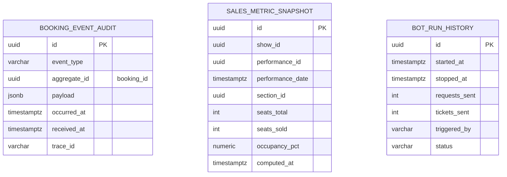

## 1. `microservice-telemetry`
* **Responsabilidade:** Dashboards de monitoramento de vendas em tempo real e simulador de carga (Bot).
* **Banco de Dados:** PostgreSQL / TimescaleDB (`telemetry_db`) para histórico de métricas.
* **Redis:** Controle de estado do Bot (RUNNING, STOPPED) e buffer de logs rápidos.
* **APIs Expostas:** WebSockets / SSE para envio das métricas ao frontend.
* **Eventos Consumidos:** Todos os eventos de negócios publicados no Kafka.


## 4. Microsserviço: `microservice-telemetry`

### Responsabilidade
Consumo de eventos de vendas para atualização de painéis de ocupação em tempo real e orquestração do robô simulador de carga (Bot) para demonstração de estresse de compras.

### Regras de Negócio (RNs) Mapeadas
* **RN31 (Métricas de Shows Ativos):** O painel analítico de métricas deve exibir informações consolidadas exclusivamente de shows que possuam performances em datas futuras (ignorar espetáculos passados).
* **RN32 (Métricas de Ocupação Futura):** O cálculo e contagem de poltronas vendidas para os gráficos de ocupação em tempo real devem desconsiderar dados de exibições passadas.
* **RN33 (Acesso de Leitura):** Os endpoints expostos pelo painel de monitoramento de métricas são estritamente de leitura (apenas métodos `@GET` HTTP).
* **RN38 (Limites do Simulador):** O robô de simulação de carga (Bot) é limitado por restrições operacionais rígidas: máximo de 100 ticket requests por simulação e no máximo 100 tickets individuais por request.
* **RN39 (Frequência do Simulador):** O Bot deve rodar de forma contínua em background disparando ordens de compra fictícias em períodos configuráveis (padrão de 3 segundos).
* **RN40 (Capacidade do Buffer de Logs):** O log de histórico de compras simuladas deve manter apenas as últimas 50 mensagens registradas na memória RAM rápida da aplicação.
* **RN41 (Limpeza em Lotes - Bot Reset):** O comando de reset de dados do ambiente de demonstração deve limpar o banco de dados transacional deletando as reservas de forma segmentada e escalonada (em lotes de 10 por transação) para evitar lock em tabelas e estouro de memória de log transacional.
* **[NOVO]** Retenção de trilha de auditoria: eventos de reserva (`BookingInitiatedEvent`, `BookingConfirmedEvent`, `BookingCancelledEvent`) publicados no Kafka devem ser retidos por período mínimo definido (ex.: 1 ano) para fins de auditoria/conciliação — o legado não mantém histórico de transições de estado, apenas o registro final no banco.


### Histórias de Usuário (US)
* **US-TEL-01:** Consultar painel analítico consolidado contendo estatísticas de ocupação de assentos para apresentações futuras.
* **US-TEL-02:** Iniciar a execução do simulador de carga (Bot) via console administrativo.
* **US-TEL-03:** Interromper a simulação de compras do Bot a qualquer momento.
* **US-TEL-04:** Consultar o log rotativo contendo as últimas 50 atividades executadas pelo robô em execução.
* **US-TEL-05:** Solicitar limpeza total de transações de venda do banco de dados (Bot Reset em lotes).
* **US-TEL-06:** Receber notificações em tempo real de novos ingressos vendidos via canal de mensageria WebSockets/SSE.
* **US-TEL-07 (nova):** Como auditor, quero consultar o histórico de eventos de uma reserva específica (tentativas, sucesso, falha, cancelamento) para fins de conciliação financeira.
### Critérios de Aceite (CAs)
* **CA-TEL-01-MET:** A contagem de ocupação de assentos em shows deve ser atualizada em tempo real (latência menor que 2 segundos) a partir do consumo de eventos `BookingConfirmedEvent` no Kafka, atualizando os clientes ativos via WebSocket.
* **CA-TEL-02-BOT:** O acionamento do Bot de compras simuladas deve ser isolado em container ou worker próprio para evitar consumo excessivo de CPU das threads principais de atendimento de clientes reais.
* **CA-TEL-03-RST:** A funcionalidade de RESET deve enviar requisições de deleção assíncronas ao `microservice-booking` em lotes controlados de 10 registros. O tempo total de execução não pode impactar o tempo de resposta da API do Gateway.
* **[ALTERA CA-TEL-02-BOT → RN]** O isolamento do Bot (já previsto como critério de aceite) passa a ser formalizado como regra de negócio: o Bot **não pode** compartilhar processo/threads com os serviços que atendem tráfego real de compradores.


> Itens marcados **[NOVO]** não têm equivalente no sistema legado e devem ser tratados no backlog como funcionalidades novas. Itens marcados **[ALTERA RNxx]** modificam o comportamento de uma regra existente e mapeada em `projeto.md` — a RN as-is correspondente permanece documentada nas seções 1–4 acima para rastreabilidade.


---

# Modelo de Dados — `microservice-telemetry`

Complementa `microservice-telemetry_spec.md`. Detalha o schema PostgreSQL/TimescaleDB (`telemetry_db`), o papel do Redis para estado efêmero do Bot, e o mapeamento de cada regra de negócio (RN) para a estrutura física.

---

## 1. Decisões de Modelagem

* **Sem FKs para outros bancos:** este serviço é o mais "consumidor puro" da arquitetura — não possui relacionamento transacional com nenhum outro. Toda referência (`booking_id`, `show_id`, `performance_id`) é um UUID lógico recebido via evento Kafka, sem constraint de FK.
* **`booking_event_audit` como log append-only:** implementa RN-NOVA-05 (trilha de auditoria). Diferente do legado — que não mantém nenhum histórico de transição de estado, apenas o registro final em `Booking` — esta tabela grava **cada evento consumido**, na íntegra (`payload JSONB`), permitindo reconstituir a linha do tempo completa de uma reserva (iniciada → alocação tentada → confirmada/falhou → cancelada).
* **Particionamento por tempo (TimescaleDB hypertable):** `booking_event_audit` é a tabela de maior volume de escrita do sistema (recebe todo evento de negócio publicado no Kafka). Modelada como *hypertable* particionada por `occurred_at`, permitindo poda eficiente de partições antigas para a política de retenção (ex.: 1 ano), sem `DELETE` linha a linha.
* **`sales_metric_snapshot` como read model materializado:** evita recalcular ocupação a partir do zero a cada requisição do dashboard. É atualizado de forma incremental a cada `BookingConfirmedEvent`/`BookingCancelledEvent` consumido, não em uma varredura completa.
* **Filtro de "apenas performances futuras" (RN31/RN32) modelado como view, não como regra embutida na tabela:** a tabela armazena o dado bruto por performance; a viés temporal (ignorar espetáculos passados) é aplicada na leitura, via view, para que o dado histórico não seja perdido (útil para outros relatórios futuros) mas o dashboard operacional sempre consulte apenas o recorte válido.
* **`bot_run_history` persiste apenas o resumo de cada execução**, não os detalhes por segundo (isso permanece no buffer Redis de curto prazo, RN40) — evita que o histórico do simulador de carga infle o `telemetry_db` sem necessidade.
* **Correlação com OpenTelemetry:** `trace_id` em `booking_event_audit` e `triggered_by` (claim `azp`/`client_id`) em `bot_run_history` fecham o ciclo de auditoria correlacionada à identidade, descrito em `proposta_arquitetura_referencia.md`, seção 5.8.

---

## 2. Diagrama ER



*(Sem relacionamentos de FK entre as três tabelas — cada uma é alimentada por uma fonte de eventos/estado independente.)*

---

## 3. DDL

```sql
CREATE SCHEMA IF NOT EXISTS telemetry;
CREATE EXTENSION IF NOT EXISTS pgcrypto;
-- CREATE EXTENSION IF NOT EXISTS timescaledb; -- se TimescaleDB estiver disponível no cluster

-- ============================================================
-- Trilha de auditoria de eventos de reserva (RN-NOVA-05)
-- ============================================================
CREATE TABLE telemetry.booking_event_audit (
    id            UUID PRIMARY KEY DEFAULT gen_random_uuid(),
    event_type    VARCHAR(100) NOT NULL,  -- BookingInitiatedEvent | SeatsAllocatedEvent | BookingConfirmedEvent | BookingFailedEvent | BookingCancelledEvent
    aggregate_id  UUID NOT NULL,           -- booking_id de origem
    payload       JSONB NOT NULL,
    occurred_at   TIMESTAMPTZ NOT NULL,    -- timestamp gerado pelo produtor do evento
    received_at   TIMESTAMPTZ NOT NULL DEFAULT now(),
    trace_id      VARCHAR(64)              -- correlação com OpenTelemetry
);

-- Hypertable particionada por tempo (retenção de 1 ano — RN-NOVA-05)
-- SELECT create_hypertable('telemetry.booking_event_audit', 'occurred_at');
-- SELECT add_retention_policy('telemetry.booking_event_audit', INTERVAL '1 year');

-- Fallback sem TimescaleDB: particionamento nativo por mês
-- CREATE TABLE telemetry.booking_event_audit (...) PARTITION BY RANGE (occurred_at);

CREATE INDEX ix_booking_event_audit_aggregate ON telemetry.booking_event_audit(aggregate_id, occurred_at); -- US-TEL-07
CREATE INDEX ix_booking_event_audit_trace ON telemetry.booking_event_audit(trace_id);
CREATE INDEX ix_booking_event_audit_type_time ON telemetry.booking_event_audit(event_type, occurred_at);

-- ============================================================
-- Read model de ocupação (dashboard em tempo real)
-- ============================================================
CREATE TABLE telemetry.sales_metric_snapshot (
    id                UUID PRIMARY KEY DEFAULT gen_random_uuid(),
    show_id           UUID NOT NULL,
    performance_id    UUID NOT NULL,
    performance_date  TIMESTAMPTZ NOT NULL,
    section_id        UUID NOT NULL,
    seats_total       INT NOT NULL,
    seats_sold        INT NOT NULL,
    occupancy_pct     NUMERIC(5,2) GENERATED ALWAYS AS (
                          CASE WHEN seats_total > 0
                               THEN round((seats_sold::numeric / seats_total) * 100, 2)
                               ELSE 0 END
                      ) STORED,
    computed_at       TIMESTAMPTZ NOT NULL DEFAULT now(),
    CONSTRAINT uq_sales_metric_perf_section UNIQUE (performance_id, section_id),
    CONSTRAINT ck_sales_metric_sold_le_total CHECK (seats_sold <= seats_total),
    CONSTRAINT ck_sales_metric_non_negative CHECK (seats_total >= 0 AND seats_sold >= 0)
);
CREATE INDEX ix_sales_metric_performance_date ON telemetry.sales_metric_snapshot(performance_date);

-- View aplicando RN31/RN32 (somente performances futuras) sem perder o dado histórico bruto
CREATE VIEW telemetry.v_sales_metric_active AS
SELECT *
FROM telemetry.sales_metric_snapshot
WHERE performance_date > now();

-- ============================================================
-- Histórico resumido de execuções do Bot (RN38-RN41)
-- ============================================================
CREATE TABLE telemetry.bot_run_history (
    id              UUID PRIMARY KEY DEFAULT gen_random_uuid(),
    started_at      TIMESTAMPTZ NOT NULL,
    stopped_at      TIMESTAMPTZ NULL,
    requests_sent   INT NOT NULL DEFAULT 0,
    tickets_sent    INT NOT NULL DEFAULT 0,
    triggered_by    VARCHAR(255),           -- claim azp/client_id de quem iniciou (US-TEL-02)
    status          VARCHAR(20) NOT NULL DEFAULT 'RUNNING',
    CONSTRAINT ck_bot_run_status CHECK (status IN ('RUNNING','STOPPED')),
    CONSTRAINT ck_bot_run_requests_limit CHECK (requests_sent <= 100),  -- RN38
    CONSTRAINT ck_bot_run_tickets_limit CHECK (tickets_sent <= 100)     -- RN38 (por request; validado também no use case)
);
CREATE INDEX ix_bot_run_status ON telemetry.bot_run_history(status) WHERE status = 'RUNNING';
```

---

## 4. Papel do Redis (fora do escopo de DDL, documentado para referência cruzada)

| Estrutura Redis | Chave | Finalidade |
|---|---|---|
| String | `bot:status` | Estado atual do Bot (`RUNNING`/`STOPPED`) — RN39 |
| Lista limitada (`LTRIM`) | `bot:log:buffer` | Buffer circular das últimas 50 mensagens (RN40) — nunca persistido em Postgres, é puramente de exibição em tempo real |
| Pub/Sub ou Stream | `metrics:updates` | Canal usado para *fan-out* das atualizações aos clientes conectados via WebSocket/SSE (CA-TEL-01-MET) |

`bot_run_history` só grava o **resumo** de cada execução (início, fim, totais) — o detalhe granular por segundo permanece exclusivamente no buffer Redis, evitando que o Postgres receba uma escrita a cada ciclo de 3s do simulador (RN39).

---

## 5. Mapeamento RN → Estrutura Física

| RN | Implementação |
|---|---|
| RN31 (métricas de shows ativos) | View `v_sales_metric_active` (`WHERE performance_date > now()`) |
| RN32 (ocupação futura) | Mesma view; `sales_metric_snapshot` bruto mantém histórico completo para outros usos |
| RN33 (acesso somente leitura) | Não é uma restrição de schema — aplicada na camada REST (`@GET` apenas), citada aqui para rastreabilidade |
| RN38 (limites do Bot) | `CHECK (requests_sent <= 100)` / `CHECK (tickets_sent <= 100)` em `bot_run_history`, além de validação em tempo real no *use case* |
| RN39 (frequência do Bot) | Não é uma regra de schema — parâmetro de configuração do worker (ciclo padrão de 3s); estado exposto via Redis `bot:status` |
| RN40 (buffer de 50 mensagens) | Vive inteiramente no Redis (`bot:log:buffer`), não no Postgres |
| RN41 (limpeza em lotes) | Não é uma regra de *schema* deste serviço — a operação de exclusão em lotes de 10 ocorre no `microservice-booking`, acionada por este serviço via requisições assíncronas (CA-TEL-03-RST) |
| RN-NOVA-05 (auditoria) | `booking_event_audit`, hypertable com retenção de 1 ano |

---

## 6. Notas de Operação

* **Ingestão:** um único consumidor Kafka (grupo `telemetry-audit-consumer`) grava cada evento recebido em `booking_event_audit` de forma idempotente (chave de deduplicação: `event_id` do payload, se disponível, ou `aggregate_id + event_type + occurred_at`), e um segundo consumidor lógico (`telemetry-metrics-consumer`) faz o *upsert* incremental em `sales_metric_snapshot` — desacoplando a trilha de auditoria bruta do read model agregado, para que uma falha na atualização de métricas não impacte a integridade da auditoria (e vice-versa).
* **Retenção diferenciada:** `booking_event_audit` (auditoria bruta) retém por 1 ano via política de hypertable; `sales_metric_snapshot` pode ser recalculado a qualquer momento a partir da auditoria, então sua retenção pode ser mais curta ou ele pode ser truncado/reprocessado sem perda de informação.
* **Escala de escrita:** por concentrar todo o tráfego de eventos de negócio do sistema (incluindo os gerados pelo Bot em alta frequência), `booking_event_audit` é a tabela com maior risco de gargalo de I/O — a hypertable com partições pequenas (ex.: diárias) mantém os índices de cada partição compactos e a escrita eficiente mesmo em picos de carga simulada.


