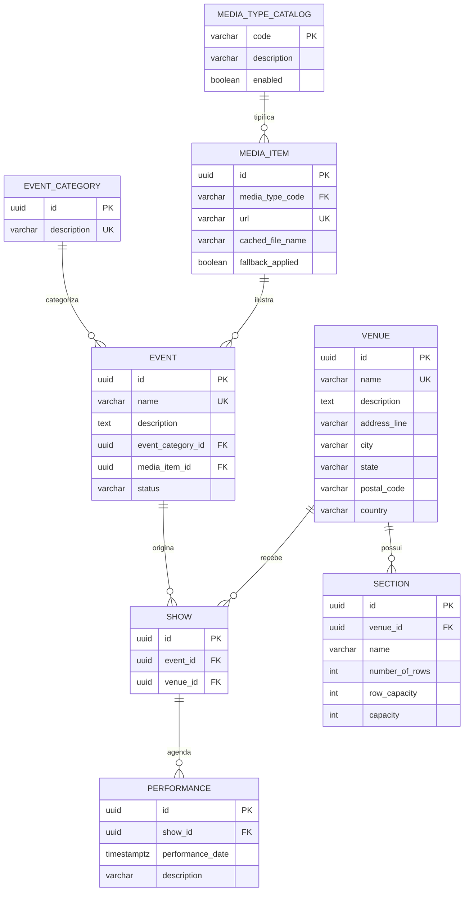
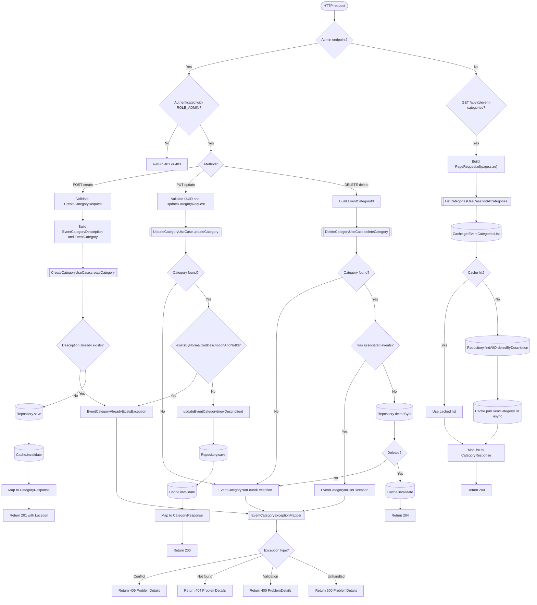

## 1. `microservice-catalog`
* **Responsabilidade:** Cadastro e exibição de eventos, venues, seções e shows.
* **Banco de Dados:** PostgreSQL (`catalog_db`). Altamente otimizado para leitura.
* **Redis Cache:** Cache-Aside para reduzir acessos ao banco para listagens públicas de eventos e estruturas de Venues.
* **APIs Expostas:** REST HTTP para consulta pública do catálogo e CRUD administrativo.
* **Dependências:** Nenhuma.


### Responsabilidade
Gerenciamento das entidades de divulgação artística, locais físicos, shows cadastrados e a agenda temporal de apresentações (performances). É um serviço otimizado para leitura intensiva (*read-heavy*), cujos dados são expostos ao canal público de vendas e painel de administração.

### Regras de Negócio (RNs) Mapeadas
* **RN01 (Unicidade do Evento):** O nome do evento deve ser único em toda a base de dados.
* **RN02 (Tamanho do Nome do Evento):** O nome de um evento deve ter obrigatoriamente entre 5 e 50 caracteres.
* **RN03 (Tamanho da Descrição do Evento):** A descrição de um evento deve ter entre 20 e 1000 caracteres.
* **RN04 (Categoria Obrigatória):** Todo evento cadastrado deve estar associado a uma categoria de evento ativa (`EventCategory`).
* **RN05 (Mídia Opcional):** A imagem promocional de um evento é um campo opcional.
* **RN06 (Categoria Única):** A descrição da categoria de evento deve ser única e não nula.
* **RN07 (Unicidade de Venue):** O nome do local físico (Venue) deve ser único e não vazio.
* **RN08 (Associação de Show):** Um Show representa uma associação única entre um `Event` e um `Venue`. Não é permitida a duplicação dessa associação.
* **RN09 (Performance Obrigatória):** Toda performance de show deve conter obrigatoriamente data/hora e estar vinculada a um `Show` válido.
* **RN10 (Unicidade de Sessão por Show):** Não é permitido agendar duas performances do mesmo show exatamente na mesma data e hora.
* **RN11 (Unicidade de Seção por Venue):** O nome de uma seção física (ex.: "Camarote") deve ser único dentro de um mesmo `Venue`.
* **RN12 (Cálculo de Capacidade de Seção):** A capacidade de assentos de uma seção física é calculada pela multiplicação de `fileiras × capacidade por fileira` (`Section.getCapacity()`).
* **RN34 (Restrição de Tipo de Mídia):** O tipo de item de mídia promocional aceito é restrito à categoria `IMAGE`.
* **RN35 (Fallback de Imagem):** Em caso de falha de carregamento ou download de uma imagem promocional remota, o microsserviço deve injetar síncronamente o caminho para uma imagem de fallback local padrão (`not_available.jpg`).
* **RN37 (URL de Mídia Válida):** A URL de um item de mídia (`MediaItem`) deve ter uma estrutura válida (`http` ou `https`) e ser única na base.


#### Sugestões de Alteração Histórias de Regras de Negócio

* **[ALTERA RN34]** O tipo de mídia deixa de ser um enum fechado (`IMAGE` apenas) e passa a ser um catálogo extensível (`IMAGE`, `VIDEO`, `AUDIO`), configurável sem redeploy do serviço.
* **[NOVO]** `Event` passa a ter ciclo de vida explícito (`DRAFT` → `PUBLISHED` → `ARCHIVED`), em vez de existir implicitamente a partir do cadastro. Hoje qualquer `Event` criado no admin já aparece imediatamente no catálogo público.
* **[NOVO]** `EventCategory` não pode ser excluída se houver `Event` associado (hoje o legado não impõe essa proteção explicitamente a nível de regra de negócio, apenas via eventual erro de integridade referencial do banco).


### Histórias de Usuário (US)
* **US-CAT-01:** Consultar catálogo de eventos ativos.
* **US-CAT-02:** Filtrar eventos catalogados por categoria de interesse.
* **US-CAT-03:** Visualizar detalhes artísticos e imagem promocional de um evento específico por ID.
* **US-CAT-04:** Consultar lista de locais de espetáculo (Venues) disponíveis para venda.
* **US-CAT-05:** Visualizar detalhes de um local de espetáculo (capacidade total, seções físicas e endereço).
* **US-CAT-06:** Listar a agenda de shows vinculados a um determinado evento ou local.
* **US-CAT-07:** Consultar sessões (performances) ativas de um show para compra.
* **US-CAT-08:** Gerenciar cadastro de eventos (Inclusão, Alteração, Exclusão) (Admin).
* **US-CAT-09:** Gerenciar catálogo de categorias de eventos (Admin).
* **US-CAT-10:** Gerenciar locais físicos de espetáculos e suas seções estruturais (Admin).
* **US-CAT-11:** Criar e alterar agendamentos de shows e suas performances temporais (Admin).
* **US-CAT-12:** Cadastrar novos itens de mídia com validação síncrona de URL (Admin).

### Critérios de Aceite (CAs)
* **CA-CAT-01-VAL:** Toda alteração de evento deve validar as constraints de tamanho (5-50 caracteres para nome, 20-1000 para descrição) retornando erro 400 (Problem Details) sob falha.
* **CA-CAT-02-UNI:** A criação de um agendamento de Show ou Performance deve validar unicidades relacionais no banco de dados e retornar HTTP 409 (Conflict) em caso de duplicidade detectada.
* **CA-CAT-03-MED:** A falha na resolução HTTP da imagem do `MediaItem` na persistência administrativa não deve travar o cadastro; o microsserviço deve persistir a URL original e marcar a imagem para fallback de leitura local.

#### Sugestões de Alteração Histórias de Usuário para a Modernização

* **US-CAT-13 (nova):** Como administrador, quero cadastrar um evento em rascunho e publicá-lo apenas quando estiver pronto, para evitar exibir eventos incompletos no catálogo público.
* **US-CAT-14 (nova):** Como administrador, quero cadastrar mídia em vídeo além de imagem, sem depender de alteração de código do serviço.

---

## Análise de Dependências — `microservice-catalog`

Mapeamento das 14 US quanto a pré-requisitos funcionais (não infra):

| US | Depende de | Motivo |
|---|---|---|
| US-CAT-09 (categorias CRUD) | — | Entidade raiz, sem FK de saída (RN06) |
| US-CAT-12 (mídia CRUD) | — | Entidade raiz, `media_type_catalog` é seed de dados, não feature (RN34/35/37) |
| US-CAT-10 (venue+seção CRUD) | — | Entidade raiz, sem FK de saída (RN07/RN11/RN12) |
| US-CAT-14 (mídia vídeo) | US-CAT-12 | Estende o catálogo de tipos já criado por US-CAT-12 |
| US-CAT-08 (evento CRUD) | US-CAT-09 (obrigatório, RN04) + US-CAT-12 (opcional, RN05) | `event.event_category_id NOT NULL` |
| US-CAT-13 (draft→published) | US-CAT-08 | É o ciclo de vida do Event já cadastrado |
| US-CAT-11 (show/performance CRUD) | US-CAT-08 + US-CAT-10 | `show` referencia `event_id` e `venue_id` (RN08) |
| US-CAT-04 (listar venues) | US-CAT-10 | Leitura da entidade recém-criada |
| US-CAT-05 (detalhe de venue) | US-CAT-10 (US-CAT-04 opcional) | Leitura de venue+seções |
| US-CAT-01 (catálogo publicado) | US-CAT-08 + US-CAT-13 | Filtra por `status = PUBLISHED` (não existe sem ciclo de vida) |
| US-CAT-03 (detalhe de evento) | US-CAT-08 (US-CAT-13 opcional) | Leitura por ID |
| US-CAT-02 (filtro por categoria) | US-CAT-01 + US-CAT-09 | Estende a listagem já existente |
| US-CAT-11 → US-CAT-06 (agenda por evento/venue) | US-CAT-11 | Lê `show` |
| US-CAT-06 → US-CAT-07 (performances de show) | US-CAT-11 | Lê `performance` |

## Lista de Tarefas Ordenada

### Fase 0 — Entidades raiz (paralelizáveis entre si, sem dependência)
1. [x] **US-CAT-09** — CRUD de `EventCategory` (RN06; proteção `[NOVO]` contra exclusão com Event associado) 
2. [ ] **US-CAT-10** — CRUD de `Venue` + `Section` (RN07, RN11, RN12 — capacidade como coluna gerada)
3. [ ] **US-CAT-12** — CRUD de `MediaItem` com validação síncrona de URL (RN34, RN35, RN37)

### Fase 1 — Extensões diretas da Fase 0
4. [ ] **US-CAT-14** — Catálogo extensível de tipos de mídia (`VIDEO`, `AUDIO`) — depende de US-CAT-12
5. [ ] **US-CAT-04** — Listagem pública de venues — depende de US-CAT-10
6. [ ] **US-CAT-05** — Detalhe de venue (capacidade, seções, endereço) — depende de US-CAT-10 / US-CAT-04
[mark -> revisar]

### Fase 2 — Evento (depende de categoria e, opcionalmente, mídia)
7. [ ] **US-CAT-08** — CRUD de `Event` (RN01–RN05) — depende de US-CAT-09 (obrigatório) e US-CAT-12 (opcional)
8. [ ] **US-CAT-13** — Ciclo de vida `DRAFT → PUBLISHED → ARCHIVED` — depende de US-CAT-08
9. [ ] **US-CAT-03** — Detalhe de evento por ID — depende de US-CAT-08

### Fase 3 — Show/Performance (depende de Event + Venue)
10. [ ] **US-CAT-11** — CRUD de `Show` e `Performance` (RN08, RN09, RN10) — depende de US-CAT-08 + US-CAT-10

### Fase 4 — Leitura pública composta (depende do ciclo de vida e das relações)
11. [ ] **US-CAT-01** — Catálogo de eventos publicados (paginado) — depende de US-CAT-08 + US-CAT-13
12. [ ] **US-CAT-02** — Filtro de catálogo por categoria — depende de US-CAT-01 + US-CAT-09
13. [ ] **US-CAT-06** — Agenda de shows por evento/venue — depende de US-CAT-11
14. [ ] **US-CAT-07** — Performances/sessões de um show — depende de US-CAT-11 / US-CAT-06

## Observações
- Fases 0 e 1 podem ser desenvolvidas em paralelo por squads diferentes — não compartilham FK entre si.
- US-CAT-01 (spec já refatorada) só é implementável de fato após US-CAT-13 existir, pois `status = PUBLISHED` é o critério central de FR-002/FR-020 — sem o ciclo de vida, a listagem "publicada" não tem o que filtrar além do `DRAFT` default.
- US-CAT-12/US-CAT-14 podem ser adiadas para depois de US-CAT-08 sem quebrar nada, já que `media_item_id` é nullable em `event` (RN05) — citadas cedo aqui só porque não têm dependência de saída, não porque sejam bloqueantes.

---

# Modelo de Dados — `microservice-catalog`


## 1. Decisões de Modelagem

* **Chave primária:** `UUID` (`gen_random_uuid()`, extensão `pgcrypto`) em vez de `BIGSERIAL`. Motivo: os IDs deste serviço são replicados por eventos para `microservice-inventory` (tabelas de snapshot) — UUID evita colisão entre serviços e permite geração client-side/offline sem round-trip ao banco.
* **Sem FKs para outros bancos:** por ser *Database per Service*, `catalog_db` não referencia `inventory_db`/`booking_db`. Onde outro serviço precisa desses dados, ele mantém uma tabela de *snapshot* populada via eventos (ver `microservice-inventory_data_model.md`, seção 3).
* **Capacidade calculada em coluna gerada:** `Section.capacity` (RN12) deixa de ser calculado em código Java a cada leitura e passa a ser uma `GENERATED COLUMN`, garantindo consistência mesmo em consultas SQL diretas/relatórios.
* **Catálogo de tipos de mídia extensível:** substitui o enum fechado do legado (`MediaType.IMAGE`) por uma tabela de domínio (`media_type_catalog`), atendendo a `[ALTERA RN34]`/US-CAT-14 sem exigir redeploy para adicionar `VIDEO`, `AUDIO`, etc.
* **Ciclo de vida do evento:** nova coluna `event.status`, atendendo ao item `[NOVO]` (DRAFT → PUBLISHED → ARCHIVED) da spec.

---

## 2. Diagrama ER



---

## 3. DDL

```sql
CREATE SCHEMA IF NOT EXISTS catalog;
CREATE EXTENSION IF NOT EXISTS pgcrypto;

-- ============================================================
-- Domínio de mídia (catálogo extensível — [ALTERA RN34])
-- ============================================================
CREATE TABLE catalog.media_type_catalog (
    code        VARCHAR(30)  PRIMARY KEY,      -- 'IMAGE', 'VIDEO', 'AUDIO'...
    description VARCHAR(120) NOT NULL,
    enabled     BOOLEAN      NOT NULL DEFAULT TRUE
);

INSERT INTO catalog.media_type_catalog (code, description, enabled)
VALUES ('IMAGE', 'Imagem promocional', TRUE); -- valor herdado do legado (RN34 as-is)

CREATE TABLE catalog.media_item (
    id                UUID PRIMARY KEY DEFAULT gen_random_uuid(),
    media_type_code   VARCHAR(30) NOT NULL REFERENCES catalog.media_type_catalog(code),
    url               VARCHAR(2048) NOT NULL,
    cached_file_name  VARCHAR(255),
    fallback_applied  BOOLEAN NOT NULL DEFAULT FALSE, -- RN35
    created_at        TIMESTAMPTZ NOT NULL DEFAULT now(),
    CONSTRAINT uq_media_item_url UNIQUE (url),                       -- RN37
    CONSTRAINT ck_media_item_url_scheme CHECK (url ~* '^https?://')  -- RN37
);

-- ============================================================
-- Categoria de evento
-- ============================================================
CREATE TABLE catalog.event_category (
    id          UUID PRIMARY KEY DEFAULT gen_random_uuid(),
    description VARCHAR(120) NOT NULL,
    created_at  TIMESTAMPTZ NOT NULL DEFAULT now(),
    CONSTRAINT uq_event_category_description UNIQUE (description) -- RN06
);

-- ============================================================
-- Evento
-- ============================================================
CREATE TABLE catalog.event (
    id                UUID PRIMARY KEY DEFAULT gen_random_uuid(),
    name              VARCHAR(50) NOT NULL,
    description       VARCHAR(1000) NOT NULL,
    event_category_id UUID NOT NULL REFERENCES catalog.event_category(id) ON DELETE RESTRICT, -- RN04 + proteção [NOVO]
    media_item_id     UUID NULL REFERENCES catalog.media_item(id) ON DELETE SET NULL,          -- RN05 (opcional)
    status            VARCHAR(20) NOT NULL DEFAULT 'DRAFT',                                     -- [NOVO] ciclo de vida
    created_at        TIMESTAMPTZ NOT NULL DEFAULT now(),
    updated_at        TIMESTAMPTZ NOT NULL DEFAULT now(),
    published_at      TIMESTAMPTZ NULL,
    CONSTRAINT uq_event_name UNIQUE (name),                                    -- RN01
    CONSTRAINT ck_event_name_length CHECK (char_length(name) BETWEEN 5 AND 50),        -- RN02
    CONSTRAINT ck_event_description_length CHECK (char_length(description) BETWEEN 20 AND 1000), -- RN03
    CONSTRAINT ck_event_status CHECK (status IN ('DRAFT','PUBLISHED','ARCHIVED'))
);
CREATE INDEX ix_event_category ON catalog.event(event_category_id);
CREATE INDEX ix_event_status_published ON catalog.event(status) WHERE status = 'PUBLISHED'; -- US-CAT-01

-- ============================================================
-- Venue (com endereço embutido — equivalente ao @Embeddable Address do legado)
-- ============================================================
CREATE TABLE catalog.venue (
    id            UUID PRIMARY KEY DEFAULT gen_random_uuid(),
    name          VARCHAR(255) NOT NULL,
    description   TEXT,
    address_line  VARCHAR(255),
    city          VARCHAR(120),
    state         VARCHAR(120),
    postal_code   VARCHAR(20),
    country       VARCHAR(120),
    created_at    TIMESTAMPTZ NOT NULL DEFAULT now(),
    CONSTRAINT uq_venue_name UNIQUE (name),                 -- RN07
    CONSTRAINT ck_venue_name_not_empty CHECK (btrim(name) <> '')  -- RN07
);

-- ============================================================
-- Seção física
-- ============================================================
CREATE TABLE catalog.section (
    id              UUID PRIMARY KEY DEFAULT gen_random_uuid(),
    venue_id        UUID NOT NULL REFERENCES catalog.venue(id) ON DELETE CASCADE,
    name            VARCHAR(120) NOT NULL,
    number_of_rows  INT NOT NULL,
    row_capacity    INT NOT NULL,
    capacity        INT GENERATED ALWAYS AS (number_of_rows * row_capacity) STORED, -- RN12
    CONSTRAINT uq_section_venue_name UNIQUE (venue_id, name),      -- RN11
    CONSTRAINT ck_section_rows_positive CHECK (number_of_rows > 0),
    CONSTRAINT ck_section_row_capacity_positive CHECK (row_capacity > 0)
);

-- ============================================================
-- Show (associação única Event + Venue)
-- ============================================================
CREATE TABLE catalog.show (
    id         UUID PRIMARY KEY DEFAULT gen_random_uuid(),
    event_id   UUID NOT NULL REFERENCES catalog.event(id) ON DELETE CASCADE,
    venue_id   UUID NOT NULL REFERENCES catalog.venue(id) ON DELETE RESTRICT,
    created_at TIMESTAMPTZ NOT NULL DEFAULT now(),
    CONSTRAINT uq_show_event_venue UNIQUE (event_id, venue_id) -- RN08
);
CREATE INDEX ix_show_venue ON catalog.show(venue_id); -- US-CAT-06

-- ============================================================
-- Performance (sessão de um Show)
-- ============================================================
CREATE TABLE catalog.performance (
    id                UUID PRIMARY KEY DEFAULT gen_random_uuid(),
    show_id           UUID NOT NULL REFERENCES catalog.show(id) ON DELETE CASCADE,
    performance_date  TIMESTAMPTZ NOT NULL,     -- RN09
    description       VARCHAR(255),
    CONSTRAINT uq_performance_show_date UNIQUE (show_id, performance_date) -- RN10
);
CREATE INDEX ix_performance_date ON catalog.performance(performance_date); -- US-CAT-07, RN31/RN32 (consumido por telemetry)
```

---

## 4. Mapeamento RN → Estrutura Física

| RN | Implementação |
|---|---|
| RN01 | `UNIQUE (name)` em `event` |
| RN02 | `CHECK` de tamanho em `event.name` |
| RN03 | `CHECK` de tamanho em `event.description` |
| RN04 | `event.event_category_id NOT NULL` + FK |
| RN05 | `event.media_item_id` nullable |
| RN06 | `UNIQUE (description)` em `event_category` |
| RN07 | `UNIQUE (name)` + `CHECK` não vazio em `venue` |
| RN08 | `UNIQUE (event_id, venue_id)` em `show` |
| RN09 | `performance.performance_date NOT NULL` |
| RN10 | `UNIQUE (show_id, performance_date)` em `performance` |
| RN11 | `UNIQUE (venue_id, name)` em `section` |
| RN12 | `GENERATED COLUMN capacity` em `section` |
| RN34 (alterada) | `media_type_catalog` (tabela de domínio, não enum) |
| RN35 | coluna `fallback_applied` em `media_item` |
| RN37 | `UNIQUE (url)` + `CHECK` de esquema `http(s)` em `media_item` |
| [NOVO] ciclo de vida | `event.status` + `CHECK` |
| [NOVO] proteção de categoria | `event_category_id ... ON DELETE RESTRICT` |

> Observação: RN sobre validação de conteúdo de negócio mais complexo (ex.: regra de publicação exigir `media_item_id` preenchido) fica na camada de aplicação (`PublishEventUseCase`), não no schema — o banco garante apenas invariantes estruturais.

## 5. Estrutura de Pacotes (Clean Architecture)

```text 
br.vsjr.labs.ticketmonster.catalog/
├── adapter/
│   ├── in/
│   │   └── rest/
│   │       ├── EventCategoryAdminResource.java
│   │       ├── EventCategoryPublicResource.java
│   │       ├── dto/
│   │       │   ├── CreateCategoryRequest.java
│   │       │   ├── UpdateCategoryRequest.java
│   │       │   └── CategoryResponse.java
│   │       ├── mapper/
│   │       │   └── CategoryDtoMapper.java
│   │       └── exception/
│   │           └── CategoryExceptionMapper.java
│   └── out/
│       ├── persistence/
│       │   ├── EventCategoryPanacheRepository.java
│       │   └── entity/
│       │       └── EventCategoryJpaEntity.java
│       └── redis/
│           └── CategoryRedisCacheAdapter.java
├── application/
│   ├── port/
│   │   ├── in/
│   │   │   ├── CreateCategoryUseCase.java
│   │   │   ├── UpdateCategoryUseCase.java
│   │   │   ├── DeleteCategoryUseCase.java
│   │   │   └── ListCategoriesUseCase.java
│   │   └── out/
│   │       ├── CategoryRepositoryPort.java
│   │       └── CategoryCachePort.java
│   └── usecase/
│       └── EventCategoryService.java
└── domain/
    ├── model/
    │   └── EventCategory.java
    ├── vo/
    │   ├── CategoryId.java
    │   └── CategoryDescription.java
    └── exception/
        ├── CategoryAlreadyExistsException.java
        ├── CategoryHasEventsException.java
        └── CategoryNotFoundException.java
```


### Flow

